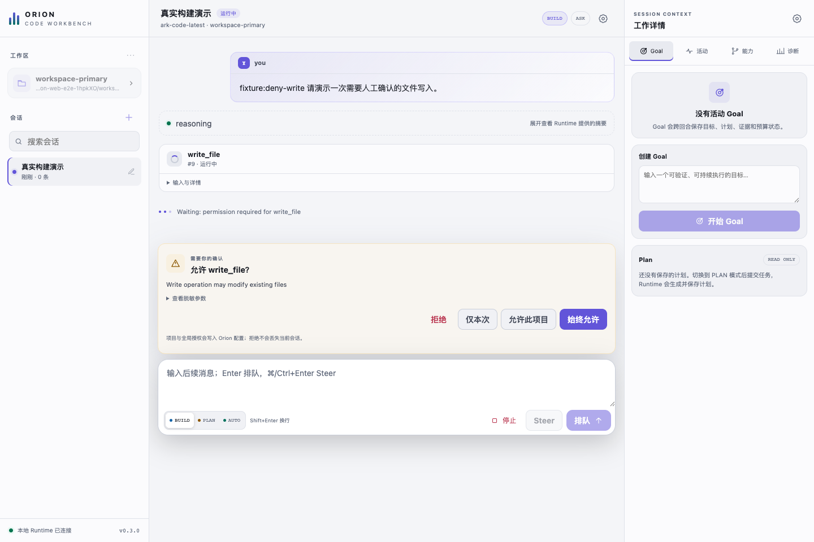
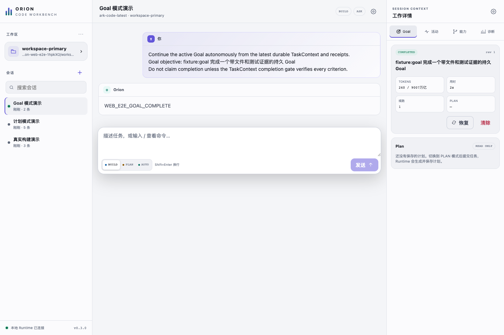
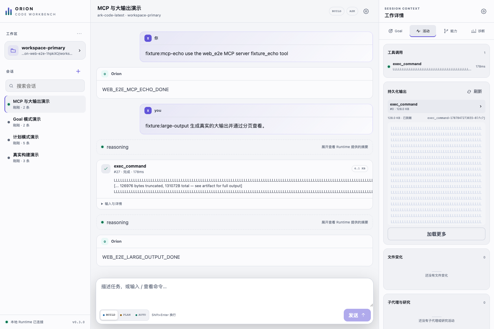
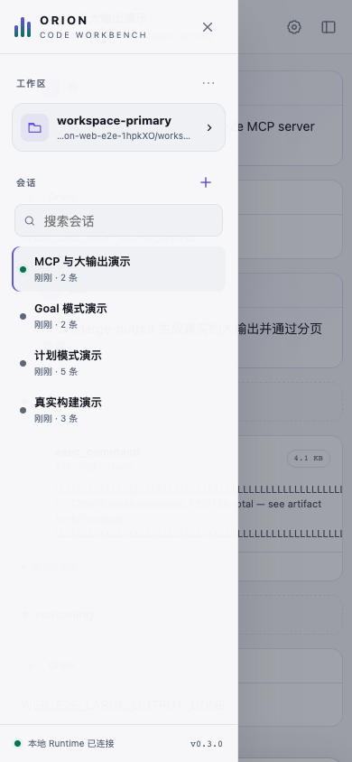
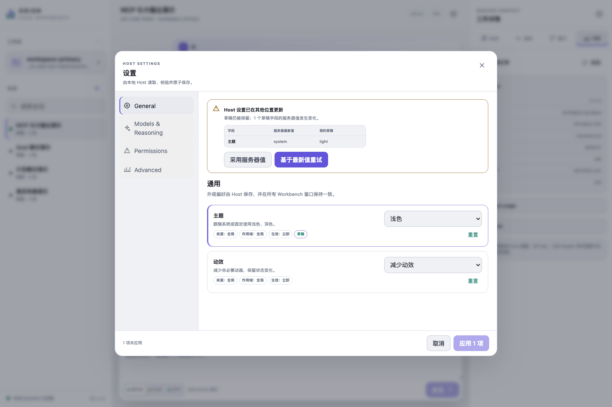
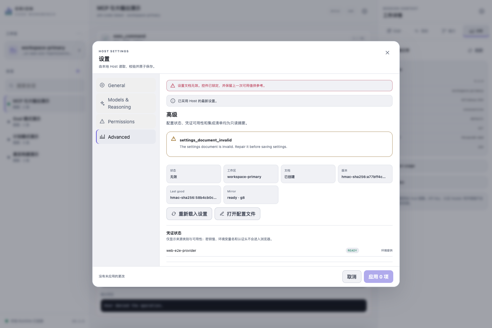

# Orion Code Web v0.3.0 状态截图

这组截图由真实 Google Chrome 驱动安装后的 `@orion-agents/orion-code@0.3.0`
tarball 生成。页面连接真实 Orion Web Host、Runtime、ToolGateway、文件工具、命令工具、
Goal/Plan 持久化和 MCP 进程；仅模型边界使用确定性的本机 OpenAI SSE fixture，保证审批、
输出和恢复状态可重复。截图中的 `fixture:*` 与 `WEB_E2E_*` 是故意保留的测试输入和结果标记。

本次图册生成于 2026-08-28（Asia/Shanghai），使用 Node.js 22.22.3 与 Google Chrome
151.0.7922.174。验证环境、tarball SHA-256 与每张 PNG 的 SHA-256 均记录在
[manifest.json](./manifest.json)。

|   # | 状态                               | 截图                                                                 |
| --: | ---------------------------------- | -------------------------------------------------------------------- |
|  01 | 空工作台                           | [01-workspace-empty.png](./01-workspace-empty.png)                   |
|  02 | BUILD 会话就绪                     | [02-session-ready.png](./02-session-ready.png)                       |
|  03 | 工具审批等待中                     | [03-approval-pending.png](./03-approval-pending.png)                 |
|  04 | 审批拒绝且无副作用                 | [04-approval-denied.png](./04-approval-denied.png)                   |
|  05 | BUILD 写入与测试完成               | [05-build-complete.png](./05-build-complete.png)                     |
|  06 | PLAN 收据与执行结果（刷新恢复后）  | [06-plan-complete.png](./06-plan-complete.png)                       |
|  07 | Goal 完成与证据（刷新恢复后）      | [07-goal-complete.png](./07-goal-complete.png)                       |
|  08 | Skills 与 MCP 未激活               | [08-capabilities-dormant.png](./08-capabilities-dormant.png)         |
|  09 | MCP 工具审批                       | [09-mcp-approval.png](./09-mcp-approval.png)                         |
|  10 | MCP 已激活，2 个工具（刷新恢复后） | [10-capabilities-connected.png](./10-capabilities-connected.png)     |
|  11 | 128 KiB 工具输出分页检查器         | [11-tool-output.png](./11-tool-output.png)                           |
|  12 | 连接与恢复诊断                     | [12-diagnostics.png](./12-diagnostics.png)                           |
|  13 | Settings · General（干净状态）     | [13-settings.png](./13-settings.png)                                 |
|  14 | 浏览器离线与待重连                 | [14-offline.png](./14-offline.png)                                   |
|  15 | 390 × 844 移动端会话导航           | [15-mobile-navigation.png](./15-mobile-navigation.png)               |
|  16 | 390 × 844 移动端详情面板           | [16-mobile-inspector.png](./16-mobile-inspector.png)                 |
|  17 | Settings · 两项草稿                | [17-settings-dirty.png](./17-settings-dirty.png)                     |
|  18 | Settings · 放弃草稿确认            | [18-settings-discard-confirm.png](./18-settings-discard-confirm.png) |
|  19 | Settings · 原子保存成功            | [19-settings-saved.png](./19-settings-saved.png)                     |
|  20 | Settings · 模型与推理              | [20-settings-models.png](./20-settings-models.png)                   |
|  21 | Settings · 权限                    | [21-settings-permissions.png](./21-settings-permissions.png)         |
|  22 | Settings · Allow 风险确认          | [22-settings-allow-confirm.png](./22-settings-allow-confirm.png)     |
|  23 | Settings · 高级状态                | [23-settings-advanced.png](./23-settings-advanced.png)               |
|  24 | Settings · 双页面版本冲突          | [24-settings-conflict.png](./24-settings-conflict.png)               |
|  25 | Settings · Runtime 忙碌锁定        | [25-settings-runtime-busy.png](./25-settings-runtime-busy.png)       |
|  26 | Settings · 非法配置与 last-good    | [26-settings-invalid.png](./26-settings-invalid.png)                 |
|  27 | Settings · 只读配置                | [27-settings-read-only.png](./27-settings-read-only.png)             |

## 代表性页面

### 工具审批等待中

### Goal 完成与证据

### 工具大输出分页检查器

### 移动端会话导航

### Settings 双页面版本冲突

### Settings 非法配置与 last-good

