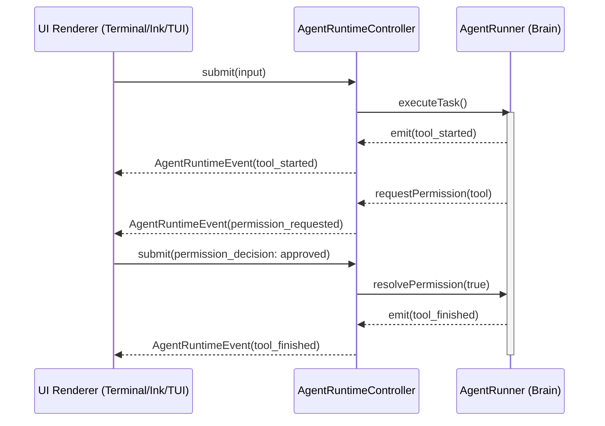
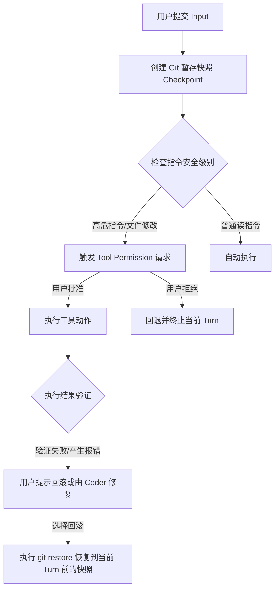

# OpenHorse 架构与技术升级方案 (Technical Upgrade Proposals)

根据 `docs/targets/first-class-coding-agent-vision.md`（一流 Coding-Agent 愿景）以及 `docs/targets/ui-runtime-boundary.md`（UI 与运行时边界定义）的要求，我们对项目进行了深度调研与分析。

为实现一流 Coding-Agent 的目标，本项目需要在 **运行时边界、上下文控制、安全审计和生态扩展** 四个维度进行深度技术升级。以下是具体的技术设计与演进方案：

---

## 1. 统一运行时与 UI 边界收敛方案 (UI/Runtime Boundary Hardening)

### 现状与挑战
当前 `v0.2.9` 实现了基础的 `AgentRuntimeController` 与事件协议，但 UI 与运行时之间仍存在一些耦合：
1. 会话恢复和命令行的交互（如 `/resume`、选择会话）在终端 UI 和协议中有部分逻辑重合。
2. 实时修正（Live Revision）及 Ctrl+C 中断的底层清理逻辑不够彻底，容易因为各 UI 的呈现差异而导致内部状态失步。

### 升级方案设计
我们将完全落实“**单脑多壳**（One Brain, Many Shells）”设计。把交互决策权限完全下沉到运行时，UI 仅作为事件的接收者（Renderer）与输入的发送者。



#### 关键接口定义升级 (`src/runtime/agent-runtime-protocol.ts`)
```typescript
/**
 * 结构化输入协议升级：完全收拢所有交互动作
 */
export type AgentRuntimeInput =
  | {
      type: 'submit';
      text: string;
      source?: 'composer' | 'picker' | 'programmatic';
    }
  | {
      type: 'select_session';
      sessionId: string;
      allProjects?: boolean;
    }
  | {
      type: 'permission_decision';
      requestId: string;
      approved: boolean;
      metadata?: Record<string, unknown>;
    }
  | {
      type: 'interrupt';
    }
  | {
      type: 'clear_exit_intent';
    }
  | {
      type: 'picker_decision';
      requestId: string;
      selectedValue: string;
    };

/**
 * 结构化事件协议升级：通过生命周期事件通知 UI，不保留 UI 本地状态
 */
export type AgentRuntimeEvent =
  | { type: 'transcript_append'; entry: TranscriptAppendEntry }
  | { type: 'transcript_update'; id: string; patch: Partial<Omit<TranscriptEntry, 'id'>> }
  | { type: 'transcript_finalize'; id: string; patch?: Partial<Omit<TranscriptEntry, 'id'>> }
  | { type: 'status_changed'; message: string }
  | { type: 'session_picker_requested'; request: SessionPickerRequest }
  | { type: 'permission_requested'; request: ToolPermissionRequest }
  | { type: 'tool_started'; event: RuntimeToolStartedEvent }
  | { type: 'tool_finished'; event: RuntimeToolFinishedEvent }
  | { type: 'processing_changed'; processing: boolean }
  | { type: 'picker_requested'; request: StructuredPickerRequest };

export interface StructuredPickerRequest {
  requestId: string;
  title: string;
  options: Array<{ label: string; value: string }>;
  allowCustom?: boolean;
}
```

### 实施路径
1. **重构 `AgentRuntimeController`**：把所有的交互式提示命令（如会话选择、模型切换）均抽象为 `picker_requested` 事件投递。
2. **彻底解耦 Renderer 触发逻辑**：确保 `src/terminal-ui/launch.ts`、`src/ink-ui/` 等只调用 `controller.handle(input)`。
3. **增加 Parity 单元测试**：使用虚拟 UI 模拟输入，并在非交互模式下断言 `permission_requested` 会被自动拒绝或按照配置自动同意。

---

## 2. Context Harness v3 上下文装配与证据引擎 (Context Harness v3 & Evidence Engine)

### 现状与挑战
当前 `ContextHarness` 根据简单关键字分词与重要度对证据进行打分（`rankEvidence`），并在此基础上做 Token 预算剪裁。随着交互轮数的增加，旧但关键的信息（例如用户最初设定的不改变特定包依赖的约束）容易被新生成的工具执行冗余结果挤出 Prompt 范围。

### 升级方案设计
升级为 **Harness v3 语义装配机制**，重构证据分类打分算法，并增强调试命令 `/harness explain` 的可视化呈现。

```text
+-------------------------------------------------------------+
| System Policy (固定系统设定，首部，100% 缓存)                 |
+-------------------------------------------------------------+
| Repo Guidance (如 AGENTS.md, 项目级别全局约束)               |
+-------------------------------------------------------------+
| Root Objective & Active Constraints (核心目标/硬性约束，绝对保留)|
+-------------------------------------------------------------+
| Dynamic Evidence (经过按优先级打分的证据索引: 文件、测试、错误等)  |
+-------------------------------------------------------------+
| Turn Summaries & History (滑动窗口的上下文历史，控制在预算内)    |
+-------------------------------------------------------------+
```

#### 证据打分与分类升级 (`src/harness/evidence.ts`)
我们引入更细粒度的权重设计和优先级保护逻辑：
*   **硬约束（Hard Constraints）**：重要度设为最高（9-10），不参与预算剪裁，即使超过预算也必须保留。
*   **近期工具失败与测试失败（Failed Verification）**：权重在常规工具之上，帮助模型保持专注解决当前报错。
*   **知识积累（Included Boost）**：针对历史生成中被反复引用（`includedCount` 高）的证据，提升分值。

```typescript
export interface EvidenceRecord {
  id: string;
  kind: 'requirement' | 'verification' | 'skill' | 'risk' | 'todo' | 'file_fact' | 'decision' | 'tool_result' | 'turn_summary';
  content: string;
  importance: number; // 1-10
  isProtected?: boolean; // 保护标记，不可被预算裁剪
  createdAt: number;
  tokenEstimate: number;
  includedCount?: number;
  // ... 其他属性
}
```

#### 开发 `/harness explain` 命令
在 `src/commands/` 下开发 `/harness explain` 指令，用于返回当前入模的完整预算利用图表：

```text
=== OpenHorse Context Harness Assembly Stats ===
Model: gemini-3.5-flash | Target Window: 1,000,000 tokens
Total Budget: 4,096 tokens | Estimated Assembly: 3,250 tokens (79.3% Utilized)

Sections:
[1] System Prompt          [ 800 tokens]   [100% Retention]  - OK
[2] Project Guidance       [ 450 tokens]   [100% Retention]  - OK
[3] Root Objective         [ 250 tokens]   [100% Retention]  - Protected
[4] Active Constraints     [ 180 tokens]   [100% Retention]  - Protected
[5] Ranked Evidence        [1,220 tokens]   [ 62% Retention]  - 3 items omitted (budget limit)
[6] Turn History           [ 350 tokens]   [100% Retention]  - OK

Omitted Evidence:
- (ledger:item-28) [tool_result] yarn run build output... (Score: 28, Tokens: 512) -> Exceeded budget
- (ledger:item-19) [file_fact] package.json dependencies... (Score: 18, Tokens: 120) -> Exceeded budget
```

---

## 3. 集中式安全审计与事务快照机制 (Centralized Security & Transactional Checkpoint Mechanism)

### 现状与挑战
Agent 在执行未知或复杂的代码改动时，容易引入不符合预期的副作用，甚至在出现错误时无法快速恢复现场。目前缺乏一种全局事务机制将工作区与对话 Turn 联系起来。

### 升级方案设计
引入 **事务快照引擎（Checkpoint Engine）** 与项目安全等级机制。



#### 关键实现：`src/services/checkpoint.ts`
```typescript
import { execSync } from 'child_process';

export interface Checkpoint {
  turnId: number;
  commitHash?: string;
  timestamp: number;
  description: string;
}

export class CheckpointManager {
  constructor(private readonly cwd: string) {}

  /**
   * 在每个 Turn 执行前自动创建临时快照 (使用本地暂存分支/Git Ref)
   */
  async createSnapshot(turnId: number, desc: string): Promise<Checkpoint | null> {
    try {
      // 检查是否有未提交更改
      const status = execSync('git status --porcelain', { cwd: this.cwd }).toString().trim();
      if (!status) {
        return null; // 无变动，无需创建快照
      }

      // 创建 stash 或临时 commit
      const branchName = `openhorse-temp-turn-${turnId}`;
      execSync(`git checkout -b ${branchName}`, { cwd: this.cwd });
      execSync('git add .', { cwd: this.cwd });
      execSync(`git commit -m "OpenHorse auto-save: ${desc}" --no-verify`, { cwd: this.cwd });
      const hash = execSync('git rev-parse HEAD', { cwd: this.cwd }).toString().trim();
      
      // 切回原分支
      execSync('git checkout -', { cwd: this.cwd });

      return {
        turnId,
        commitHash: hash,
        timestamp: Date.now(),
        description: desc,
      };
    } catch {
      return null; // 若不是 Git 仓库，自动退化为内存备份或跳过
    }
  }

  /**
   * 回滚当前工作区到指定 Turn 的快照
   */
  async rollbackTo(checkpoint: Checkpoint): Promise<boolean> {
    if (!checkpoint.commitHash) return false;
    try {
      execSync(`git reset --hard ${checkpoint.commitHash}`, { cwd: this.cwd });
      return true;
    } catch {
      return false;
    }
  }
}
```

#### 安全策略分级 (Permission Profile)
*   `read-only`：只读模式，拦截一切写文件和 shell 执行请求。
*   `workspace-edit`：允许修改项目文件，但任何 shell 命令执行（如 `npm test`）均需审批。
*   `auto`：在被识别为低风险且有测试覆盖的情况下允许自动执行，对毁灭性操作（如带 `-f`、`rm`）进行拦截提示。
*   `full-access`：完全信任模式，直接执行。

---

## 4. 插件化 Skills、Hooks 与 Subagents 协同架构 (Plugins, Hooks & Subagents)

### 现状与挑战
随着项目演进，我们引入了 `skills`、`subagents` 等外部能力，但它们在 `query` 决策内核中的注入方式是硬编码的。如果外部需要引入第三方 MCP Server 或新的 Hook 处理，修改内核的代价较高。

### 升级方案设计
将所有外部系统（包括 MCP、Skills、甚至子代理 Subagents）均抽象为统一注册的 **运行时扩展（Runtime Extension）** 体系，并暴露标准的生命周期钩子（Hooks）。

```text
+--------------------------------------------------------------+
|                    AgentRuntimeController                    |
+--------------------------------------------------------------+
   |              |                |                |
   v              v                v                v
[Pre-Submit]  [Pre-Tool]      [Post-Tool]      [Post-Turn]
   |              |                |                |
   +--------------+----------------+----------------+
                  |  （插件分发与拦截）
                  v
       +--------------------+
       |  ExtensionManager  |
       +--------------------+
         /        |       \
        /         |        \
   [MCP Tool]  [Skills]  [Subagents]
```

#### 关键接口定义：`src/services/plugin-manager.ts`
```typescript
import type { AgentRuntimeInput, AgentRuntimeEvent } from '../runtime/agent-runtime-protocol';
import type { OpenHorseTool, ToolContext } from '../framework';

export interface RuntimeHookContext {
  cwd: string;
  modelId: string;
  harnessState: Record<string, any>;
  input?: AgentRuntimeInput;
  event?: AgentRuntimeEvent;
}

export interface OpenHorsePlugin {
  name: string;
  version: string;
  
  // 生命周期钩子
  hooks?: {
    preSubmit?: (context: RuntimeHookContext, input: string) => Promise<string | void>;
    preTool?: (context: RuntimeHookContext, tool: OpenHorseTool, args: Record<string, any>) => Promise<{ allowed: boolean; reason?: string } | void>;
    postTool?: (context: RuntimeHookContext, tool: OpenHorseTool, result: any) => Promise<any | void>;
    postTurn?: (context: RuntimeHookContext) => Promise<void>;
  };
  
  // 注入的工具列表
  tools?: OpenHorseTool[];
}
```

#### Subagents 挂载升级
Subagents（例如 `research` 或 `review`）将独立于主会话。
1. **通信隔离**：主 CoderAgent 可以通过特殊的 `invoke_subagent` 工具派生 Subagent。
2. **事件订阅**：Subagent 产生的 tool 执行、大模型调用 delta 等事件，都会作为子级树事件包裹进 `AgentRuntimeEvent` 投递回 UI，使终端用户在执行时能够直观监听到子代理在做什么（低干扰展示），而不是直接将子代理的聊天细节堆叠进主 Transcript。

---

## 5. 升级路线图与阶段性里程碑 (Roadmap)

我们建议将上述升级方案分为三个迭代期逐步落地：

| 阶段 | 核心任务 | 交付物/标准 |
| :--- | :--- | :--- |
| **Stage 1: 边界收拢与 explain 调试 (1-2周)** | 1. 彻底切分 UI 与核心 Controller 交互点。<br>2. 补充 protocol 事件覆盖，编写 UI 测试。<br>3. 落地 Harness v3 打分算法，提供 `/harness explain` 终端状态调试命令。 | 1. 确保在任意 renderer 下交互逻辑 100% parities。<br>2. 可以通过命令行实时查看上下文 token 预算使用。 |
| **Stage 2: 事务快照与安全审批 (2-3周)** | 1. 引入安全策略的配置与分级解析。<br>2. 落地 Git 快照机制，并在写文件操作前触发 checkpoint 存盘。<br>3. 开发 `/rollback` 命令支持回退。 | 1. 在 `workspace-edit` 模式下智能识别敏感改动。<br>2. 运行异常时可通过回撤将代码复原。 |
| **Stage 3: 生态化扩展与插件生态 (3-4周)** | 1. 实现运行时 Hook 执行器与插件管理器。<br>2. 将 Skills、MCP 协议的发现与挂载移入插件层。<br>3. 实现子代理的隔离与日志管道输出。 | 1. 核心 query 方法不再直连任何具体的工具或 skills 实现，完全通过模块总线动态解析。 |
