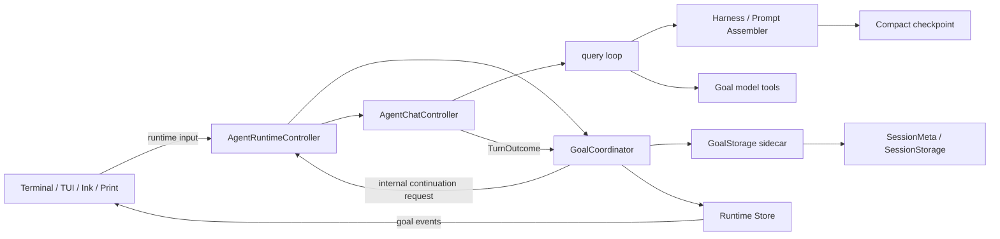

# OpenHorse v0.2.24 `/target` 持久目标模式迭代计划

> 版本：v0.2.24
>
> 文档状态：Draft / Implementation Ready
>
> 调研日期：2026-07-20
>
> 目标读者：GLM-5.1、Codex、Claude Code 或其他承担实现、测试、CR 的 Coding Agent
>
> 前置基线：v0.2.23 完成并合入后再开始开发
>
> 范围约束：本版本实现单 Session、单活跃目标；不实现跨 Session 调度与多目标 DAG

## 1. 版本目标

v0.2.24 增加 `/target` 目标模式，使 OpenHorse 能够接收一个明确、持久的目标，并在多个 Agent turn、Compact、进程重启和 `/resume` 之后持续推进，直到目标被验证完成、用户暂停、预算耗尽、服务受限或确实阻塞。

目标模式必须具备以下核心语义：

1. **显式创建**：只有用户明确执行 `/target ...`，或明确要求 Agent 创建目标时才建立目标；普通问题不能自动升级为目标。
2. **持续追求**：一个 turn 结束但目标未完成时，Agent Core 在空闲状态自动启动下一次 continuation，而不是要求用户反复输入“继续”。
3. **跨重启持久化**：目标状态、累计 token、累计运行时间、最近进度和终止原因绑定 Session 保存；`/resume` 后按原状态恢复。
4. **目标不漂移**：后续普通输入是补充、纠偏或最新指令，不得无意覆盖根目标；只有 `/target edit`、`/target replace` 或对应控制行为能改变目标。
5. **完成必须有证据**：Agent 只有在逐项审计目标且验证通过后才能将目标标记为完成；预算接近耗尽、工作很难或“看起来差不多”都不是完成。
6. **阻塞必须可信**：一般语义阻塞需要同一阻塞条件连续出现至少 3 个目标 turn；不可恢复的系统错误可以立即停止自动续跑并进入阻塞或受限状态。
7. **控制面与展示层分离**：目标生命周期、自动续跑、预算和完成审计归 Agent Core；Terminal UI、TUI、Ink、Print 只发送控制输入并渲染统一事件。
8. **不绕过安全边界**：目标模式不能提高工具权限、自动同意危险操作、绕过现有 permission gate，或降低命令和文件访问限制。

## 2. 用户价值与验收场景

### 2.1 典型场景

```text
/target 修复当前仓库全部失败测试，完成代码审查，并在验证通过后给出发布结论
```

预期行为：

1. OpenHorse 创建持久目标并立即开始第一个目标 turn。
2. Agent 检查仓库、执行测试、修改、复测和 CR。
3. 某个单 turn 达到现有 loop budget 时，不结束整个目标；Runtime 在空闲后自动发起下一目标 turn。
4. 用户随时可以补充“不要修改 docs/*”或执行 `/target pause`。
5. Compact 后继续使用同一个目标，根目标不被摘要替换。
6. 退出 OpenHorse 后再次 `/resume`，仍能看到目标、累计用量和当前状态。
7. 只有完成审计通过时目标进入 `complete`；否则继续推进或进入可信的受限状态。

### 2.2 最小验收脚本

```text
/target 创建 3 个文件，运行验证脚本，删除临时文件，最后确认工作区干净
/target
/target pause
/target resume
/compact
/resume <session-id>
/target
```

必须证明：

- 目标 ID 和 objective 全程不变；
- 自动 continuation 至少发生 2 次；
- pause 后没有新的自动 turn；
- Compact 和 Resume 后没有恢复已淘汰的模型上下文；
- 原始 transcript 可审计，但内部 continuation prompt 不伪装成用户消息；
- 目标完成前有验证证据，完成后不再自动续跑。

## 3. Codex Goal 模式调研结论

### 3.1 调研来源

本方案以 OpenAI 官方文档和 `openai/codex` 官方源码为主，不以截图或第三方文章推断协议：

- [Codex CLI Slash Commands](https://developers.openai.com/codex/cli/slash-commands)
- [Codex App Server README：Thread Goals](https://github.com/openai/codex/blob/main/codex-rs/app-server/README.md)
- [Goal tool specification](https://github.com/openai/codex/blob/main/codex-rs/ext/goal/src/spec.rs)
- [Goal extension and idle continuation](https://github.com/openai/codex/blob/main/codex-rs/ext/goal/src/extension.rs)
- [Goal runtime state transitions](https://github.com/openai/codex/blob/main/codex-rs/ext/goal/src/runtime.rs)
- [Goal continuation prompt](https://github.com/openai/codex/blob/main/codex-rs/ext/goal/templates/goals/continuation.md)
- [Goal persistence schema](https://github.com/openai/codex/blob/main/codex-rs/state/goals_migrations/0001_thread_goals.sql)
- [TUI goal actions](https://github.com/openai/codex/blob/main/codex-rs/tui/src/app/thread_goal_actions.rs)

本机 `codex-cli 0.141.0` 的 feature 列表中，`goals` 已标记为 stable。版本号只作为本次调研快照；开发时若 Codex 协议发生变化，应重新核对官方源码。

### 3.2 Codex 的实际能力模型

Codex Goal 不是“把目标文字放进 system prompt”这么简单，而是以下能力的组合：

| 维度 | Codex 行为 | OpenHorse v0.2.24 对齐策略 |
|---|---|---|
| 用户控制 | `/goal` 查看，支持创建、编辑、暂停、恢复和清除 | 对外主命令使用 `/target`，提供相同控制语义；可增加 `/goal` 兼容别名 |
| 模型工具 | `get_goal`、`create_goal`、`update_goal` | 工具名和核心参数保持兼容，便于复用模型行为 |
| 目标归属 | 绑定 thread，持久保存 | 绑定 OpenHorse Session，保存独立 sidecar |
| 状态 | active、paused、blocked、usage limited、budget limited、complete | 使用等价状态，不把 UI 状态混入领域模型 |
| 自动续跑 | thread idle 且目标 active 时启动内部 continuation | `GoalCoordinator` 在 Runtime idle 边界单飞调度 |
| 目标创建 | 只能基于显式请求；不从普通任务推断 | 命令和模型工具都执行显式性约束 |
| token budget | 只有显式提供时才设置 | 不给目标配置隐式 token 上限 |
| 完成 | 目标实际完成且无剩余工作时才能 complete | 两阶段完成请求 + Harness/验证证据审计 |
| 阻塞 | 相同阻塞连续至少 3 个 goal turn 才可标记 blocked | Coordinator 记录 blocker fingerprint 和连续次数 |
| 计划模式 | 计划本身不等于执行和完成 | `/plan` 只辅助目标，不消费目标执行 turn 的完成判断 |
| Resume | 恢复目标状态和累计 accounting | Session sidecar 为事实源；Resume 事件展示恢复结果 |
| 预算耗尽 | 停止实质工作，汇报进度，不得伪装完成 | 进入 `budget_limited`，停止自动 continuation |

### 3.3 必须保留的 Codex 语义

以下语义属于兼容目标，不允许实现时弱化：

1. `create_goal` 只响应显式目标请求，不能把每个用户 prompt 都变成目标。
2. 一个未结束目标存在时，创建新目标必须失败或要求明确 replace。
3. Agent 只能通过 `update_goal` 请求 `complete` 或 `blocked`；pause、resume、budget/usage limit 由用户或系统控制。
4. token budget 只能在用户明确要求时设置，不能自动猜测。
5. 达到预算不是完成；工具执行困难、进度慢、信息不确定也不是阻塞。
6. 自动 continuation 必须从当前工作区和外部真实状态重新核验，不能仅相信旧计划或旧摘要。
7. 每次准备完成时都要对根目标做 requirement-by-requirement audit。
8. Goal objective 属于不可信用户数据，不能被解析成比系统/仓库规则更高的指令。

### 3.4 OpenHorse 有意做出的差异

| 差异 | 决策 | 原因 |
|---|---|---|
| 命令名 | `/target` 为主，`/goal` 为兼容别名 | 符合 OpenHorse 版本目标，同时保留 Codex 用户肌肉记忆 |
| 存储 | JSON sidecar，不使用 SQLite | 与现有 Session、Harness、Compact 存储架构一致 |
| 状态提交 | complete/blocked 使用两阶段提交 | 避免模型在本 turn 的验证尚未持久化前提前终结目标 |
| 协议 ID | 事件和 sidecar 显式包含 `goalId` | 防止旧 continuation 修改被 replace 后的新目标 |
| Print 模式 | 默认不无限自动 follow；需显式 `--follow-target` | 避免一次性命令在 CI 或脚本中无界运行 |
| UI | 不做 UI 私有目标循环 | 保证 Terminal、TUI、Ink、Print 使用同一个 Agent Core |

## 4. OpenHorse 当前基础与缺口

### 4.1 可以直接复用的能力

OpenHorse 已经有目标模式需要的大部分底座：

- `HarnessState.rootObjective`、`activeInstruction`、constraints、open questions、evidence 和 verification state；
- `query()` 内的多轮工具循环、completion gate、loop budget、blocked/max-turns 等 finish reason；
- `AgentRuntimeController` 统一 Terminal UI、TUI、Ink 和 Print 的输入与生命周期；
- Session JSONL、Harness sidecar、Compact checkpoint、Resume 和原子文件写入；
- 95% 安全 context budget 自动 Compact；
- 统一 Runtime event / Store / renderer 边界；
- permission、interrupt、subtask、usage 和 trace 基础能力。

### 4.2 当前缺口

现有 Agent loop 仍然以“一次用户输入”为生命周期边界：

1. `query()` 的 `loopBudget` 结束后，会提示用户继续，但不会形成跨 turn 的持久目标循环。
2. `rootObjective` 是 Harness 字段，不是独立生命周期实体；没有 ID、状态、累计预算和 CAS revision。
3. Session 没有 goal sidecar，也无法在 `/resume` 后判断应自动继续、提示恢复还是停止。
4. `/compact` 能保留根目标信息，但 Compact 摘要不是目标状态事实源。
5. 模型没有 `get_goal/create_goal/update_goal` 工具，无法正确报告目标完成或阻塞。
6. Runtime 没有 idle continuation scheduler；直接在 UI 里补循环会导致多 renderer 行为分叉。
7. `runInput()` 不返回结构化 turn outcome，Coordinator 无法可靠累计 token、时间、finish reason 和验证证据。
8. 当前运行中命令通常被忽略，目标执行时用户无法可靠执行 pause/status/clear。

结论：v0.2.24 不能只添加一个 `/target` slash command。必须增加独立 `GoalCoordinator`，把现有单次 Agent turn 编排成可持久恢复的多 turn 状态机。

## 5. 产品范围

### 5.1 P0 必须完成

- `/target` 创建、查看、编辑、暂停、恢复、替换、清除；
- 单 Session、单 Goal；
- Goal sidecar 原子持久化和 Session 删除清理；
- `get_goal/create_goal/update_goal` 模型工具；
- Runtime idle 自动 continuation；
- user interrupt、permission、provider error 和 no-progress 的停止策略；
- token/time accounting 和可选 token budget；
- completion/blocked 审计；
- Compact/Resume 连续性；
- Terminal UI、TUI、Ink、Print 的协议一致性；
- 单元、集成、PTY、完整回归和本地 linked binary 验收。

### 5.2 P1 建议完成

- `/target --file <path>` 从文件读取超过单行输入长度的目标；
- Session picker 显示目标状态；
- `/status` 展示目标摘要、累计运行时间和累计 tokens；
- Print 模式 `--follow-target`；
- trace 中增加 continuation 原因和 goal revision；
- metrics：continuation 次数、pause 原因、完成审计失败次数。

### 5.3 非目标

- 多个并行目标、目标依赖图或项目级 portfolio；
- 定时器、cron、后台 daemon 或机器重启后无用户进程自动运行；
- 跨 Session 共享同一目标；
- 从每条自然语言请求自动推断目标；
- 让子 Agent 创建独立持久 Goal；
- 让目标模式绕过 permission 或安全策略；
- 为目标模式重写整个 Harness、Compact 或 Session 系统；
- 在 v0.2.24 内实现远程目标看板。

## 6. 用户命令设计

### 6.1 命令表

```text
/target <objective>                  创建目标；已有未结束目标时拒绝
/target                              查看当前目标
/target status                       同上
/target edit <objective>             修改当前目标，保留 goalId 和累计 usage
/target replace <objective>          明确结束旧目标并创建新 goalId
/target pause                        暂停自动 continuation
/target resume                       恢复目标并在 Runtime idle 后继续
/target budget <positive-integer>    设置或更新累计 token budget
/target budget off                   清除用户 token budget
/target clear                        删除目标控制状态，不删除 Session transcript
/goal ...                            `/target` 的兼容别名
```

### 6.2 命令约束

- objective `trim()` 后不能为空，UTF-8 字符数上限 4,000；
- 超长目标提示使用 `/target --file <path>`，不得静默截断；
- `edit` 不能重置累计 tokens、time、createdAt 或 goalId；
- `replace` 必须生成新 goalId，并使旧 scheduler generation 失效；
- `clear` 必须二次确认，或要求 `/target clear --yes`；
- 完成目标可以直接被新目标替换；未结束目标必须显式 replace；
- `pause/status/clear` 是控制命令，即使 Agent 正在运行也必须可处理；
- `/target resume` 不能隐式重试已知 usage limit，除非 Provider 状态已经恢复或用户确认；
- 命令结果必须通过 Runtime event 广播，不能只向某一个 renderer `console.log`。

### 6.3 用户输入在目标模式中的语义

普通用户输入默认作为目标内的最新 steering：

```text
目标：完成 v0.2.24
用户：不要修改 docs/*
```

新的约束应更新 `activeInstruction/constraints`，但不得把 root objective 改成“不要修改 docs/*”。如果用户要改变目标，必须执行 `/target edit` 或 `/target replace`。

## 7. 状态机

### 7.1 状态定义

```ts
export type GoalStatus =
  | 'active'
  | 'paused'
  | 'blocked'
  | 'usage_limited'
  | 'budget_limited'
  | 'complete';
```

### 7.2 状态迁移

| 当前状态 | 事件 | 下一状态 | 说明 |
|---|---|---|---|
| none | user create | active | 创建后可立即执行第一个 turn |
| active | user pause / Ctrl+C policy | paused | 停止调度新 continuation |
| paused | user resume | active | Runtime idle 后继续 |
| active | validated completion request | complete | 必须通过完成审计 |
| active | same semantic blocker x3 | blocked | 一般阻塞阈值 |
| active | fatal non-retryable runtime error | blocked | 防止错误无限循环 |
| active | provider hard usage error | usage_limited | 停止续跑，等待用户恢复 |
| active | tokensUsed >= tokenBudget | budget_limited | tokenBudget 必须是显式配置 |
| blocked | user resume | active | 新一轮阻塞审计从 0 开始 |
| usage_limited | user resume | active | Provider 可用性需重新验证 |
| budget_limited | user increases/removes budget + resume | active | 仅改预算不自动继续 |
| complete | user create | active | 创建新 goalId |
| any | user replace | active | 原 goal generation 永久失效 |
| any | user clear | none | 保留原始 Session 历史 |

### 7.3 不变量

1. 一个 Session 最多一个 current goal。
2. 只有 `active` 可以调度 continuation。
3. 同一 `goalId + revision` 同时最多一个 continuation。
4. `complete` 不可自动恢复为 active。
5. `blocked/usage_limited/budget_limited` 不可自动恢复，必须用户控制。
6. 被 replace/clear 的旧 continuation 即使晚到，也不能提交新 goal 的状态。
7. `tokensUsed` 和 `timeUsedMs` 单调递增；edit/resume 不重置。
8. Goal sidecar 是事实源；Store、status line 和 transcript event 都是投影。

## 8. 持久化数据模型

### 8.1 Goal sidecar

新增：

```text
<session-dir>/<sessionId>.goal.json
```

数据结构：

```ts
export interface SessionGoalV1 {
  version: 1;
  goalId: string;
  sessionId: string;
  revision: number;
  objective: string;
  status: GoalStatus;

  tokenBudget?: number;
  tokensUsed: number;
  timeUsedMs: number;

  createdAt: number;
  updatedAt: number;
  activeSince?: number;
  completedAt?: number;

  continuationCount: number;
  noProgressCount: number;
  blocker?: {
    fingerprint: string;
    firstSeenAt: number;
    lastSeenAt: number;
    consecutiveTurns: number;
    summary: string;
  };

  lastTurn?: {
    turnId: string;
    finishReason: LoopFinishReason;
    endedAt: number;
    promptTokens: number;
    completionTokens: number;
    totalTokens: number;
    madeProgress: boolean;
  };

  completionAudit?: {
    requestedAt: number;
    auditedAt: number;
    passed: boolean;
    verificationSummary: string;
    remainingRequirements: string[];
    evidenceRefs: string[];
  };

  stopReason?: {
    kind: 'user' | 'blocked' | 'usage_limit' | 'budget_limit' | 'runtime_error';
    message: string;
    at: number;
  };
}
```

### 8.2 SessionMeta 增量字段

```ts
interface SessionMeta {
  // existing fields...
  activeGoalId?: string;
  goalStatus?: GoalStatus;
  lastGoalAt?: number;
}
```

这些字段仅用于 picker/index 快速展示。sidecar 始终是完整事实源。

### 8.3 原子提交顺序

所有 Goal 写入统一经过 `GoalStorage`：

1. 获取 Session goal mutex；
2. 读取当前 `goalId/revision` 并执行 compare-and-swap；
3. 写临时文件，权限 `0600`；
4. flush 后原子 rename 为 `.goal.json`；
5. 更新 SessionMeta 的 denormalized pointer/status；
6. 更新 Runtime Store；
7. 发出 `goal_updated` 或 `goal_cleared`；
8. 释放锁。

若第 5 步 meta 更新失败：

- sidecar 仍是事实源；
- 不回滚已经安全落盘的 Goal；
- 记录 repair-needed trace；
- 下次 load 使用 sidecar 修复 SessionMeta。

不得出现“UI 已显示 active，但磁盘仍是 paused”的先发事件后落盘顺序。

### 8.4 兼容与损坏恢复

- 没有 `.goal.json` 的旧 Session 按无目标处理，不做强制迁移；
- sidecar JSON 损坏时改名为 `.goal.corrupt-<timestamp>.json`，发出 diagnostic，禁止自动 continuation；
- sidecar `sessionId` 不匹配时视为损坏；
- Session 删除必须同步删除 `.goal.json` 和临时文件；
- storage maintenance 的 sidecar 分类必须加入 `.goal.json`，避免误当孤儿文件；
- Goal 不写入原始 Session JSONL，原 transcript 保持可审计和向后兼容。

## 9. 核心架构

### 9.1 组件图



### 9.2 GoalCoordinator 职责

`GoalCoordinator` 是 Runtime 独享实例，不是进程全局单例。职责：

- 加载、创建、编辑、替换、暂停、恢复和清除 Goal；
- 对 Goal mutation 执行 goalId/revision 校验；
- 接收结构化 `AgentTurnOutcome` 并累计 usage/time；
- 判断是否可以调度下一 continuation；
- 管理 single-flight、generation 和 continuation deferral；
- 处理 token budget、usage limit、fatal error 和 no-progress；
- 接收模型完成/阻塞请求并在 turn 结束时执行审计；
- 持久化后更新 Store 和发送 Runtime events；
- Resume 时决定自动继续还是只展示提示。

禁止 `GoalCoordinator`：

- 直接向终端写 ANSI；
- 读取 renderer 局部状态；
- 自己调用 LLM；
- 修改 permission policy；
- 把内部 continuation 保存为 user transcript。

### 9.3 新的 Turn 请求与结果协议

当前 `runInput()` 需要从 `void` 升级为结构化结果：

```ts
export type AgentInputKind =
  | 'user'
  | 'revision'
  | 'goal_continuation'
  | 'command';

export interface AgentTurnRequest {
  inputKind: AgentInputKind;
  text?: string;
  sessionId: string;
  goal?: {
    goalId: string;
    revision: number;
    continuationIndex: number;
  };
  persistAsUserMessage: boolean;
  echoToTranscript: boolean;
}

export interface AgentTurnOutcome {
  turnId: string;
  sessionId: string;
  startedAt: number;
  endedAt: number;
  finishReason: LoopFinishReason;
  usage: {
    promptTokens: number;
    completionTokens: number;
    subagentTokens: number;
    totalTokens: number;
  };
  harnessState: HarnessState;
  verification: VerificationSnapshot;
  madeProgress: boolean;
  blocker?: {
    fingerprint: string;
    summary: string;
    retryable: boolean;
  };
  providerError?: {
    kind: 'usage_limit' | 'rate_limit' | 'auth' | 'network' | 'unknown';
    retryable: boolean;
  };
}
```

内部 continuation 必须满足：

```ts
persistAsUserMessage: false
echoToTranscript: false
```

否则 `/resume` 会把系统自动续跑误显示成用户输入，并污染对话语义。

### 9.4 Idle 自动续跑

`AgentRuntimeController` 在一次 turn 完整提交后调用：

```ts
await goalCoordinator.finalizeTurn(outcome);
await goalCoordinator.continueIfIdle(runtimeSnapshot);
```

续跑前必须同时满足：

- current goal 存在且 `status === 'active'`；
- Runtime 没有 active turn；
- 没有 permission prompt；
- 没有未处理用户 revision；
- 没有 continuation deferral；
- `goalId/revision/generation` 与调度时一致；
- 未达到 token budget；
- Provider 未处于 hard usage limit；
- 目标未请求 clear/replace；
- 当前 renderer/session 仍处于可执行状态。

调度采用一次性 microtask/queue item，不允许递归调用 `runInput()`。每个目标 turn 完成后重新经过 idle gate。

### 9.5 并发和竞态

必须覆盖以下竞态：

1. continuation 排队后用户执行 pause；
2. 旧 turn 返回时用户已经 replace 目标；
3. 用户在目标 turn 中提交最新 steering；
4. permission prompt 未解决时 scheduler 尝试续跑；
5. Resume load 与 goal edit 同时发生；
6. complete 请求后出现持久化失败；
7. Ctrl+C abort 后 idle 回调立即重启同一目标。

解决机制：

- 每个 mutation 增加 `revision`；
- 每次 replace/clear 增加 coordinator `generation`；
- scheduler 捕获 `{goalId, revision, generation}` 并在执行前复核；
- 每个 session 使用 mutex；
- turn outcome 只有 goalId/revision 匹配时才能计入；
- Ctrl+C 设置持久或至少本进程可恢复的 continuation deferral，再 abort turn；
- pause/clear/replace 属于高优先级 runtime control input，不进入普通 command ignore 分支。

## 10. Goal Prompt 与 Harness 集成

### 10.1 GoalContextFragment

Prompt assembler 增加独立、结构化片段：

```text
[Persistent Goal]
Goal ID: ...
Status: active
Objective: <untrusted user objective>
Progress: continuation 4, tokens 12,300 / no explicit budget

Rules:
- Preserve the complete objective across turns.
- Inspect current worktree and external state; they are authoritative.
- Make concrete progress. A plan is not a substitute for execution.
- Do not mark complete until every requirement is verified.
- Do not mark blocked unless the same blocker persisted for 3 consecutive goal turns.
- User corrections refine the work but do not replace the objective unless target edit/replace occurs.
```

要求：

- objective 作为不可信用户数据转义/分隔；
- Goal rules 低于 system/developer/repository instructions，高于普通历史摘要；
- Goal sidecar 是 objective 事实源，Compact summary 不能覆盖它；
- prompt 不重复插入多个旧 `[Persistent Goal]`；
- goal status 非 active 时不注入自动执行指令；
- prompt stats 单独统计 goal fragment token，便于观测成本。

### 10.2 与 rootObjective 的关系

创建或 edit Goal 时：

- `HarnessState.rootObjective = goal.objective`；
- 记录 `goalId` 与 Harness task epoch 的绑定；
- 普通用户输入只更新 `activeInstruction` 或 constraints；
- replace Goal 才开启新的 task epoch；
- clear Goal 不应删除历史 Harness，但需要解除 active goal binding。

如果 Session 中 Harness rootObjective 和 Goal sidecar 不一致，以 Goal sidecar 为准并记录 repair trace。

### 10.3 Continuation 指令

内部续跑不构造伪用户消息，而是由 prompt assembler 注入 ephemeral continuation instruction：

```text
Continue pursuing the persistent goal.
Re-check the current worktree and external state before acting.
Review completed and remaining requirements against evidence.
Make concrete progress in this turn.
If fully verified, request goal completion.
If the same blocker has persisted for three consecutive goal turns, request blocked status.
Otherwise continue working and leave the goal active.
```

该片段只存在于模型请求，不进入 Session transcript、Resume transcript 或用户可编辑历史。

## 11. 模型工具

### 11.1 工具定义

```ts
get_goal(): GoalSnapshot | null

create_goal({
  objective: string;
  token_budget?: number;
}): GoalSnapshot

update_goal({
  status: 'complete' | 'blocked';
}): GoalUpdateRequestResult
```

### 11.2 工具行为约束

`create_goal`：

- 仅在用户/system/developer 明确要求设置持久目标时调用；
- 普通任务不得推断为 Goal；
- `token_budget` 仅在用户明确给出预算时传入；
- 未完成 Goal 存在时失败，不做隐式 replace；
- objective 不得超过 4,000 字符。

`update_goal complete`：

- 只表示“请求完成”；
- Coordinator 在 turn 结束后执行 completion audit；
- 审计失败时 Goal 保持 active，并把缺口注入下一 continuation；
- 预算耗尽、测试未运行、用户未确认的外部动作不能当作完成。

`update_goal blocked`：

- 只表示“请求阻塞”；
- 一般阻塞必须与前两次 goal turn 的 blocker fingerprint 相同；
- 困难、缓慢、不确定、需要更多调查不是阻塞；
- resumed blocked Goal 的连续阻塞计数从 0 重新开始。

### 11.3 工具可见性

Goal 工具只在以下条件出现：

- feature flag 开启；
- 存在可持久 Session；
- 不是 review-only subagent；
- 不是无持久状态的 ephemeral execution；
- Runtime 注入了当前 `GoalCoordinator` 绑定。

子 Agent 可以为主 Agent 执行子任务，但不能创建、暂停或终结主 Session 的 Goal。主 Agent 汇总子 Agent 结果后决定 Goal 状态。

## 12. 完成、阻塞和进度审计

### 12.1 两阶段终态提交

模型工具调用不直接把 sidecar 改为终态：

```text
模型请求 complete/blocked
        ↓
GoalCoordinator 记录 pendingTerminalRequest
        ↓
当前 turn 的消息、Harness、Compact、usage 全部提交
        ↓
执行 completion/block audit
        ↓
原子提交 Goal 状态
        ↓
发出 goal_updated / goal_audit_failed
```

这样可以避免模型说“完成”后，测试结果或 Session 写入失败却仍然停止目标。

### 12.2 CompletionAudit

完成审计至少检查：

1. 当前 Goal objective 逐项拆解的 requirement matrix；
2. Harness open questions 是否还包含 required item；
3. 当前 verification profile 要求的 build/test/lint/CR 是否有证据；
4. 最近命令是否失败或未完成；
5. 工作区是否存在与目标冲突的未检查变化；
6. 外部动作是否真的成功，而不是只提出建议；
7. 用户明确要求的“不提交/不 push/不发布”等约束是否遵守；
8. completion evidence 是否来自当前状态，而不是过期摘要。

审计输出：

```ts
interface GoalCompletionAuditResult {
  passed: boolean;
  verificationSummary: string;
  remainingRequirements: string[];
  evidenceRefs: string[];
}
```

`passed === false` 时：

- Goal 保持 active；
- 连续 no-progress 不因完成请求而清零；
- 下一 continuation 明确收到 remaining requirements；
- UI 只显示简洁提示，不打印整段内部审计对象。

### 12.3 BlockedAudit

每个 Goal turn 产生稳定 blocker fingerprint：

```text
<category>:<normalized-resource>:<normalized-reason>
```

示例：

```text
permission:/repo/secrets:write-denied
provider:openai:hard-usage-limit
external:github:required-auth-missing
```

一般 blocker 只有在连续 3 个 goal turn fingerprint 相同且没有实质进度时，才允许进入 `blocked`。以下情况可立即停止自动续跑：

- 非重试 fatal runtime invariant；
- Session/Goal 持久化失败；
- Provider hard usage limit；
- 安全系统明确拒绝且无替代路径；
- sidecar 损坏，无法确认当前目标身份。

立即停止不等于伪装成语义完成；应使用正确的 `blocked` 或 `usage_limited` 状态并保留原因。

### 12.4 Progress 判断

`madeProgress` 不能只依赖“有工具调用”。至少考虑：

- requirement 状态发生变化；
- 新增可验证 evidence；
- 测试失败数下降；
- 代码/配置产生与目标相关的有效变化；
- 消除了 open question；
- 外部状态成功变化；
- 纯重复读取、重复失败和同样解释不算进度。

连续 3 个 turn 无进度但又没有稳定 blocker 时，自动 pause 并提示用户审查，避免无限消耗；状态保持 `paused`，不要冒充 `blocked`。

## 13. Usage、时间和预算

### 13.1 累计口径

Goal usage 是目标级累计，不是当前 Session 总量，也不是 UI status line 的单 turn 数值：

```ts
goalTurnTokens =
  promptTokens
  + completionTokens
  + subagentPromptTokens
  + subagentCompletionTokens;
```

要求：

- 只累计带匹配 `goalId/revision` 的目标 turn；
- Provider retry 如果底层 usage 已计费，只能按实际 Provider 记录累计一次；
- subagent usage 通过父 turn usage ledger 汇总，不能父子重复计算；
- Compact 摘要调用若属于该目标，应计入 Goal usage；
- 普通 `/target status`、pause 等本地命令不计 LLM tokens；
- edit 目标不清零累计 usage；replace 创建新 Goal 后从 0 开始。

### 13.2 运行时间

- 使用 monotonic clock 计算每个 active goal turn；
- 只累计模型/工具实际执行时间；
- pause、等待用户 permission、进程关闭期间不累计；
- 进程崩溃后发现遗留 `activeSince` 时，最多计到最后 durable turn heartbeat，不按离线时长无限累计。

### 13.3 Token budget

- 默认没有目标 token budget；
- 只有用户命令或显式自然语言要求可设置；
- `tokensUsed >= tokenBudget` 后不再启动新的实质 continuation；
- 当前 turn 到达安全提交边界后进入 `budget_limited`；
- 给用户展示已完成工作、剩余事项和验证状态；
- 不得因为预算耗尽调用 `update_goal complete`；
- 用户提高/取消预算后仍需显式 `/target resume`。

## 14. Interrupt、权限和错误策略

### 14.1 Ctrl+C

目标 turn 中第一次 Ctrl+C：

1. 设置 continuation deferral；
2. abort 当前 turn；
3. 将 Goal 转为 `paused`；
4. 完成本 turn 可安全持久化的 usage/trace；
5. 不允许 idle callback 立即重新启动；
6. 提示 `/target resume`。

第二次 Ctrl+C 沿用现有退出语义，但退出前必须尝试持久化 Goal 状态。

### 14.2 Permission

- permission prompt 存在时禁止续跑；
- 用户拒绝一次权限不自动等于 Goal blocked；
- Agent 应尝试不需要该权限的替代路径；
- 同一必要权限连续拒绝且无替代路径，可进入 blocker 审计；
- Goal 不得改变现有 allow/deny policy。

### 14.3 Provider 错误

| 错误 | 行为 |
|---|---|
| transient network/rate limit | 交给现有 retry；重试耗尽后 pause，避免 tight loop |
| hard usage limit | `usage_limited`，禁止自动续跑 |
| auth invalid | `blocked`，展示配置问题，不重复调用 |
| unknown retryable | 最多执行现有有限重试，然后 pause |
| runtime invariant/persistence error | 立即停止 scheduler，记录诊断，不丢 Goal |

## 15. Compact 与 Resume

### 15.1 Compact

目标模式必须与 v0.2.22/v0.2.23 的 Compact 事务兼容：

- Goal sidecar 独立于 Compact checkpoint；
- Compact summary 可以包含目标进度摘要，但不能成为 status/objective/usage 的事实源；
- Compact 后 `HarnessState.rootObjective` 仍与 active Goal 对齐；
- 内部 continuation prompt 不进入原始 transcript，也不进入 transcript message count；
- Compact 失败时不得改变 Goal status；
- Goal usage 需要包含实际产生的 Compact LLM usage；
- completion audit 必须检查 Compact 后的当前 evidence，而不是只信 summary。

### 15.2 Resume

Resume 顺序：

1. 加载 SessionMeta；
2. 加载并验证 Goal sidecar；
3. 加载 Compact checkpoint 和模型历史；
4. 加载 Harness，修复 rootObjective binding；
5. 投影 Goal 到 Runtime Store；
6. 发出 `session_restored`；
7. 发出 `goal_restored`；
8. 根据状态决定调度或提示。

状态行为：

| Resume 状态 | 行为 |
|---|---|
| active | Session 完成 materialize 且 Runtime idle 后自动 continuation |
| paused | 只展示原因，等待 `/target resume` |
| blocked | 展示 blocker 和连续次数，等待用户改变外部状态后 resume |
| usage_limited | 展示 Provider 限制，不自动重试 |
| budget_limited | 展示 tokensUsed/budget，等待调整预算和 resume |
| complete | 展示完成时间和验证摘要，不续跑 |

Resume 展示示例：

```text
Target restored: active
  Goal: 修复当前仓库全部失败测试并完成验证
  Progress: 6 continuations · 18.4K tokens · 4m 12s
  Last turn: max_turns, progress recorded
  Next: continuing while runtime is idle
```

## 16. Runtime 协议与 UI 事件

### 16.1 Input 增量

```ts
type AgentRuntimeInput =
  | ExistingInputs
  | {
      type: 'goal_control';
      action:
        | 'show'
        | 'create'
        | 'edit'
        | 'replace'
        | 'pause'
        | 'resume'
        | 'clear'
        | 'set_budget';
      payload?: unknown;
    };
```

`goal_control` 必须由 `AgentRuntimeController` 高优先级处理，尤其是运行中的 pause/status/clear。

### 16.2 Event 增量

```ts
export interface RuntimeGoalSnapshot {
  goalId: string;
  revision: number;
  objective: string;
  status: GoalStatus;
  tokenBudget?: number;
  tokensUsed: number;
  timeUsedMs: number;
  continuationCount: number;
  updatedAt: number;
  stopReason?: string;
}

type AgentRuntimeEvent =
  | ExistingEvents
  | { type: 'goal_updated'; goal: RuntimeGoalSnapshot; reason: string }
  | { type: 'goal_cleared'; goalId: string; reason: string }
  | {
      type: 'goal_continuation';
      goalId: string;
      phase: 'scheduled' | 'started' | 'deferred' | 'stopped';
      reason: string;
    }
  | {
      type: 'goal_audit_failed';
      goalId: string;
      audit: 'completion' | 'blocked';
      summary: string;
    }
  | { type: 'goal_restored'; goal: RuntimeGoalSnapshot };
```

### 16.3 Store

```ts
interface AppState {
  // existing fields...
  activeGoal?: RuntimeGoalSnapshot;
}
```

Store 只保存投影，不负责写 sidecar、预算判断或 continuation。

## 17. Renderer 设计

### 17.1 统一原则

- 所有 renderer 消费同一 Runtime event；
- 任何 renderer 都不得自己 setTimeout 后调用 Agent；
- 不在界面实时打印完整 objective；只展示状态和短摘要；
- `/target` 命令输出可以显示完整 objective、usage、状态和 stop reason；
- 颜色用于辅助，不作为唯一状态信号；
- 目标状态变化进入 transcript，周期性 token 变化不刷屏。

### 17.2 Terminal UI（主力，P0）

Terminal UI 使用 append-only shell-native 输出：

```text
target  active  6 turns  18.4K tokens  修复当前仓库全部失败测试…
```

要求：

- status line 增加短字段 `target=active` 或 `target=paused`；
- create/pause/resume/complete/blocked 各输出一条 system event；
- continuation scheduled 不反复刷屏，只在 debug/trace 模式显示；
- 运行时 `/target pause` 可立即生效；
- 目标事件不能破坏 multiline editor、scrollback 或输入框 repaint；
- objective 宽度使用 ANSI/CJK-aware truncate；
- PTY resize、窗口切换和 IME 输入下布局稳定。

### 17.3 TUI（P0）

- header/status area 显示目标状态图标和短摘要；
- `/target` detail 可复用 overlay/picker，不做持久悬浮大卡片；
- active/paused/limited/complete 使用可读但克制的差异色；
- 目标事件加入 transcript model，不直接写 stdout；
- 交互展开工具输出与 Goal 状态互不抢占 input ownership；
- resize 后不得重复绘制边框或产生输入框变形。

### 17.4 Ink（P0）

- 消费相同 `RuntimeGoalSnapshot`；
- 状态和命令能力与 Terminal/TUI 一致；
- 不实现 Ink 私有 Goal state；
- 旧 consumer 对新增可选事件保持兼容。

### 17.5 Print / Headless（P0 基础，P1 follow）

- `/target` 控制命令可以确定性输出 JSON 或文本结果；
- 默认一次性 Print 调用不启动无界自动 continuation；
- 显式 `--follow-target` 才持续运行到终态；
- 退出码区分 complete、paused、blocked、usage limited、budget limited；
- CI 中达到用户预算或限制时必须结束进程。

## 18. 配置与 Feature Flag

```ts
interface TargetModeConfig {
  enabled: boolean;                    // default true after release gate
  autoContinue: boolean;               // interactive default true
  maxObjectiveChars: number;           // fixed 4000
  maxConsecutiveBlockerTurns: number;  // fixed/default 3
  maxConsecutiveNoProgressTurns: number; // default 3, then pause
  continuationDelayMs: number;         // short queue delay, not polling
  printAutoFollow: boolean;             // default false
}
```

配置原则：

- 不提供“自动同意 permission”；
- 不设置默认 token budget；
- continuationDelay 只用于让控制输入有机会抢占，不是后台定时器；
- 实验期可通过 feature flag 回退，但 sidecar schema 必须向前兼容；
- 关闭 feature 后保留 sidecar，不删除用户目标。

## 19. 文件级实施方案

### 19.1 新增文件

```text
src/runtime/goals/types.ts
src/runtime/goals/coordinator.ts
src/runtime/goals/accounting.ts
src/runtime/goals/completion-audit.ts
src/runtime/goals/prompt.ts
src/runtime/goals/tools.ts
src/services/goal-storage.ts
src/commands/target-command.ts
```

建议职责：

| 文件 | 职责 |
|---|---|
| `types.ts` | Goal domain types、status、turn outcome、runtime snapshot |
| `coordinator.ts` | 状态机、single-flight、idle continuation、终态提交 |
| `accounting.ts` | token/time ledger、budget 判断、去重 |
| `completion-audit.ts` | complete/blocked/no-progress 审计 |
| `prompt.ts` | Goal context 和 ephemeral continuation fragment |
| `tools.ts` | `get_goal/create_goal/update_goal` 注册与权限边界 |
| `goal-storage.ts` | 原子 sidecar、CAS revision、repair/quarantine |
| `target-command.ts` | `/target` 语法、帮助和 command result |

### 19.2 修改文件

```text
src/services/config-dir.ts
src/services/session-storage.ts
src/services/storage-maintenance.ts
src/framework/store.ts
src/framework/query.ts
src/framework/prompt.ts                 # 以实际 prompt assembler 路径为准
src/harness/types.ts
src/harness/state.ts
src/harness/contract.ts
src/runtime/agent-runtime-protocol.ts
src/runtime/agent-runtime-controller.ts
src/runtime/chat-controller.ts
src/runtime/ui-events.ts
src/commands/types.ts
src/commands/index.ts
src/terminal-ui/launch.ts
src/tui-ui/state.ts
src/tui-ui/launch.ts                    # 以实际入口为准
src/ui/ink/*                            # 仅修改实际 Goal event consumer
src/print-ui/*                          # 以实际入口为准
```

实施前必须用 `rg` 确认真实路径，不得因为本文是计划而创建与现有组织重复的抽象。

### 19.3 关键修改点

`session-storage/config-dir/storage-maintenance`：

- 注册 `.goal.json` sidecar；
- 原子读写和删除；
- meta repair；
- 文件权限和 corrupt quarantine。

`agent-runtime-controller`：

- Runtime 独享 `GoalCoordinator`；
- `goal_control` 高优先级输入；
- turn 完成后 finalize + idle continuation；
- interrupt deferral；
- Resume 目标恢复顺序。

`chat-controller/query`：

- 接收 `AgentTurnRequest`；
- continuation 不持久为 user message；
- 返回 `AgentTurnOutcome`；
- 汇总真实 usage 和 verification；
- 暴露 pending goal terminal request。

`harness/prompt`：

- 注入 GoalContextFragment；
- rootObjective binding；
- requirement/evidence audit；
- Compact 后恢复一致性。

`commands`：

- `/target` 全语法；
- `/goal` alias；
- 运行中 pause/status/clear 的 control path；
- deterministic errors。

`ui-events/store/renderers`：

- 添加协议和 Store projection；
- Terminal/TUI/Ink parity；
- Print follow 明确 opt-in。

## 20. 分阶段开发顺序

### Phase 0：协议先行

交付：

- Goal 状态机、不变量和命令语义测试；
- domain types、Runtime input/event、TurnOutcome；
- feature flag；
- 不接 UI、不自动续跑。

Gate：类型检查通过，状态迁移表有完整单测。

### Phase 1：持久化与本地命令

交付：

- `.goal.json` 原子存储；
- SessionMeta 投影和 storage cleanup；
- `/target` create/status/edit/replace/pause/resume/budget/clear；
- `/goal` alias；
- 旧 Session 兼容。

Gate：杀进程/重启后 Goal 数据不丢，corrupt sidecar 不触发自动执行。

### Phase 2：Prompt、Harness 和模型工具

交付：

- GoalContextFragment；
- rootObjective binding；
- `get_goal/create_goal/update_goal`；
- 显式目标创建约束；
- ephemeral continuation request 基础。

Gate：模型工具无法隐式 replace，普通聊天不自动创建 Goal。

### Phase 3：GoalCoordinator 自动续跑

交付：

- idle scheduler；
- single-flight/generation/revision；
- TurnOutcome 回传；
- user steering、pause、Ctrl+C 和 permission deferral；
- no fake user transcript。

Gate：连续多 turn 自动推进，pause/replace 后旧 continuation 绝不提交。

### Phase 4：Accounting 和限制

交付：

- token/time/subagent/compact usage ledger；
- budget limit；
- provider usage limit；
- retry/pause 策略；
- no-progress 自动 pause。

Gate：usage 无双计，预算跨 Resume 保持准确。

### Phase 5：Completion/Blocked 审计

交付：

- 两阶段终态请求；
- requirement-by-requirement completion audit；
- blocker fingerprint 和连续 3 turn 规则；
- 失败审计反馈到下一 continuation。

Gate：测试未通过或证据缺失时无法 complete；一次困难无法 blocked。

### Phase 6：Compact、Resume 和 UI parity

交付：

- Compact/Resume 恢复；
- Terminal UI、TUI、Ink、Print 渲染；
- status/session picker；
- PTY resize/scrollback/IME 验证。

Gate：四种 renderer 消费同一 Goal events；重启后 active Goal 正确继续。

### Phase 7：稳定性、CR 和本地部署

交付：

- full test/build/lint；
- race/fault-injection/PTY smoke；
- security/privacy CR；
- `npm link` 和 linked binary 手工验收；
- release readiness report。

Gate：所有 P0 acceptance 通过后才能更新版本和进入发布流程。

## 21. 测试计划

### 21.1 单元测试

建议新增：

```text
tests/goal-state-machine.test.ts
tests/goal-storage.test.ts
tests/goal-command.test.ts
tests/goal-tools.test.ts
tests/goal-prompt.test.ts
tests/goal-accounting.test.ts
tests/goal-completion-audit.test.ts
tests/goal-blocked-audit.test.ts
tests/goal-runtime-protocol.test.ts
```

覆盖：

- 4,000 字符边界、空目标、超长目标；
- 未完成 Goal 的 duplicate create；
- edit 保留 goalId/usage；replace 生成新 goalId；
- pause/resume/clear 状态合法性；
- token budget 只能为正整数；
- no budget 默认行为；
- CAS stale revision；
- 原子写失败、meta 写失败、corrupt sidecar；
- Session 删除 cleanup；
- 终态不可非法迁移；
- 一次 blocker 不可 blocked，连续 3 次才可；
- completion audit 缺 evidence 时拒绝；
- Agent 无权 pause/resume/clear；
- ephemeral/review subagent 不暴露 Goal tools。

### 21.2 Runtime 集成测试

```text
tests/goal-auto-continuation.test.ts
tests/goal-runtime-races.test.ts
tests/goal-resume.test.ts
tests/goal-compact-continuity.test.ts
tests/goal-permission-interrupt.test.ts
tests/goal-provider-limit.test.ts
tests/goal-renderer-parity.test.ts
```

必须证明：

1. 第一个 goal turn 未完成后，idle 自动启动第二个 turn；
2. continuation 不写成 user message；
3. pause 后 queue 中 continuation 被取消；
4. replace 后旧 outcome 不计入新 Goal；
5. Ctrl+C 后不会立即重启；
6. permission pending 时不续跑；
7. Compact 后下一 turn 使用压缩模型历史和同一 Goal；
8. 进程重启 `/resume` 后 active Goal 继续，paused Goal 不继续；
9. token/time accounting 跨重启连续；
10. hard usage limit 后没有 tight retry loop；
11. completion tool request 在 Session/Goal 持久化失败时不生效；
12. Terminal/TUI/Ink 收到相同状态和计数。

### 21.3 竞态与故障注入

- pause 与 continuation scheduled 同时发生；
- clear 与 turn complete 同时发生；
- replace 与旧 tool result 同时发生；
- sidecar rename 失败；
- SessionMeta 更新失败；
- Compact checkpoint 写失败；
- Provider 返回 usage 后进程崩溃；
- renderer unmount 时 goal event 到达；
- goal objective edit 在 active turn 中发生。

每个测试必须有超时和最终状态断言，不能只断言“没有抛异常”。

### 21.4 PTY / 手工验收

Terminal UI：

- 多行输入中执行 `/target`；
- 目标运行时 pause/status；
- 终端 resize、切换窗口、滚动历史；
- Ctrl+C 两段式行为；
- CJK objective 截断和 status line；
- Resume 后 shell-native scrollback 不乱序。

TUI：

- Goal status 与工具输出折叠共存；
- 输入 ownership 不丢失；
- resize 后无重复边框；
- 长 objective 不撑坏布局；
- active 自动续跑时仍可输入 pause。

Linked binary：

```bash
npm run build
npm link
/Users/hope/.nvm/versions/node/v24.14.1/bin/openhorse --version
/Users/hope/.nvm/versions/node/v24.14.1/bin/openhorse --ui terminal
/Users/hope/.nvm/versions/node/v24.14.1/bin/openhorse --ui tui
```

## 22. 质量与发布 Gate

开发完成后依次执行：

```bash
npm run build
npm test -- --runInBand
npm run lint
git diff --check
npm link
```

Go 条件：

- P0 命令、状态机、持久化、自动续跑全部完成；
- 目标能跨 Compact、退出和 Resume；
- complete/blocked 审计不可绕过；
- pause/Ctrl+C/permission 可以停止续跑；
- token/time accounting 无已知双计或丢计；
- Terminal UI、TUI、Ink 协议一致；
- Print 默认不会无界运行；
- full tests/build/lint/PTY/linked binary 全部通过；
- 无数据丢失、权限提升、无限重试和 transcript 污染问题；
- CR 已检查 scheduler 竞态、sidecar 原子性、prompt injection 和 usage accounting。

No-Go 条件：

- 目标只存在内存或 Harness summary；
- `/resume` 后恢复完整旧上下文或丢失 Goal；
- UI 自己触发 continuation；
- internal continuation 伪装为 user message；
- Ctrl+C 后马上自动重启；
- 达到预算时错误标记 complete；
- 一次失败就 blocked；
- stale goal turn 可以修改 replace 后的新目标；
- 任一主力 UI 无法 pause 或查看目标；
- 当前 v0.2.23 未完成问题被 v0.2.24 代码掩盖或回归。

## 23. 代码审查清单

### 23.1 数据一致性

- sidecar 是否先持久化再发成功事件；
- revision/CAS 是否覆盖所有 mutation；
- replace/clear 是否使旧 continuation 失效；
- meta 是否只是投影；
- corrupt sidecar 是否 fail closed；
- Resume 是否按正确顺序 materialize。

### 23.2 Agent 行为

- 普通任务是否被错误升级为 Goal；
- root objective 是否可能被用户补充指令覆盖；
- completion 是否有可核查 evidence；
- blocked 是否满足连续阈值；
- no-progress 是否会造成无限 token 消耗；
- 计划文本是否被错误当作执行结果。

### 23.3 安全与隐私

- objective 是否按不可信用户数据处理；
- Goal 是否绕过 permission；
- sidecar 权限是否为 `0600`；
- trace/event 是否泄露敏感 objective；
- `/target --file` 是否遵守文件访问和路径安全边界；
- 子 Agent 是否能越权修改主 Goal。

### 23.4 UI 与可用性

- Runtime event 是否唯一；
- Terminal 是否保持 append-only scrollback；
- TUI resize/input ownership 是否稳定；
- 状态是否不仅依赖颜色；
- 高频 accounting 是否造成 transcript 刷屏；
- pause/status 是否在运行中可达。

## 24. 风险与缓解

| 风险 | 影响 | 缓解 |
|---|---|---|
| 自动 continuation 无限循环 | token 和时间失控 | no-progress pause、hard error stop、用户 pause、可选显式 budget |
| UI 与 Core 双重调度 | 重复 turn | GoalCoordinator 唯一 owner，renderer 只发 input |
| stale turn 污染新目标 | 状态/usage 错乱 | goalId + revision + generation 三重校验 |
| fake user message | Resume 语义错误 | ephemeral prompt fragment，禁止 transcript persistence |
| 过早 complete | 目标未达成 | 两阶段提交 + completion audit |
| 过早 blocked | Agent 放弃 | 同一 blocker 连续 3 turn + runtime 审计 |
| accounting 双计 | 预算提前耗尽 | turn ledger idempotency key，父子 usage 去重 |
| Resume 意外执行 | 用户失去控制 | 状态明确；active 才自动继续，其他状态只提示；Ctrl+C 持久 pause |
| sidecar 损坏 | 无法确定目标 | quarantine + fail closed + 保留 transcript |
| objective prompt injection | 权限/规则绕过 | 明确 untrusted boundary，系统和仓库规则优先 |
| v0.2.23 UI 变更冲突 | 集成回归 | 以 v0.2.23 合入后的真实入口重新定位，不覆盖未完成代码 |

## 25. Definition of Done

v0.2.24 只有同时满足以下条件才算完成：

- [ ] `/target` 全命令可用，`/goal` 兼容别名行为一致；
- [ ] Goal 只在显式请求下创建；
- [ ] Goal sidecar 原子持久化，旧 Session 兼容；
- [ ] 自动 continuation 由 Agent Core 在 idle 边界调度；
- [ ] continuation 不进入 user transcript；
- [ ] Goal 跨 Compact、重启和 `/resume` 保持一致；
- [ ] pause、Ctrl+C、permission、replace 和 clear 能可靠阻止续跑；
- [ ] tokens/time/subagent/compact accounting 经过回归验证；
- [ ] budget/usage/blocked/complete 状态语义正确；
- [ ] completion audit 和 3-turn blocker audit 生效；
- [ ] Terminal UI、TUI、Ink、Print 消费统一协议；
- [ ] Terminal 和 TUI PTY 验收通过；
- [ ] build、full tests、lint、diff check、npm link 全部通过；
- [ ] linked binary 手工完成 create → continue → pause → resume → compact → restart → complete；
- [ ] CR 无 P0/P1 数据一致性、安全、竞态或恢复问题；
- [ ] release readiness 明确给出 Go，而不是仅凭功能存在判断完成。

## 26. 给开发 Agent 的执行指令

1. 先读取本计划以及 `docs/targets/general-agent-loop-final-form-reference.md`、`docs/targets/general-coding-agent-vision-reference.md`。
2. 确认 v0.2.23 工作树和测试基线；不要覆盖未提交或正在开发的 UI 变更。
3. 按 Phase 0 到 Phase 7 顺序开发，每个 Phase 先写失败测试，再写实现，再跑 focused tests。
4. 不得把 Goal 简化为全局变量、单个 prompt 字符串或 UI state。
5. 不得在 renderer 内启动自动 continuation。
6. 不得把内部 continuation 保存成 user message。
7. 不得为了通过测试降低 permission、completion gate 或 blocked 规则。
8. 每个持久化 mutation 都要验证 goalId/revision，并先落盘后发成功事件。
9. 每完成一个 Phase，记录改动文件、测试命令、测试结果、剩余风险和下一 Gate。
10. 最终必须执行完整测试、CR、PTY 和本地 linked binary 验收，再判断是否可以发布。

---

本计划的核心判断是：`/target` 的本质不是新增一条命令，而是为 OpenHorse 增加一个可持久化、可审计、可中断、可恢复的长期 Agent 运行层。只有目标状态机、Runtime idle continuation、Harness 目标约束、Session sidecar、Compact/Resume 和统一 UI 协议同时成立，才能达到 Codex Goal 模式的实际能力水平。
