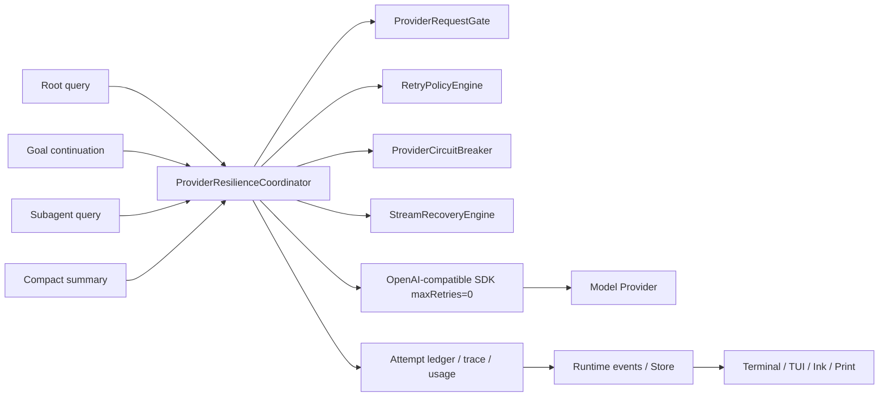
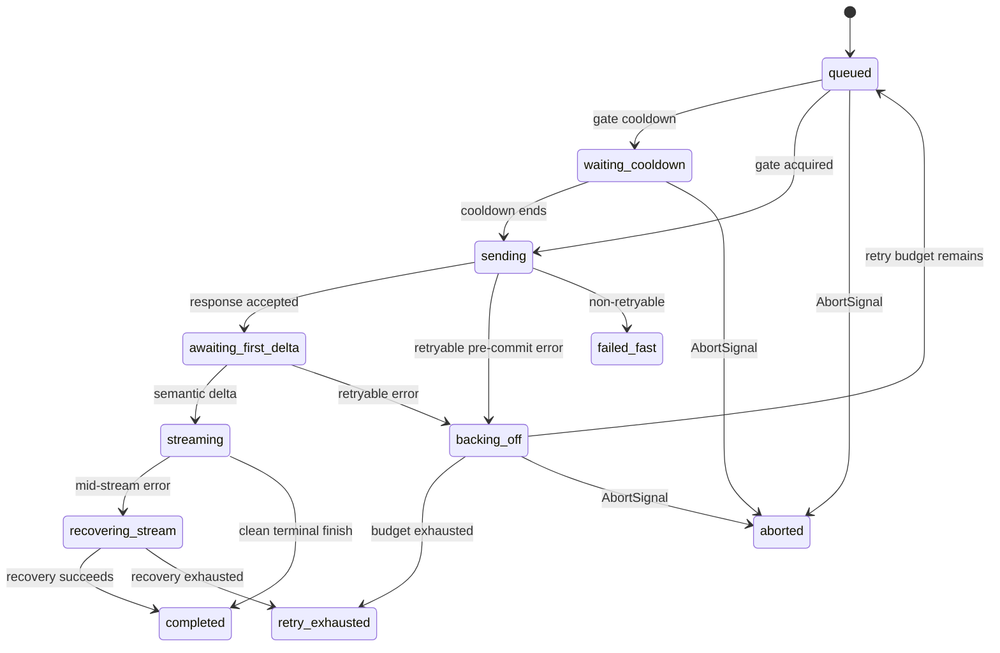

# OpenHorse v0.2.25 Provider 请求韧性与流式安全重试计划

> 版本：v0.2.25
>
> 文档状态：Draft / Implementation Ready
>
> 调研日期：2026-07-21
>
> 前置基线：v0.2.23、v0.2.24 完成并合入后实施
>
> 目标读者：承担架构、开发、测试、CR 和发布验证的 Coding Agent
>
> 版本主题：单次基模 API 临时故障不能直接中断 Agent；重试不能制造重复输出、重复工具调用、重试风暴或虚假计费

## 1. Summary

v0.2.25 将 OpenHorse 现有的局部 Provider 重试升级为统一的 **Provider Request Resilience Layer**。所有根 Agent、目标模式 continuation、子 Agent、Compact 摘要和其他 LLM 请求经过同一个可中断、可观测、有限重试的协调器。

推荐方案不是简单增加 `maxRetries`，而是：

1. **单一重试所有者**：关闭 OpenAI SDK 内置重试，由 OpenHorse 统一决定是否、何时以及以哪个模型重试。
2. **总尝试次数有限**：默认最多 3 次 HTTP attempt，即首次请求 + 最多 2 次重试，而不是“SDK 2 次 × OpenHorse 4 次”。
3. **错误分类驱动**：只重试连接错误、超时、明确可重试的 408/409/429/5xx/529；认证、权限、余额、模型不存在、非法请求和 context overflow 不盲目重放。
4. **流式提交边界**：首个语义 delta 前可透明重试；正文已经展示后不能从头重放同一请求。
5. **流式恢复**：发生 mid-stream 错误时，以已接收的部分正文构造一次受控 continuation recovery，并在输出边界去重；不执行任何不完整 tool call。
6. **共享限流门**：根 Agent、子 Agent、Compact 共享 Provider cooldown 和并发门，避免多个 LLMService 同时撞击 429。
7. **熔断与半开探测**：连续逻辑请求失败后暂停新请求，只允许一个 half-open probe，防止 Provider 故障时无限消耗。
8. **进程不退出**：重试耗尽只结束当前 turn，Runtime 回到可输入状态；Goal 模式进入 paused，不把临时 Provider 故障误判为目标完成或永久阻塞。
9. **准确可解释的计费**：区分逻辑模型请求与物理 Provider attempts；有 Provider usage 才记实际 tokens/cost，未知失败 attempt 单独标记，不能伪装成精确费用。
10. **Renderer 无决策权**：Terminal UI、TUI、Ink 和 Print 只渲染统一 retry/cooldown/recovery 事件，不自行重试。

## 2. 用户问题与版本目标

### 2.1 用户问题

当前用户体验中，基模某一次 API 请求出现临时网络错误、Provider busy 或流式中断时，整个 turn 可能失败并直接回到错误状态，长期目标也可能停止。用户无法判断系统是否尝试恢复，往往只能重新输入相同内容。

更严重的是，当前代码虽然已经有局部重试，但不能保证：

- 实际 HTTP 请求次数受控；
- 流式正文不重复；
- 子 Agent 不形成并发重试风暴；
- fallback 不污染后续 Session；
- 失败 attempt 的 usage/cost 不被忽略或双计；
- Ctrl+C 能同时取消请求和 backoff；
- 重试耗尽后 CLI 仍保持稳定可用。

### 2.2 v0.2.25 目标

做到：

```text
一次可恢复的基模 API 故障
        ↓
OpenHorse 自动判断错误类型
        ↓
遵守 Retry-After / 有抖动退避
        ↓
安全重试或流式恢复
        ↓
用户只看到一份连贯回复
        ↓
Agent turn、Goal、Session、usage 和 UI 状态保持一致
```

### 2.3 核心验收陈述

1. 首次请求返回 503，第二次成功：用户得到正常答案，Session 不断，UI 不出现重复正文。
2. SSE 已输出部分正文后连接断开：系统最多执行一次 stream recovery，只补充缺失后缀，不重放已有前缀。
3. 429 带 `Retry-After`：根 Agent 与子 Agent 共享等待窗口，不并发抢跑。
4. 429 `insufficient_quota`：不重试，直接给出可行动错误。
5. Ctrl+C 发生在请求或 backoff 中：立即取消，不再发下一 attempt。
6. 重试耗尽：当前 turn 标记 `retry_exhausted`，CLI 返回输入状态，不退出进程。
7. Goal 模式重试耗尽：Goal 进入 paused，用户恢复 Provider 后可 `/target resume`。
8. 所有 retry attempts、Provider request IDs、延迟和失败类型可从 `/status` 或 `/trace` 解释，但不泄露 prompt、key 或原始敏感错误。

## 3. 当前实现审计

### 3.1 已有能力

OpenHorse 当前并非完全没有重试：

- `src/services/llm.ts` 有 `withRetry()`；
- 默认外层 `maxRetries = 3`、base delay 500ms、max delay 10s；
- 已分类 rate limit、provider busy、quota、auth、model not found 等错误；
- 支持 `Retry-After` 的整数秒读取；
- backoff 可以被 `AbortSignal` 中断；
- 429/529 连续失败后可切换 fallback model；
- `LoopStats`、Session trace 和 `/status` 已包含部分 retry/fallback diagnostics；
- 子 Agent 有独立 `SubagentProviderGate`，支持 FIFO concurrency 和 cooldown；
- CostTracker/usage state 已能基于 Provider request ID 去重成功 usage。

这些能力应迁移和收敛，不应全部推翻重写。

### 3.2 已确认缺口

#### 缺口 A：SDK 与 OpenHorse 双层重试

当前 `new OpenAI(...)` 没有设置 `maxRetries: 0`。安装的 OpenAI SDK 默认自行重试 2 次；OpenHorse `chatStream()` 外层又允许最多 3 次 retry。

理论最坏物理请求数：

```text
(1 次首次请求 + 3 次 OpenHorse retry)
×
(1 次 SDK 请求 + 2 次 SDK retry)
= 12 HTTP attempts
```

这会放大：

- 429/5xx 压力；
- 用户等待时间；
- Provider 可能计费；
- request ID 数量；
- 根/子 Agent 并发重试风暴。

#### 缺口 B：非流式和流式策略不一致

- `chatStream()` 走 OpenHorse 外层 retry；
- `chat()` 没走同一重试策略，只依赖 SDK 隐式行为；
- Compact summary 使用 `chat()`，无法获得与根 Agent 相同的 diagnostics、cooldown 和 policy；
- 子 Agent 创建独立 LLMService，mutable fallback/retry state 不共享。

#### 缺口 C：mid-stream 从头重试会重复正文

当前 `withRetry()` 包住完整 `for await (const chunk of stream)`。如果流已经通过 `onChunk()` 输出部分正文后异步迭代器抛错，外层会重新发起完整请求。

第二个 attempt 的本地 `content` 会清零，但第一个 attempt 的 chunk 已经进入 UI，因此可能出现：

- 重复开头；
- 两个 attempt 的不同回答拼接；
- Markdown/code fence 损坏；
- TUI/Terminal transcript 与最终 `LLMResponse.content` 不一致；
- 用户看到内容，但 Session 未持久化该部分内容。

#### 缺口 D：fallback 是 LLMService 全局 mutable 状态

当前 fallback 会修改 `this.config.model` 和 `usingFallback`。这意味着一次请求的错误可能改变同一 LLMService 后续所有请求的模型，且 `consecutive529Errors` 是跨逻辑请求的共享计数。

风险：

- 不同 Session 的失败互相污染；
- 成功后何时回主模型不明确；
- diagnostics 只能读取“最后一次请求”，并发时可能错配；
- fallback model 与原模型的 context/output 上限可能不同。

#### 缺口 E：错误类型不足以支持精确策略

当前 `ProviderErrorType` 尚未显式区分：

- user abort 与 timeout；
- connect timeout、read timeout、socket reset；
- context overflow；
- request too large；
- content/safety policy；
- malformed response；
- stream interrupted after HTTP 200；
- retry exhausted；
- SDK internal retry；
- Provider 明确 `x-should-retry: false`。

#### 缺口 F：Retry-After 解析不完整

当前只在 `OpenAI.APIError` 上读取整数秒形式的 `retry-after`，未统一支持：

- 普通对象或兼容 Provider headers；
- `retry-after-ms`；
- 浮点秒；
- HTTP-date；
- 不合理的超长/负值；
- Provider reset headers；
- 共享 cooldown 广播。

#### 缺口 G：请求次数、重试次数和 usage 语义混合

当前 LoopStats 的 `llmRequests` 更接近 Agent 逻辑请求，而 Provider retry 是附加字段。v0.2.25 必须明确区分：

```text
logical LLM request
provider HTTP attempt
retry attempt
stream recovery request
fallback attempt
```

否则 loop budget、Goal token budget、日志和用户对成本的理解都会失真。

## 4. 官方行为依据

本计划使用 Provider 官方文档，不依赖第三方博客：

- [OpenAI Node SDK retries](https://github.com/openai/openai-node#retries)：SDK 默认重试 2 次，覆盖连接错误、408、409、429 和 5xx，可通过 `maxRetries` 关闭。
- [OpenAI Node SDK request IDs](https://github.com/openai/openai-node#request-ids)：成功响应和异常可提供 Provider request ID，应用应保留用于诊断。
- [Anthropic API errors](https://docs.anthropic.com/en/api/errors)：500 建议指数退避，529 表示 overloaded；官方 SDK 对连接、rate limit、5xx 默认重试 2 次。
- [Anthropic mid-stream errors](https://docs.anthropic.com/en/api/errors)：SSE 返回 200 后仍可能出现 error event，不能只按普通 HTTP 状态处理。
- [Anthropic rate limits](https://docs.anthropic.com/en/api/rate-limits)：429 返回 `retry-after`，早于该时间重试仍会失败。
- [Google Generative AI API errors](https://docs.cloud.google.com/vertex-ai/generative-ai/docs/model-reference/api-errors)：429/500/503 可能是临时容量问题，建议有限次数、指数退避，避免流量尖峰。

### 4.1 从官方行为得到的设计结论

1. SDK 重试和应用重试不能同时作为 owner。
2. 429 不是单一语义，quota/credit 与临时 rate limit 必须分开。
3. `Retry-After` 优先于本地 backoff。
4. 200/SSE 后发生的错误属于流式阶段错误，不能按“请求尚未开始”处理。
5. request ID 是诊断证据，但不是通用的幂等保障。
6. 生成式 POST 请求的重试可能产生额外计费；无 Provider usage 时不能声称成本精确。

## 5. 范围

### 5.1 P0 必须完成

- 关闭 SDK 内置 retry；
- 统一流式与非流式请求执行器；
- 结构化 Provider failure taxonomy；
- 有限 attempt、equal-jitter backoff、Retry-After；
- pre-commit 透明 retry；
- mid-stream text recovery；
- 不完整 tool call 隔离；
- Runtime 共享 request gate/cooldown；
- 根 Agent、子 Agent、Compact 共用策略；
- circuit breaker；
- AbortSignal 全链路；
- retry/fallback/recovery diagnostics；
- 重试耗尽后 Runtime 不退出；
- Goal 模式协同；
- Terminal/TUI/Ink/Print event parity；
- 单元、集成、故障注入和 PTY 验收。

### 5.2 P1 建议完成

- `/retry` 手动重试最近失败 turn；
- Provider profile 动态并发降低；
- 持久 RetryTicket，支持进程重启后恢复失败 turn；
- Provider-specific rate-limit reset header adapters；
- 跨进程共享 cooldown；
- fallback provider 而不只是同 endpoint 的 fallback model；
- retry dashboard/metrics export。

### 5.3 非目标

- 对 file write、shell、git push 等有副作用工具自动重试；
- 对 MCP、Web 搜索和任意第三方工具统一套用 LLM retry policy；
- 无限重试直到 Provider 恢复；
- 为了成功而自动更换用户未配置的 Provider；
- 把认证、余额或非法请求伪装成临时错误；
- 通过重试绕过 permission、安全策略或内容政策；
- 保证失败 attempt 不被 Provider 计费；
- 在 UI renderer 内实现定时器或 retry loop。

## 6. 设计原则

### 6.1 单一所有者

OpenHorse 自己拥有 retry policy，SDK 只做 HTTP/SSE transport：

```ts
new OpenAI({
  apiKey,
  baseURL,
  timeout,
  maxRetries: 0,
});
```

所有 attempts 必须经过 `ProviderResilienceCoordinator`，不允许某个调用点额外再包一层 `for retry`。

### 6.2 有限恢复，不保证永不失败

重试的目标是吸收瞬时故障，不是掩盖长期故障。默认策略：

```text
max total attempts: 3
max ordinary retries: 2
max mid-stream recoveries: 1
max elapsed retry window: 90s
```

超过边界后稳定停止，返回可行动状态。

### 6.3 流式提交后不盲目重放

一旦正文或 tool-call delta 到达，Provider 已经开始产生语义响应。之后的恢复必须携带 partial state，并经过边界去重或重新生成完整 tool call，不能简单调用原 request。

### 6.4 工具副作用只发生在完整响应之后

Provider retry/recovery 期间：

- 不执行 partial tool call；
- 不持久化 incomplete assistant tool-call message 到模型历史；
- 不创建 tool result；
- 只有完整、验证通过的最终 `LLMResponse.toolCalls` 才进入 scheduler。

### 6.5 显式未知比虚假精确更重要

失败 attempt 若 Provider 未返回 usage：

- 记录 request/attempt 发生；
- 记录 estimated prompt tokens 作为诊断；
- 不把估算值写入 `actualCostUsd`；
- 将 cost confidence 标为 `partial` 或 `unknown`。

## 7. 总体架构

### 7.1 组件图



### 7.2 Runtime ownership

`ProviderResilienceCoordinator` 应由 Runtime/bootstrap 创建，并注入所有 LLMService：

```ts
const resilience = new ProviderResilienceCoordinator(config.providerResilience);

const rootLlm = new LLMService(llmConfig, { resilience });
const childLlm = new LLMService(llmConfig, { resilience });
```

要求：

- 同一 OpenHorse Runtime 和 Provider profile 共享 gate/circuit；
- 不使用进程全局 singleton；
- 不在每个 child 内创建独立 cooldown；
- test 可注入 clock、random、timer 和 transport；
- 多 Provider profile 按安全 provider key 隔离。

### 7.3 Provider key

```ts
interface ProviderKey {
  providerFamily: string;
  normalizedEndpoint: string;
  accountScopeId?: string;
  modelGroup?: string;
}
```

`accountScopeId` 只能使用配置生成的不可逆短 hash，不能记录 API key。Rate limit 若是 account-wide，gate key 不应只按 model 隔离。

## 8. 数据契约

### 8.1 Request context

```ts
export type ProviderOperation =
  | 'root_chat'
  | 'goal_continuation'
  | 'subagent_chat'
  | 'compact_summary'
  | 'session_summary'
  | 'doctor_probe';

export interface ProviderRequestContext {
  logicalRequestId: string;
  sessionId?: string;
  turnId?: string;
  goalId?: string;
  subtaskId?: string;
  operation: ProviderOperation;
  providerKey: string;
  requestedModel: string;
  abortSignal?: AbortSignal;
  estimatedPromptTokens?: number;
}
```

### 8.2 Failure taxonomy

```ts
export type ProviderFailureKind =
  | 'aborted'
  | 'connect_timeout'
  | 'read_timeout'
  | 'connection_reset'
  | 'network_error'
  | 'rate_limit'
  | 'provider_overloaded'
  | 'server_error'
  | 'conflict'
  | 'auth_failed'
  | 'permission_denied'
  | 'quota_or_credit_exhausted'
  | 'model_not_found'
  | 'invalid_endpoint'
  | 'invalid_request'
  | 'context_overflow'
  | 'request_too_large'
  | 'content_policy'
  | 'malformed_response'
  | 'stream_interrupted'
  | 'unknown';

export type RetryDisposition =
  | 'retry_precommit'
  | 'recover_stream'
  | 'compact_then_rebuild'
  | 'fallback_once'
  | 'defer_until_cooldown'
  | 'fail_fast';
```

### 8.3 Attempt record

```ts
export interface ProviderAttemptRecord {
  attemptId: string;
  logicalRequestId: string;
  attemptNumber: number;
  model: string;
  startedAt: number;
  endedAt: number;
  providerRequestId?: string;
  status?: number;
  failureKind?: ProviderFailureKind;
  retryDisposition?: RetryDisposition;
  retryAfterMs?: number;
  backoffMs?: number;
  semanticDeltaSeen: boolean;
  visibleTextBytes: number;
  toolCallDeltaSeen: boolean;
  terminalFinishReasonSeen: boolean;
  outcome: 'succeeded' | 'failed' | 'aborted' | 'recovered' | 'superseded';
  usage?: LLMUsage;
}
```

### 8.4 Request diagnostics

```ts
export interface ProviderRequestDiagnosticsV2 {
  logicalRequestId: string;
  operation: ProviderOperation;
  requestedModel: string;
  finalModel?: string;
  finalState:
    | 'succeeded'
    | 'recovered'
    | 'retry_exhausted'
    | 'failed_fast'
    | 'aborted'
    | 'circuit_open';
  attempts: ProviderAttemptRecord[];
  retryCount: number;
  recoveryCount: number;
  fallbackCount: number;
  totalBackoffMs: number;
  sdkRetriesDisabled: true;
  usageConfidence: 'exact' | 'partial' | 'unknown';
  unknownBilledAttemptCount: number;
}
```

## 9. Error policy matrix

| 错误 | 默认行为 | 可重试阶段 | 说明 |
|---|---|---|---|
| user abort / 499 | fail fast | never | 用户取消优先，不得自动恢复 |
| connection reset / EPIPE | retry | pre-commit | mid-stream 走 recovery |
| connect/read timeout | retry | pre-commit | 遵守总 elapsed budget |
| HTTP 408 | retry | pre-commit | 临时 request timeout |
| HTTP 409 | retry | pre-commit | 仅 Provider 明确可重试的冲突 |
| HTTP 429 rate limit | retry/defer | pre-commit | 必须排除 quota/credit；优先 Retry-After |
| HTTP 500/502/503/504 | retry | pre-commit | equal-jitter backoff |
| HTTP 529 / overloaded | retry | pre-commit | 进入共享 cooldown，可 fallback |
| HTTP 400 invalid request | fail fast | never | 同 payload 重试没有意义 |
| context overflow | compact + rebuild once | new logical payload | 不是相同请求 transport retry |
| HTTP 401/403 | fail fast | never | 配置/权限问题 |
| HTTP 404 model not found | fail fast | never | 除非显式 fallback model 存在且校验通过 |
| 413 request too large | fail fast | never | 需要缩小请求，不是重试 |
| quota/credit exhausted | fail fast | never | 即使 HTTP status 是 429 也不能重试 |
| content/safety policy | fail fast | never | 不绕过 Provider policy |
| malformed response before delta | retry once | pre-commit | 可能是网关临时损坏 |
| SSE error after partial text | recover once | mid-stream | 以 partial assistant continuation 恢复 |
| SSE error with partial tool call | regenerate tool call | mid-stream | 丢弃不完整 tool delta，不执行 |
| stream ended after terminal finish, usage trailer missing | accept | committed | 返回语义结果，usage confidence 降级 |
| unknown | conservative | pre-commit max once | mid-stream 默认不盲目重放 |

### 9.1 Provider override signals

Policy engine 应优先解析：

- `x-should-retry: true|false`；
- SDK/API typed error；
- status/code/type；
- `Retry-After`；
- Provider-specific error code；
- 最后才使用经过脱敏的 message pattern。

字符串匹配只作为 OpenAI-compatible 网关兼容层，不能覆盖明确 typed signal。

## 10. Retry 状态机

### 10.1 状态

```ts
type ProviderRequestState =
  | 'queued'
  | 'waiting_cooldown'
  | 'sending'
  | 'awaiting_first_delta'
  | 'streaming'
  | 'recovering_stream'
  | 'backing_off'
  | 'completed'
  | 'retry_exhausted'
  | 'failed_fast'
  | 'aborted';
```

### 10.2 基本流程



### 10.3 不变量

1. 每个 logical request 同时最多一个 active attempt。
2. attempt number 单调递增，不超过 policy max total attempts。
3. abort 后不得启动任何新 attempt。
4. `onChunk` 已展示的文本不能通过重放再次提交。
5. partial tool call 永远不能进入 ToolScheduler。
6. terminal finish reason 已确认后，usage trailer 缺失不能导致完整语义响应被重放。
7. fallback 不修改 LLMService 的全局 model 配置。
8. circuit open 时不消耗 ordinary retry budget。
9. 所有 timer、queue waiter 和 abort listener 在终态清理。

## 11. Backoff 与 Retry-After

### 11.1 默认参数

```ts
export const DEFAULT_PROVIDER_RESILIENCE_CONFIG = {
  enabled: true,
  maxTotalAttempts: 3,
  baseDelayMs: 500,
  maxDelayMs: 8_000,
  minRateLimitDelayMs: 2_000,
  maxRetryAfterMs: 60_000,
  maxElapsedMs: 90_000,
  maxStreamRecoveries: 1,
  circuitFailureThreshold: 5,
  circuitWindowMs: 60_000,
  circuitCooldownMs: 30_000,
};
```

### 11.2 Equal jitter

避免 full jitter 产生接近 0 的延迟：

```ts
cap = min(maxDelayMs, baseDelayMs * 2 ** (retryNumber - 1));
delay = cap / 2 + random(0, cap / 2);
```

429 没有 Retry-After 时：

```ts
delay = max(delay, minRateLimitDelayMs);
```

### 11.3 Retry-After 解析优先级

1. `retry-after-ms` 毫秒；
2. `retry-after` 浮点/整数秒；
3. `retry-after` HTTP-date；
4. Provider adapter 提供的 reset timestamp；
5. 本地 equal-jitter backoff。

规则：

- 非法、负数和 NaN 忽略；
- 合理范围内至少等待 Provider 指定时间；
- 大于 60 秒时进入共享 cooldown，不在单个 request 内静默 sleep 很久；
- cooldown 可被 Ctrl+C 取消当前 waiter，但不会清除 Provider 全局 cooldown；
- 多个 Retry-After 只延长 cooldown，不缩短已有更长窗口。

## 12. Stream-safe recovery

### 12.1 Stream attempt state

```ts
interface StreamAttemptState {
  attemptId: string;
  text: string;
  visibleTextBytes: number;
  semanticDeltaSeen: boolean;
  toolCallDeltaSeen: boolean;
  partialToolCalls: Map<number, PartialToolCall>;
  providerRequestId?: string;
  finishReason?: string;
  usage?: LLMUsage;
}
```

### 12.2 Commit boundary

以下任一出现即视为 semantic stream 已开始：

- 非空 text/content delta；
- reasoning/thinking semantic delta；
- tool call id/name/arguments delta；
- Provider-specific message delta。

首个 semantic delta 之前发生的可重试错误可以重新发送原 payload。之后只能走 stream recovery。

### 12.3 文本流恢复

mid-stream text error 的 recovery request：

1. 保留原始 messages；
2. 追加 ephemeral partial assistant text；
3. 注入内部恢复指令；
4. 请求模型从截断处继续，不重复完整答案；
5. 暂存 recovery 的起始文本窗口；
6. 使用 `StreamOverlapReconciler` 消除重复前缀；
7. 只向 UI 输出新后缀；
8. 最终将原 partial text + recovery suffix 合成为一个 assistant response。

内部恢复指令示例：

```text
[Internal Stream Recovery]
The previous assistant response was interrupted by a transport failure.
Continue from the exact partial assistant content supplied above.
Do not repeat content already present.
Do not claim that the user sent a new request.
If a tool is still needed, emit a fresh complete tool call.
```

该指令：

- 不持久化为 user message；
- 不显示在 transcript；
- 低于 system/developer/repository rules；
- 不能改变 Goal objective；
- 不增加一个 Agent logical turn。

### 12.4 Overlap 去重

`StreamOverlapReconciler` 在 recovery 最初若干字符到达前暂存，寻找：

```text
max suffix(previousText) == prefix(recoveryText)
```

建议边界：

- 最大比较窗口 2,048 UTF-16 code units；
- CJK/emoji 按 grapheme-safe slicing；
- 优先按行和 token-like boundary，再按字符；
- 无可信 overlap 时不删除内容，只插入一次内部 recovery boundary event；
- 不能使用模糊相似度删除可能真实的新内容。

### 12.5 Partial tool call

如果失败 attempt 包含 tool-call delta：

- 丢弃所有 partial tool calls；
- 不构造 assistant tool-call history；
- 不执行任何工具；
- recovery request 只携带已经展示的纯文本；
- 要求模型输出一个新的完整 tool call；
- 新 tool call 使用 Provider 返回的新 ID；
- 若 recovery 仍给出 malformed tool call，则 turn 失败，不无限修补 JSON。

### 12.6 已完成语义但 usage trailer 丢失

若已经看到 terminal finish reason，且 text/tool calls 完整，只在尾部 usage chunk 前断开：

- 接受该语义响应；
- 不从头重试；
- `usageConfidence = partial|unknown`；
- 使用本地估算更新 context safety snapshot，但不写入 actual billed cost；
- trace 标记 `usage_trailer_missing`；
- tool calls 仍可在完整结构验证后执行。

## 13. Shared Provider Request Gate

### 13.1 从 Subagent gate 收敛

将 `SubagentProviderGate` 的 FIFO semaphore、abort waiter 和 cooldown 能力迁移为通用 `ProviderRequestGate`：

```ts
interface ProviderRequestGate {
  acquire(request: GateRequest): Promise<GateLease>;
  enterCooldown(providerKey: string, until: number, reason: string): void;
  snapshot(providerKey: string): ProviderGateSnapshot;
}
```

`SubagentProviderGate` 在一个版本内保留兼容 wrapper，随后删除，避免大范围同步重构。

### 13.2 请求优先级

建议优先级：

1. `stream_recovery`：正在回答用户的中断流；
2. `root_chat` / `goal_continuation`：主工作流；
3. `compact_summary`：保证 context 安全，但避免抢占正在进行的回答；
4. `subagent_chat`：可排队且可降并发；
5. `doctor_probe`：最低优先级。

必须使用有界公平策略，不能让持续 root requests 永久饿死 child，也不能让 child 占满所有 Provider slots。

### 13.3 Cooldown 广播

任一请求确认 429/529 + Retry-After 后：

- 更新该 provider key 的 cooldown；
- 新 root/child/compact attempts 进入可中断等待；
- 已在运行的请求不强制 abort；
- UI 只显示一个聚合 cooldown 状态；
- trace 记录来源 attempt 和截止时间；
- 不让每个 child 独立打印相同 429。

## 14. Circuit breaker

### 14.1 状态

```ts
type CircuitState = 'closed' | 'open' | 'half_open';
```

### 14.2 默认策略

- 统计 logical request 的最终结果，不统计每个内部 attempt；
- 60 秒窗口内连续 5 个 retry-exhausted logical failures 后 open；
- 默认 cooldown 30 秒，Provider Retry-After 更长时使用更长窗口；
- open 期间快速返回 `circuit_open`，不发送 HTTP 请求；
- cooldown 到期后只允许一个 half-open probe；
- probe 成功则 closed，并清零连续失败；
- probe 失败则重新 open；
- auth/quota/config error 不进入 transient circuit，而是形成 terminal provider diagnostic；
- user abort 不算 Provider failure。

### 14.3 与 Goal 模式协同

Circuit open 时：

- 不启动新的 Goal automatic continuation；
- active Goal 转为 paused，stop reason 为 provider circuit open；
- 不标记 blocked/complete；
- half-open probe 由用户 `/target resume` 或普通新请求触发；
- 不使用后台无限 timer 自动唤醒 Goal。

## 15. Fallback policy

### 15.1 请求级 fallback

fallback 不再修改 `this.config.model`：

```ts
interface AttemptPlan {
  model: string;
  isFallback: boolean;
  routeIndex: number;
}
```

每个 logical request 生成自己的 route plan。

### 15.2 触发条件

允许 fallback：

- primary model 的 rate limit/provider overloaded/server error 重试耗尽；
- primary model not found 且用户显式配置 fallback；
- fallback model 的 context/output capability 能满足当前请求；
- fallback 未超过一次。

禁止 fallback：

- auth/permission/quota 失败且 fallback 仍使用同账号；
- invalid request/context overflow/request too large；
- content policy；
- user abort；
- fallback 未配置；
- 已有 partial tool call 无法安全恢复。

### 15.3 同 Provider 限流

当前 `fallbackModel` 通常仍使用相同 base URL。若 429 是 account-wide：

- fallback 也必须遵守共享 cooldown；
- 不能把换模型当成绕过 Retry-After；
- diagnostics 明确 fallback 是否同 provider/profile。

## 16. Runtime 和 Agent loop 集成

### 16.1 `query()` 语义

一个 Provider retry attempt：

- 不增加 Agent `turnsStarted`；
- 不增加 logical `llmRequests`；
- 增加 `providerAttempts`；
- 增加 `providerRetryCount`（首次 attempt 除外）；
- 计入 Provider retry elapsed；
- 若有实际 usage，计入 usage ledger；
- 不触发新的 tool loop iteration。

建议扩展 `LoopStats`：

```ts
interface LoopStats {
  // existing fields...
  providerAttempts?: number;
  providerRetryCount?: number;
  providerRecoveryCount?: number;
  providerUnknownBilledAttempts?: number;
  providerTotalBackoffMs?: number;
  providerFinalState?: string;
  providerCircuitState?: string;
}
```

### 16.2 重试耗尽

重试耗尽不抛到 CLI 顶层导致进程退出：

```ts
class ProviderRetryExhaustedError extends LLMProviderError {
  diagnostics: ProviderRequestDiagnosticsV2;
  recoverableTurnFailure = true;
}
```

`AgentChatController` 捕获后：

1. 记录当前 turn failed；
2. 持久化 safe trace 和 partial transcript metadata；
3. 清理 processing/streaming 状态；
4. 返回 Runtime idle；
5. 输入框可继续使用；
6. 展示一次简洁、可行动提示；
7. 不追加模型可见的伪用户 error message。

### 16.3 Context overflow

Context overflow 不重放相同 payload：

1. 错误分类为 `context_overflow`；
2. 调用 Agent Core CompactCoordinator；
3. 成功后重新 assemble prompt；
4. 创建新的 logical request ID；
5. 最多自动恢复一次；
6. Compact 失败则稳定终止 turn。

该路径属于 context recovery，不计入 ordinary transport retry。

### 16.4 Goal v0.2.24 集成

- retry attempts 属于同一个 goal turn；
- stream recovery 不增加 continuationCount；
- retry 实际 usage 计入 Goal usage；
- unknown failed attempt 只增加 unknown billed count；
- retry exhausted/circuit open 将 Goal pause；
- Provider 临时错误不能触发 3-turn semantic blocker count；
- `/target resume` 后创建新 logical request，而不是恢复旧 socket；
- budget exhausted 时不得因为 retry 失败标记 complete。

## 17. Partial transcript 与 Session

### 17.1 成功 recovery

成功时只保存合成后的单个 assistant message：

```text
original partial text + deduplicated recovery suffix
```

不保存内部 recovery instruction，也不保存失败 attempt 的 partial tool call。

### 17.2 recovery 最终失败

为了审计用户已经看到的内容，可以为 transcript 记录：

```ts
interface SessionMessage {
  // existing fields...
  interrupted?: boolean;
  modelHistoryEligible?: boolean;
  logicalRequestId?: string;
}
```

规则：

- `interrupted: true`；
- `modelHistoryEligible: false`；
- 不包含 tool calls；
- Resume transcript 可以显示“response interrupted”；
- 下一次模型请求不把该消息当作完整 assistant turn；
- 原始失败错误只保存脱敏摘要和 request ID。

若现有 Session schema 不适合扩展，则使用独立 runtime/trace event，不要把不完整 assistant message塞进模型历史。

## 18. Usage 与 cost

### 18.1 分层记账

```text
Agent logical request count
Provider physical attempt count
Provider-reported usage per attempt
Actual cost when provider reports it
Unknown billed attempt count
Estimated prompt tokens for safety only
```

### 18.2 规则

- 同一 provider request ID 的 usage 只记一次；
- 不同 retry attempt 的不同 request ID 各自记账；
- 失败 attempt 返回 usage 时也必须记账；
- 失败 attempt 不返回 usage 时不得写 actual cost；
- stream recovery 是新 Provider attempt，usage 单独记录；
- CostTracker 汇总 actual known cost；
- `/status` 显示 known cost confidence，而不是把估算伪装为准确；
- UI 不需要实时持续显示 cost；retry 只显示状态和 attempt 信息；
- Goal token budget 使用 Provider-reported usage；未知失败 attempt 进入风险提示，不偷偷估算扣减 actual budget。

### 18.3 Request ID

每个 logical request 生成本地 UUID，每个 attempt 收集 Provider request ID：

```text
logicalRequestId: lr_...
attempt 1: req_provider_a
attempt 2: req_provider_b
```

本地 logical ID 用于关联，不等同 Provider 幂等键。除非 Provider 明确支持，不发送通用 `Idempotency-Key` 并假设可以避免重复计费。

## 19. Runtime events 与 UI

### 19.1 统一事件

```ts
type RuntimeProviderEvent =
  | {
      type: 'provider_retry_scheduled';
      logicalRequestId: string;
      attempt: number;
      maxAttempts: number;
      delayMs: number;
      failureKind: ProviderFailureKind;
    }
  | {
      type: 'provider_retry_started';
      logicalRequestId: string;
      attempt: number;
      model: string;
    }
  | {
      type: 'provider_stream_recovery_started';
      logicalRequestId: string;
      receivedBytes: number;
    }
  | {
      type: 'provider_recovered';
      logicalRequestId: string;
      attempts: number;
      recoveryUsed: boolean;
    }
  | {
      type: 'provider_retry_exhausted';
      logicalRequestId: string;
      attempts: number;
      failureKind: ProviderFailureKind;
    }
  | {
      type: 'provider_cooldown_changed';
      providerKey: string;
      until?: number;
      reason?: string;
    }
  | {
      type: 'provider_circuit_changed';
      providerKey: string;
      state: 'closed' | 'open' | 'half_open';
    };
```

### 19.2 UI 原则

- renderer 不执行 timer，不调用 retry；
- retry 等待期间 input/Ctrl+C 仍可用；
- 同一 retry 状态更新同一 live row，不向 transcript 连续追加多行；
- recovery 成功后最多追加一条聚合 system 记录；
- error 文案不展示 API key、完整 endpoint query、prompt 或 raw body；
- 颜色不是唯一状态信号；
- Terminal、TUI、Ink、Print 使用相同 attempt/maxAttempts。

### 19.3 Terminal UI

等待示例：

```text
provider  temporary overload · retry 2/3 in 1.8s · Ctrl+C cancels
```

恢复后：

```text
provider  recovered after 1 retry (2.1s)
```

要求：

- live status 更新不能污染 shell-native scrollback；
- retry 期间不破坏 multiline draft；
- 窗口 resize/切换后状态不重复；
- 重试耗尽后 editor 恢复；
- partial stream recovery 不重复已打印内容。

### 19.4 TUI / Ink

- 复用 processing/status surface；
- retry/cooldown/circuit 是结构化状态；
- 不新增嵌套卡片；
- stream recovery 保持同一 assistant live entry；
- retry exhausted 把 live entry 结束为 error/interrupted；
- input ownership 不被 provider event 抢走。

### 19.5 Print

- 非交互 Print 同样执行有限 retry；
- backoff 不读取 stdin；
- retry exhausted 使用稳定非零 exit code；
- JSON 模式输出最终 diagnostics summary；
- 不输出每个 stream delta 的内部 recovery instruction。

## 20. 配置

### 20.1 配置结构

```ts
interface ProviderResilienceConfig {
  enabled: boolean;
  maxTotalAttempts: number;
  baseDelayMs: number;
  maxDelayMs: number;
  minRateLimitDelayMs: number;
  maxRetryAfterMs: number;
  maxElapsedMs: number;
  maxStreamRecoveries: number;
  circuitFailureThreshold: number;
  circuitWindowMs: number;
  circuitCooldownMs: number;
}
```

### 20.2 安全边界

- `maxTotalAttempts` 限制在 1..5；
- `maxStreamRecoveries` 限制在 0..1；
- `maxElapsedMs` 设置硬上限；
- 配置错误回退默认值并发 warning；
- 不支持 `maxRetries = Infinity`；
- Provider adapter 可降低 retry，不可超过全局硬上限；
- `openhorse doctor` 展示有效策略和 SDK retry 是否关闭。

### 20.3 向后兼容

- 现有 `LLMConfig.timeout/fallbackModel` 保留；
- 旧配置无需增加字段即可使用安全默认值；
- `LLMRequestDiagnostics` 通过 V2 additive fields 兼容旧消费者；
- `SubagentProviderGate` 暂时保留 deprecated adapter；
- 现有 trace reader 忽略未知 event types。

## 21. 文件级实施方案

### 21.1 新增模块

```text
src/services/provider-resilience/types.ts
src/services/provider-resilience/error-classifier.ts
src/services/provider-resilience/retry-after.ts
src/services/provider-resilience/retry-policy.ts
src/services/provider-resilience/request-gate.ts
src/services/provider-resilience/circuit-breaker.ts
src/services/provider-resilience/stream-recovery.ts
src/services/provider-resilience/coordinator.ts
src/services/provider-resilience/index.ts
```

可选 P1：

```text
src/commands/retry-command.ts
src/runtime/provider-retry-ticket.ts
```

### 21.2 现有文件修改

```text
src/services/llm.ts
src/services/provider-diagnostics.ts
src/services/config.ts
src/services/yaml-config.ts
src/services/session-storage.ts
src/services/cost-tracker.ts
src/services/usage-state.ts
src/services/compact/summary-generator.ts
src/framework/query.ts
src/framework/store.ts
src/runtime/chat-controller.ts
src/runtime/agent-runtime-protocol.ts
src/runtime/agent-runtime-controller.ts
src/runtime/ui-events.ts
src/runtime/subagents/provider-gate.ts
src/runtime/subagents/production.ts
src/runtime/subagents/runtime-integration.ts
src/commands/status.ts                    # 以实际路径为准
src/commands/trace.ts                     # 以实际路径为准
src/terminal-ui/launch.ts
src/tui-ui/state.ts
src/ui/ink/*                              # 仅修改实际 event consumer
src/print-ui/launch.ts
src/cli.ts
```

开发前必须用 `rg` 确认命令和 renderer 的真实文件，不得照计划创建重复入口。

### 21.3 `llm.ts` 重构要求

`LLMService` 最终只负责：

- OpenAI-compatible message/tool 转换；
- 创建单次 transport attempt；
- 解析 stream chunks 和完整 response；
- 把 request context 交给 resilience coordinator；
- 返回统一 `LLMResponse`。

移出：

- `withRetry()`；
- 全局 `consecutive529Errors`；
- mutable fallback model；
- Retry-After 解析；
- retry policy；
- circuit/cooldown。

## 22. 分阶段实施

### Phase 0：Characterization tests

先用测试固定当前问题：

- SDK 默认 maxRetries 为 2；
- OpenHorse 外层 retry 会放大物理 attempts；
- mid-stream retry 重复 `onChunk`；
- `chat()` 与 `chatStream()` policy 不一致；
- child gate 不约束 root/compact；
- fallback 修改全局 model。

Gate：测试能够稳定复现缺陷，不依赖真实 Provider。

### Phase 1：错误模型与 policy

交付：

- V2 failure taxonomy；
- typed signal 优先级；
- Retry-After parser；
- equal jitter；
- policy matrix；
- deterministic fake clock/random tests。

Gate：每种 error 只得到一个明确 disposition。

### Phase 2：统一 coordinator，关闭 SDK retry

交付：

- `ProviderResilienceCoordinator`；
- OpenAI client `maxRetries: 0`；
- chat/chatStream/compact 统一执行路径；
- attempt ledger；
- total attempt 和 elapsed budget。

Gate：任一 logical request 的物理 attempts 不超过配置上限。

### Phase 3：stream-safe recovery

交付：

- stream attempt state；
- pre-commit retry；
- mid-stream continuation recovery；
- overlap reconciler；
- partial tool call isolation；
- terminal finish/usage trailer handling。

Gate：故障注入后 UI 和最终 response 都无重复前缀，工具最多执行一次。

### Phase 4：共享 gate 与 circuit breaker

交付：

- 通用 ProviderRequestGate；
- 子 Agent gate adapter；
- root/child/compact shared cooldown；
- priority/fair queue；
- circuit closed/open/half-open。

Gate：10 个并发 child 遇到同一 429 时不会各自独立重试。

### Phase 5：Runtime、Goal 和 UI

交付：

- runtime provider events；
- retry exhausted 不退出；
- Goal pause/resume 协同；
- Terminal/TUI/Ink/Print parity；
- Ctrl+C 清理；
- status/trace diagnostics。

Gate：所有 UI 都能看到同一 attempt 和 cooldown，且没有 UI 私有 timer。

### Phase 6：usage、cost 和 Session

交付：

- per-attempt request ID 和 usage；
- known/unknown cost confidence；
- partial transcript metadata；
- trace redaction；
- Session/Resume 兼容。

Gate：成功/失败/recovery/fallback usage 无双计，未知费用不伪装为准确。

### Phase 7：稳定性、CR 和本地部署

交付：

- full build/test/lint；
- fault injection；
- PTY；
- real Provider smoke；
- security/accounting/stream CR；
- `npm link` linked binary 验收；
- release readiness。

Gate：全部 P0 DoD 通过才允许进入发布流程。

## 23. 测试计划

### 23.1 单元测试

新增建议：

```text
tests/provider-error-classifier.test.ts
tests/provider-retry-after.test.ts
tests/provider-retry-policy.test.ts
tests/provider-request-gate.test.ts
tests/provider-circuit-breaker.test.ts
tests/provider-stream-recovery.test.ts
tests/provider-resilience-coordinator.test.ts
```

覆盖：

- 408/409/429/500/502/503/504/529；
- 429 rate limit vs insufficient quota；
- auth/model/context/request-too-large/content-policy；
- connection reset/connect timeout/read timeout；
- `x-should-retry true/false`；
- retry-after-ms、浮点秒、整数秒、HTTP-date；
- 非法/负数/超长 Retry-After；
- equal-jitter 范围；
- max attempts 和 max elapsed；
- abort during gate/backoff/stream；
- circuit open/half-open/close；
- FIFO、公平性和 listener cleanup。

### 23.2 LLM transport tests

更新 `tests/llm.test.ts` 与 `tests/llm-fallback.test.ts`：

1. OpenAI client 构造时 `maxRetries: 0`；
2. 首次 503、第二次成功，transport 总调用 2 次；
3. max total attempts 3 时绝不调用第 4 次；
4. non-stream chat 同样重试；
5. quota 429 只调用 1 次；
6. Retry-After 被遵守；
7. abort 后不再调用；
8. fallback 不修改下一 logical request 的 primary model；
9. Provider request IDs 全部保留；
10. diagnostics 与并发 logical request 不串线。

### 23.3 Stream recovery tests

必须覆盖：

- error before first delta -> 原请求透明 retry；
- partial text `abc` -> error -> recovery `abc def` -> UI 只新增 ` def`；
- CJK overlap；
- emoji/grapheme overlap；
- no trustworthy overlap 不错误删字；
- partial tool name/arguments -> error -> 不执行；
- recovery 给出完整 tool call -> 只执行一次；
- recovery 再次 mid-stream fail -> retry exhausted；
- terminal finish seen + usage trailer fail -> 接受 response；
- completed tool calls + usage trailer fail -> 工具结构保持完整；
- Markdown code fence 在 recovery 后保持可解析。

### 23.4 Runtime integration tests

新增建议：

```text
tests/provider-retry-runtime.test.ts
tests/provider-retry-goal.test.ts
tests/provider-retry-subagent.test.ts
tests/provider-retry-compact.test.ts
tests/provider-retry-renderer-parity.test.ts
tests/provider-retry-usage.test.ts
```

证明：

- retry 不增加 logical loop turn；
- root/child/compact 共享 cooldown；
- child 并发不会形成 storm；
- retry exhausted 回到 Runtime idle；
- input draft 保留；
- Goal paused 而不是 complete/blocked；
- `/target resume` 可重新请求；
- Compact retry 失败后 heuristic fallback 仍可工作；
- partial assistant 不进入 model history；
- Terminal/TUI/Ink/Print event 相同；
- session trace 无 raw prompt/key；
- actual usage/request ID 去重。

### 23.5 故障注入

Fake transport 应能精确编排：

```text
attempt 1: connect timeout
attempt 2: 429 Retry-After=2
attempt 3: success
```

以及：

```text
headers 200
chunk "正在处理"
chunk partial tool call
SSE error event
recovery success
```

每个测试必须断言：

- transport call count；
- timer delays；
- emitted chunks；
- final LLMResponse；
- tool execution count；
- diagnostics；
- listener/timer cleanup；
- Runtime final state。

### 23.6 PTY / 手工验收

Terminal UI：

- retry live status 不污染 scrollback；
- retry 中输入 multiline draft；
- Ctrl+C 立即取消；
- resize/切换窗口后状态行不重复；
- mid-stream recovery 后正文无重复；
- retry exhausted 后输入框可继续。

TUI：

- retry 状态与工具折叠共存；
- input ownership 稳定；
- live assistant entry 不复制；
- circuit/cooldown 不撑坏布局；
- 低高度/窄宽/CJK 正常。

真实 Provider smoke：

- 使用可控代理注入一次 502；
- 使用代理中断一次 SSE；
- 使用 fake 429 + Retry-After；
- 正常 Provider 请求验证没有额外 latency；
- 记录实际 request IDs，不记录 key。

## 24. Observability

### 24.1 Trace events

扩展 Session trace：

```text
provider_request_attempt
provider_retry_scheduled
provider_stream_interrupted
provider_stream_recovery
provider_cooldown
provider_circuit_state
provider_retry_exhausted
```

只持久化：

- logical/attempt IDs；
- Provider request ID；
- model label；
- status/failure kind；
- bytes/timing；
- delay/cooldown；
- usage metadata；
- final outcome。

禁止持久化：

- API key；
- Authorization header；
- 完整 prompt；
- 原始 response body；
- 未脱敏 endpoint query；
- partial tool arguments 原文。

### 24.2 `/status`

简洁展示最近逻辑请求：

```text
Provider   recovered · 2 attempts · 1.8s backoff · stream recovery=no
Circuit    closed
Usage      exact (2 provider request IDs)
```

### 24.3 `/trace`

完整展示每个 attempt 的安全诊断，但默认不在普通 UI 持续刷 retry 细节。

## 25. CR 清单

### 25.1 请求放大

- SDK `maxRetries` 是否真的为 0；
- 是否还有调用点自己包 retry；
- max total attempts 是总次数还是额外次数；
- fallback 是否额外越过 attempt 上限；
- root/child/compact 是否共享 cooldown；
- circuit 是否按 logical failure 而不是 attempt 计数。

### 25.2 流式正确性

- 首个 semantic delta 边界是否准确；
- 已展示文本是否可能重复；
- incomplete tool call 是否可能执行；
- finish reason 与 usage trailer 是否分开处理；
- recovery instruction 是否进入 transcript；
- overlap 是否可能误删真实内容；
- Markdown/CJK/emoji 是否安全。

### 25.3 并发和取消

- abort 是否清理 timer/waiter/listener；
- race：abort 与 retry timer 同时触发；
- race：circuit open 与 half-open probe；
- race：root 与 child 同时收到 429；
- race：Goal pause 与 recovery request；
- Runtime teardown 后是否还有 retry callback 写 UI。

### 25.4 Usage 与费用

- request ID 去重是否正确；
- failed attempt usage 是否遗漏；
- unknown usage 是否错误计为 0 成本；
- recovery/fallback 是否双计；
- Goal budget 是否使用 actual usage；
- UI 是否把估算成本当准确成本。

### 25.5 安全

- typed error 是否优先于字符串；
- auth/quota/content policy 是否 fail fast；
- retry 是否绕过 permission；
- trace 是否脱敏；
- partial tool args 是否泄露；
- fallback 是否使用用户明确配置。

## 26. 风险与缓解

| 风险 | 影响 | 缓解 |
|---|---|---|
| SDK + 应用双层重试 | 请求放大、计费增加 | SDK maxRetries=0，单一 coordinator |
| mid-stream 盲目重放 | 重复正文、语义分叉 | commit boundary + continuation recovery + overlap |
| partial tool 被执行 | 重复副作用或非法参数 | tool delta 隔离，完整 response 后才调度 |
| 429 并发 storm | Provider 更长限流 | shared gate/cooldown/circuit |
| 无限等待 | CLI 看似卡死 | max elapsed、可中断 backoff、状态展示 |
| fallback 全局污染 | 后续请求用错模型 | immutable per-request attempt plan |
| overlap 误删 | 回答内容丢失 | 只做严格 suffix-prefix 匹配，不用模糊删除 |
| failed attempt 计费未知 | cost 不准确 | usage confidence + unknown billed count |
| retry exhausted 导致 Goal 自启循环 | 持续消耗 | Goal paused，不自动再 continuation |
| renderer 自己重试 | 多 UI 行为分叉 | Runtime event only，UI 无 timer |
| circuit 误开 | 正常请求被拒绝 | logical failure 计数、half-open probe、diagnostics |
| 计划与 v0.2.24 冲突 | Goal 状态错乱 | retry 属于同一 goal turn，明确 pause contract |

## 27. Release Gate

执行：

```bash
npm run build
npm test -- --runInBand
npm run lint
git diff --check
npm link
```

额外验证：

- fake transport 故障矩阵；
- root + 3 child 并发 429；
- SSE partial text；
- SSE partial tool call；
- Ctrl+C during backoff；
- Goal active during retry exhaustion；
- Compact summary retry；
- Terminal/TUI PTY；
- linked binary 真实 Provider smoke。

### 27.1 Go 条件

- SDK 内置 retry 已关闭并有测试；
- 任一 logical request HTTP attempts 不超过配置；
- transient pre-commit error 自动恢复；
- mid-stream recovery 无重复正文；
- partial tool 永不执行；
- Retry-After 和共享 cooldown 生效；
- circuit breaker 生效；
- abort 无 timer/listener 泄漏；
- retry exhausted 不退出 CLI；
- Goal 正确 pause；
- usage/cost confidence 正确；
- 四种 UI 协议一致；
- full test/build/lint/PTY/linked binary 全部通过；
- CR 无 P0/P1 请求放大、重复副作用、数据泄露或无限循环问题。

### 27.2 No-Go 条件

- 只把 `maxRetries` 从 3 调大；
- SDK retry 仍开启；
- mid-stream 仍从头重放；
- 不完整 tool call 可能进入 scheduler；
- child 各自独立 backoff；
- fallback 仍修改全局 model；
- Retry-After 被忽略；
- Ctrl+C 不能取消 backoff；
- retry exhausted 仍导致 CLI 退出；
- failed attempt 被错误标记为零成本或精确成本；
- Goal 在 Provider 故障后无限自动 continuation。

## 28. Definition of Done

- [ ] `ProviderResilienceCoordinator` 是唯一 retry owner；
- [ ] OpenAI SDK `maxRetries: 0`；
- [ ] chat/chatStream/compact/subagent 使用统一策略；
- [ ] 默认最多 3 个总 attempts；
- [ ] error taxonomy 和 policy matrix 完整；
- [ ] Retry-After parser 完整且有边界；
- [ ] equal-jitter、max elapsed 和 AbortSignal 生效；
- [ ] pre-commit retry 无重复输出；
- [ ] mid-stream text recovery 无重复前缀；
- [ ] partial tool call 永不执行；
- [ ] usage trailer 丢失不重放完整响应；
- [ ] shared gate/cooldown 覆盖 root、child、compact；
- [ ] circuit closed/open/half-open 测试通过；
- [ ] fallback 是 request-scoped immutable plan；
- [ ] retry exhausted 回到 Runtime idle；
- [ ] Goal retry exhausted 进入 paused；
- [ ] per-attempt usage/request ID 无双计；
- [ ] unknown billed attempts 明确展示；
- [ ] Terminal/TUI/Ink/Print 使用统一事件；
- [ ] Session/Resume 不把 partial assistant 当完整模型历史；
- [ ] build、full tests、lint、diff check、PTY、npm link 通过；
- [ ] linked binary 真实故障注入验收通过；
- [ ] release readiness 给出明确 Go。

## 29. 给开发 Agent 的执行指引

1. 先阅读本计划、v0.2.24 Target plan、现有 `llm.ts`、`provider-diagnostics.ts`、`query.ts` 和 subagent provider gate。
2. 不覆盖 v0.2.23/v0.2.24 尚未合入的代码；以合入后的真实路径重新定位。
3. Phase 0 必须先写 characterization tests，证明请求放大和 mid-stream 重复确实存在。
4. 先关闭 SDK retry，再迁移 OpenHorse retry；中间提交必须保持测试可解释。
5. 不得通过增加 retry 次数掩盖错误分类问题。
6. 不得在 UI、GoalCoordinator、subagent supervisor 和 compact 中分别实现 retry loop。
7. 不得在 Provider response 完整前执行 tool calls。
8. 不得把内部 stream recovery instruction 写进 Session transcript。
9. 每个 Phase 输出变更文件、focused tests、结果、剩余风险和下一 Gate。
10. 最终完成 fault injection、CR、PTY 和 linked binary 验收后，再判断是否可发布。

---

v0.2.25 的正确方向是把“请求失败后再试一次”升级为一个有明确所有权和提交边界的可靠性协议。只有统一 attempt accounting、流式安全恢复、共享 Provider gate、熔断、AbortSignal、Goal 协同和准确 diagnostics 同时成立，才能真正避免一次基模 API 临时错误直接打断用户工作，同时不引入更隐蔽的重复输出、重复工具副作用和请求放大问题。
