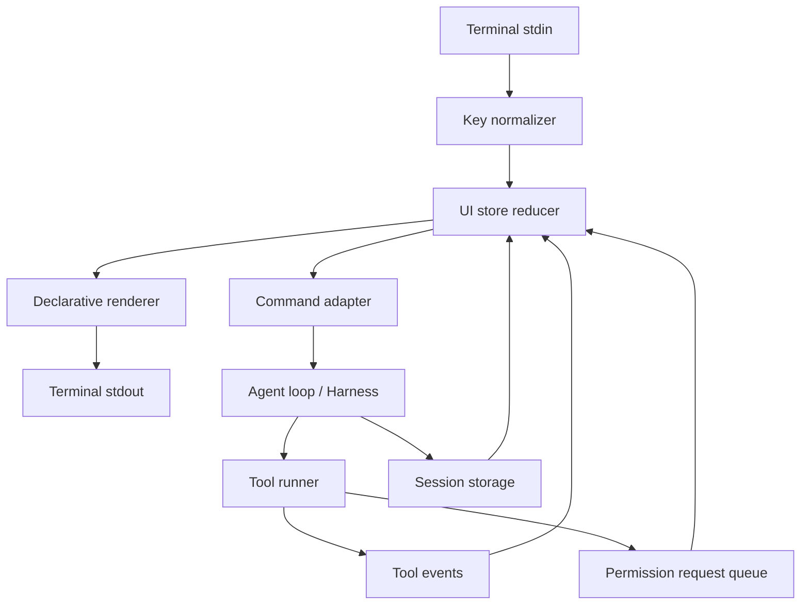

# UI 重构调研与开发路径

> 创建日期: 2026-06-15  
> 文档类型: 调研与实施方案  
> 范围: OpenHorse CLI 交互界面、命令面板、输入框、会话/权限/工具展示  
> 结论: 推荐新增 `ui-v2` 声明式终端 UI，先灰度接入，再逐步替换当前手写 ANSI REPL。

## 1. 背景

OpenHorse 当前 UI 主要由 `src/cli.ts` 驱动：`readline.emitKeypressEvents` 读取按键，命令面板、文件补全、历史搜索、多行输入、状态栏都在同一个 REPL 流程里串联。`src/ui/*` 组件大多直接写 `process.stdout`，并持有模块级 mutable state。

这套方案早期迭代快，但已经暴露出几个结构性问题：

- `/` 命令面板、过滤结果、输入行重绘彼此独立，容易出现重复面板或旧内容未清理。
- picker、permission prompt、session restore、MCP elicitation 等交互都需要临时接管键盘，当前模式判断会越来越复杂。
- 工具输出、状态栏、输入框、弹层都在抢 stdout 光标，resize、小终端、NO_COLOR、TERM=dumb 的一致性难保障。
- 当前 `src/ink/index.ts` 只是 ANSI helper，不是 React/Ink 意义上的声明式 UI runtime。

UI 重构的核心不是“换颜色”，而是把 OpenHorse 从手写光标控制升级为“状态驱动渲染”。

## 2. Claude Code UI 方案调研

Claude Code 官方交互面可以概括为四层：

1. **Prompt 输入层**: 支持普通输入、多行输入、历史搜索、外部编辑器、图片粘贴、vim mode、`@` 文件引用、`/` 命令过滤。
2. **命令与扩展层**: `/` 菜单合并内置命令、skills、plugins、MCP server 贡献的命令。命令只在输入开头识别，输入 `/xxx args` 后把 args 传给命令。
3. **模式与弹层层**: transcript viewer、task list、background bash、permission modes、model picker、theme/config picker 都是可切换的交互模式。
4. **终端适配层**: 处理快捷键冲突、tmux/VS Code/Option as Meta、多行输入绑定、主题、status line、自定义 keybindings。

对 OpenHorse 的启发：

- `/` 菜单不应只读静态命令列表，而应从 commands、skills、MCP、session actions 聚合出统一 suggestion model。
- 输入、弹层、运行中任务、权限确认要有明确 mode ownership，避免多个组件同时处理按键。
- transcript 和 tool detail 需要可展开/可折叠，普通输出只显示摘要。
- status line 应从固定字符串升级为状态 token，例如 provider、model、session、project、MCP、permission mode、context usage。

## 3. OpenClaude UI 方案调研

本地参考目录: `/Users/hope/ai-project/openclaude`

OpenClaude 采用 React/Ink 风格架构，重点文件包括：

- `src/screens/REPL.tsx`: 顶层 REPL，组合消息列表、PromptInput、权限弹窗、MCP elicitation、任务列表、远程/本地会话状态。
- `src/components/PromptInput/PromptInput.tsx`: 输入框核心，拆分 input buffer、typeahead、history search、keybindings、footer、suggestions。
- `src/components/PromptInput/PromptInputFooterSuggestions.tsx`: 命令、文件、MCP resource、agent 等建议的统一渲染。
- `src/components/permissions/PermissionRequest.tsx`: 按工具类型路由到专门的权限确认 UI，例如 Bash、FileEdit、WebFetch。
- `src/components/mcp/ElicitationDialog.tsx`: MCP 表单/URL 类交互弹层。
- `src/components/QuickOpenDialog.tsx`: 异步 fuzzy picker，带预览和 resize 适配。
- `src/ink/components/ScrollBox.tsx`: 可滚动窗口、sticky scroll、viewport culling。
- `src/utils/theme.ts` 和 `src/utils/status.tsx`: 主题 token 与结构化 status line。

OpenClaude 的关键价值不是某个组件样式，而是架构原则：

- UI 由 store/selectors 驱动，工具、MCP、命令列表每轮从最新状态合并，减少 stale closure。
- 键盘事件先经过 overlay/mode，再到 prompt，避免弹层打开时输入泄漏。
- 所有 picker 使用统一形态：query、items、selectedIndex、visible range、onSelect、onCancel。
- 工具权限是一条异步队列，UI 只负责展示和 resolve/reject，不直接执行工具。

## 4. 推荐目标架构

建议新增 `src/ui-v2/`，保留现有 `src/ui/` 作为 fallback。历史灰度方案曾使用环境变量或 `openhorse.json`：

```text
OPENHORSE_UI=v2
```

v0.1.22 起，v2 已是默认 UI，`renderer` 不再写入 `~/.openhorse/openhorse.json`；需要回退时使用 `openhorse --ui legacy`。

目标目录：

```text
src/ui-v2/
├── runtime/
│   ├── terminal.ts          # stdin/stdout、resize、raw mode、cleanup
│   ├── keymap.ts            # 统一按键解析与可配置快捷键
│   └── renderer.tsx         # Ink/React 或轻量声明式 renderer
├── state/
│   ├── ui-store.ts          # UIState、actions、selectors
│   ├── input-reducer.ts     # 输入、多行、历史、光标
│   ├── overlay-store.ts     # picker/dialog/permission ownership
│   └── suggestions.ts       # /、@、session、MCP suggestions 聚合
├── components/
│   ├── App.tsx
│   ├── TranscriptView.tsx
│   ├── PromptInput.tsx
│   ├── FooterStatus.tsx
│   ├── CommandPalette.tsx
│   ├── SessionPicker.tsx
│   ├── PermissionDialog.tsx
│   └── ToolCard.tsx
└── adapters/
    ├── cli-bridge.ts        # 连接现有 handleInput / command executor
    ├── tool-events.ts       # Store tool state -> UI events
    └── session-events.ts    # session restore/list/rename picker
```

建议先使用公开 `react` + `ink` 包实现 `ui-v2`。OpenClaude 的自研 Ink runtime 可作为设计参考，但不建议直接搬运：维护成本高，也容易把 OpenHorse 的 agent loop 绑定到另一套复杂渲染器。

## 5. 状态模型

```typescript
type UIMode =
  | 'input'
  | 'running'
  | 'overlay'
  | 'permission'
  | 'transcript'
  | 'shutdown';

interface UIState {
  mode: UIMode;
  input: {
    value: string;
    cursor: number;
    multiline: boolean;
    historyIndex: number | null;
    searchQuery: string | null;
  };
  overlay: null | {
    kind: 'command' | 'file' | 'session' | 'model' | 'permission' | 'mcp';
    query: string;
    selectedIndex: number;
  };
  suggestions: SuggestionItem[];
  transcript: TranscriptItem[];
  toolRuns: ToolRunView[];
  status: StatusTokens;
  terminal: {
    width: number;
    height: number;
    color: boolean;
  };
}
```

所有按键只走一条入口：

```text
stdin key
  -> normalizeKey()
  -> active overlay handler
  -> mode handler
  -> input reducer
  -> render(UIState)
```

这样 `/` 面板、`@` 文件补全、`/resume` picker、permission dialog 可以共用选择器行为，不再各自清屏重绘。

## 6. 目标交互设计

### 6.1 PromptInput

- 支持单行、软换行、多行输入，提交后渲染为整行灰色填充的用户输入 echo。
- `\ + Enter`、`Ctrl+J`、可选 `Shift+Enter` 进入多行。
- `Ctrl+R` 历史搜索，`Up/Down` 在首尾行时切历史。
- 粘贴大段文本时进入 bracketed paste 模式，避免逐字符触发 suggestion。

### 6.2 Unified Suggestions

统一 suggestion item：

```typescript
interface SuggestionItem {
  id: string;
  kind: 'command' | 'file' | 'session' | 'model' | 'mcp-resource' | 'skill';
  label: string;
  detail?: string;
  shortcut?: string;
  disabledReason?: string;
  action: () => Promise<void> | void;
}
```

`/` 菜单默认只显示高频 8 项；过滤后显示最多 6 项，并显示 “more results” 数量，不把所有参数和所有低频命令直接铺开。参数提示放在选中行 detail 或 footer 中，不作为列表项。

### 6.3 PermissionDialog

当前“所有工具是否需要确认”的配置已经可以先放到系统配置。UI v2 后应支持：

- `allow once`
- `allow for session`
- `deny`
- `view details`
- tool-specific preview，例如 bash 命令、文件 diff、web fetch URL、MCP server 名称。

权限请求由 tool runner 发事件，UI resolve promise。工具执行层不直接读 stdin。

### 6.4 TranscriptView 和 ToolCard

默认主屏展示紧凑 transcript：

- assistant streaming 文本
- tool call 一行摘要
- 长输出折叠为 “N lines, exit code X”
- `Ctrl+O` 或 `/transcript` 进入详情视图，支持滚动、搜索、展开 MCP/tool payload。

### 6.5 StatusLine

状态栏改为 token 组合：

```text
model=gpt-5-codex | project=openhorse | session=abc123 | mcp=3 | ctx=41% | mode=default
```

小屏幕按优先级裁剪：mode/session/model 优先，成本和详细 MCP 状态后置。

## 7. 数据流



## 8. 开发路径

### Phase 0: UI 边界固化

- 给当前 `src/cli.ts` 抽出 `handleSubmittedInput(input)`、`ToolEvent`、`SessionEvent`。
- 将 command/file/session suggestion 聚合逻辑写成纯函数，先被旧 UI 使用。
- 给 `/` 面板补测试：输入 `/`、`/s`、退格、Esc、Enter、resize 后只能有一个面板。

验收：不改变默认 UI，但旧问题可测、可复现、可回归。

### Phase 1: ui-v2 runtime 灰度

- 增加 `react`、`ink` 依赖。
- 新建 `src/ui-v2/App.tsx`，只实现 transcript、PromptInput、FooterStatus。
- 历史灰度期通过 `openhorse --ui=v2` 或 `OPENHORSE_UI=v2 npx openhorse` 启用。
- v0.1.22 起默认使用 v2；旧 UI 仅作为 `openhorse --ui legacy` 回退。

验收：基础对话、Ctrl+C、/exit、流式输出、状态栏正常。

### Phase 2: 迁移高痛点交互

- 迁移 `/` command palette。
- 迁移 `@` file completion。
- 新增 `/resume` session picker、`/session-rename` picker、冲突提示弹层。
- 统一 picker 宽度、截断、选中行、空状态、loading 状态。

验收：`/` 过滤不重复渲染；参数不刷屏；session 多选恢复清晰。

### Phase 3: 权限与 MCP 交互

- 工具执行层改为发 `PermissionRequest`，UI v2 显示确认。
- MCP elicitation、WebSearch/WebFetch 这类交互用统一 dialog。
- 系统配置中的 `toolConfirmations` 继续作为无交互 fallback。

验收：未启用交互时走配置；启用 UI v2 时可按工具确认。

### Phase 4: Transcript 和工具详情

- 工具调用展示为 `ToolCard`，长输出折叠。
- `Ctrl+O` transcript viewer。
- 支持小屏、省略、滚动、搜索、复制原始输出到临时文件。

验收：长任务不会把 prompt 挤乱；工具详情可追踪。

### Phase 5: 默认切换与旧 UI 下线

- `ui-v2` 覆盖主工作流后改为默认。
- 旧 `src/ui/*` 标记 legacy，只保留非 TTY fallback。
- 完成迁移文档和配置迁移。

验收：TTY 默认进入 v2；`TERM=dumb`、管道输入、CI 仍可用。

## 9. 测试策略

- **Reducer 单测**: 输入编辑、多行、历史、overlay ownership、suggestion filtering。
- **组件快照**: PromptInput、CommandPalette、SessionPicker、PermissionDialog 在不同 terminal width 下的输出。
- **PTY E2E**: 使用伪终端启动 `openhorse --ui=v2`，发送 `/s`、方向键、Enter、Ctrl+C，断言屏幕内容。
- **回归用例**: `/` 面板重复渲染、`/resume` 卡顿、permission prompt 无 UI、NO_COLOR、TERM=dumb、小宽度截断。
- **手工验收**: macOS Terminal、iTerm2、VS Code terminal、tmux 各跑一次核心输入流。

## 10. 风险与取舍

- **引入 React/Ink 增加依赖**: 通过 feature flag 灰度，保留旧 UI fallback。
- **终端兼容性复杂**: 先支持通用快捷键，Shift+Enter、Option as Meta 做可选增强。
- **agent loop 与 UI 耦合**: 所有执行能力通过 adapter/event 通信，UI 不直接调用工具内部。
- **OpenClaude 架构很完整但重**: 只学习模式和组件边界，不直接复制 runtime。

## 11. 推荐优先级

1. 先做 `ui-v2` 状态机和统一 suggestion model。
2. 优先修 `/` 命令面板和 session picker，因为它们已经影响日常验证。
3. 再做 permission dialog，这会解锁后续“工具确认交互”。
4. 最后做 transcript viewer 和主题系统。

这条路径可以让 OpenHorse 保持当前 coding-agent 内核不动，只把终端交互从“手写光标操作”逐步升级为“声明式状态渲染”。短期解决重绘和 picker 问题，中期承接权限确认、MCP 表单、session 恢复，长期支撑更接近 Claude Code 的完整终端体验。

## 12. 资料来源

- Claude Code Interactive Mode: https://code.claude.com/docs/en/interactive-mode
- Claude Code Commands: https://code.claude.com/docs/en/commands
- Claude Code Terminal Configuration: https://code.claude.com/docs/en/terminal-config
- Claude Code Permissions: https://code.claude.com/docs/en/permissions
- Claude Code Keybindings: https://code.claude.com/docs/en/keybindings
- OpenClaude 本地源码: `/Users/hope/ai-project/openclaude/src/screens/REPL.tsx`
- OpenClaude 本地源码: `/Users/hope/ai-project/openclaude/src/components/PromptInput/PromptInput.tsx`
- OpenClaude 本地源码: `/Users/hope/ai-project/openclaude/src/components/permissions/PermissionRequest.tsx`
