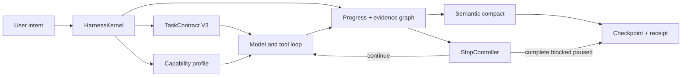

# Orion Code v0.1.9 Plan — Semantic Context & Autonomous Harness

> 状态：Implementation candidate，P0/P1 正在按 release checklist 收口
> 分支：`v0.1.9`（本地）
> 基线：`e74cbebc7ea02895bf7444ace5296e419234bcb7`
> 规划日期：2026-08-15
> 版本定位：v0.2.0 平台化之前的语义上下文、自主停止与 Harness 可靠性收敛版本

## 1. 一句话目标

让 Orion 不再依靠“保留最近 N 条消息”和“运行最多 N 轮”维持任务，而是依靠可验证的任务契约、
语义上下文、进展证据与显式停止决策，持续工作到完成、明确阻塞、用户取消或达到用户授权的资源预算。

## 2. 决策摘要

v0.1.9 做四件事：

1. 将现有 compact 从“摘要加尾部保留”升级为可校验、可回滚、可恢复的语义压缩。
2. 弃用 root `maxTurns`，移除 Goal 的固定 continuation 上限，并在逐请求预算接管后迁移 subagent
   turn cap；任何固定计数都不再代表整个任务完成。
3. 建立单一 `HarnessKernel`，统一任务契约、能力边界、进展、证据、compact 与停止决策。
4. 修复 live bug，并建立代码健康台账；优先解决 usage ledger 并发一致性和 Harness 关键缺口。

以下结论已经由当前源码审计确认：

- compact 不是纯粹的 `slice()`：生产主路径会保留 system、对齐工具调用组、生成摘要并注入
  Harness State/Context Capsule；但固定保留 20 条消息、500 字符摘要、8,000 字符前缀输入仍会造成
  语义损失，另有未被生产调用的直接截断 API。
- `QueryParams.maxTurns` 默认未设置，但主循环仍有默认 24/48 次 LLM 请求、120/180 次工具调用的
  单请求硬停止；Goal 自动续跑固定为 5 次，production subagent 默认 6 轮并限制在 1–12，legacy
  coordinator/worker 另有 3/5 轮。
- Harness 已具备 contract、ledger、capsule、evidence、drift guard 和 completion gate 的基础，但契约提取、
  证据绑定和停止判断仍是启发式，尚不能证明每条验收标准都已达成。
- 因此本版本不是删除所有保护阈值，而是把“任务完成”和“资源/安全暂停”分开建模。

## 3. 当前基线

本节记录规划开始时的 `e74cbeb` 基线，用于对照，不代表当前候选实现。候选状态与最终凭据分别维护在
[`v0.1.9-health-ledger.md`](v0.1.9-health-ledger.md) 和
[`v0.1.9-release-checklist.md`](v0.1.9-release-checklist.md)。

### 3.1 Git、发布与质量基线

- 当前分支为本地 `v0.1.9`，基线提交与 `main` 一致；尚无 v0.1.9 远程分支、tag 或 npm 版本。
- 基线 `package.json` 版本为 `0.1.8`；实现候选进入 RC 后同步为 `0.1.9`。
- v0.1.8 发布凭据记录：245 个 Jest suites 通过、1 个跳过；3821 个 tests 通过、6 个跳过；
  statements 82.60%、branches 72.23%、functions 83.15%、lines 84.30%。这些是上一版本凭据，
  v0.1.9 必须重新生成自己的结果。
- npm 当前为 `next=0.1.8`、`latest=0.1.4`。稳定渠道升级是独立发布决策，不由代码合并自动触发。
- 规划时存在 4 份用户拥有的未提交文档改动。本计划不覆盖这些内容；进入 RC 前再做一次 goals、
  v0.2.0 roadmap 与发布事实的一致性合并。

### 3.2 Live issues（2026-08-15）

| Issue                                                                                               | 判断                                                        | v0.1.9 动作                                      |
| --------------------------------------------------------------------------------------------------- | ----------------------------------------------------------- | ------------------------------------------------ |
| [#206 usage-ledger 并发追加缺少显式文件锁](https://github.com/orion-agents/orion-code/issues/206)   | 可复现的持久化一致性缺口；`appendFileSync` 未经过 ledger 锁 | P0 修复并加入真实多进程回归                      |
| [#207 project context 可经 symlink 越界读取](https://github.com/orion-agents/orion-code/issues/207) | canonical path trust 与 authority 边界缺口                  | P0 修复三类入口并加入 adversarial regression     |
| [#161 npm `latest` 停留在 0.1.4](https://github.com/orion-agents/orion-code/issues/161)             | 发布渠道治理问题，不是运行时代码 bug                        | RC 时给出稳定晋级决策；未经明确授权不改 dist-tag |

每次发布前重新查询 live issue，不能把本表当作冻结快照。

### 3.3 Compact 现状

当前主路径位于 [`src/services/compact/`](../../src/services/compact/compact.ts)：

| 已有能力                             | 当前缺口                                                                   |
| ------------------------------------ | -------------------------------------------------------------------------- |
| 保留 system message 和最近对话       | 自动策略固定保留 20 条，无法按语义价值和 token 成本选择                    |
| 切点对齐完整 tool-call group         | 未使用的 `quickCompact`、`microCompact`、`ultraCompact` 仍包含直接位置截断 |
| Harness State/Context Capsule 可注入 | 摘要缺少稳定 criterion ID、决策原因、失败尝试和证据绑定                    |
| LLM summary 失败时有确定性 fallback  | 错误被静默降级，用户和 trace 无法判断摘要质量                              |
| compact 后要求 token 数下降          | 只验证“变小”，未验证目标 headroom 与语义不变量                             |
| checkpoint 可供 session resume       | schema 仍缺 source boundary hash、摘要策略、验证 receipt 与迁移版本        |

具体风险：

- heuristic summary 默认最多 500 字符；只收集有限用户主题、工具和文件。
- LLM summary 会先压缩单条消息，再对拼接内容取前 8,000 字符；长任务尾部信息可能从摘要输入消失。
- 多次 summary merge 继续受 500 字符限制，长期任务中的决定、原因和失败路径会逐代衰减。
- 80% `preCompactThreshold` 当前只是预热已有 Capsule；预测与硬触发默认都在 95%，没有生成可提交草稿。
- 自动 compact 使用弱 fingerprint（长度和首尾长度），不能可靠识别内容变化或 compact thrash。
- checkpoint 主要依赖消息数组计数，没有单调 transcript cursor、covered-prefix hash、Goal/Harness revision；
  边界前损坏或跨 sidecar 崩溃可能让恢复投影不一致。
- `CompactOptions.goalObjective` 没有进入生产摘要，Goal 保真实际依赖独立 sidecar，而不是 compact 自身。
- 切换到更小 context window 时只返回 `compacted=true` 提示，真正 compact 延后到下一次 Agent loop，
  不符合“切换前事务性预检”的含义。

### 3.4 停止与自主运行现状

主循环虽为 `while (true)`，仍存在以下默认终止条件：

| 路径                     | 当前固定值         | 问题                                                    |
| ------------------------ | ------------------ | ------------------------------------------------------- |
| 主 Agent 默认 profile    | 24 LLM / 120 tools | 阈值到达后直接产生 complete event，任务可能未完成       |
| 主 Agent complex profile | 48 LLM / 180 tools | 只是扩大计数，没有基于进展判断                          |
| Goal 自动 continuation   | 5 次               | 有进展的长目标也会暂停并要求人工 `/goal resume`         |
| coordinator / worker     | 3 或 5 turns       | 子任务复杂度与预算无关，易产生不完整聚合结果            |
| completion gate          | 连续阻止 2 次      | 第二次直接结束当前 turn，没有统一的 blocked/paused 语义 |

正确方向不是“无限运行”，而是“不用固定交互轮次宣告任务完成”。每个逻辑请求和 child task 仍必须有
LLM/tool/bytes/deadline 资源阀；安全 hard deny、用户取消、显式成本/时间预算、provider fatal error、
无进展和 context thrash 仍必须阻断或暂停。Goal 可在一次请求到达资源阀后，依据进展与累计预算决定是否开始
下一次 continuation，而不是把阈值当作整个目标的完成结果。

### 3.5 Coding-agent Harness 由什么决定

Orion 的 coding-agent 属性不是某一条 system prompt，而是下列控制面的组合：

| 控制面     | 当前实现                                       | 主要缺口                                                |
| ---------- | ---------------------------------------------- | ------------------------------------------------------- |
| 目标与验收 | `harness/contract.ts`                          | 正则/行提取、180 字符截断、无稳定 criterion ID          |
| Agent loop | `framework/query.ts`                           | 状态与停止原因混杂；硬计数代替进展判断                  |
| 工具与权限 | tool scheduler、allowlist、mode lifecycle      | 能力、权限、sandbox、provider feature 未汇成同一快照    |
| 上下文     | assembler、ledger、capsule、compact            | 多个阈值重复；固定尾部；最终按字符裁剪                  |
| 证据与完成 | evidence、completion gate                      | “任一测试成功”可满足整个验证要求，未逐 criterion 绑定   |
| Goal       | Goal coordinator / storage                     | 自有 continuation 上限和完成状态，和 query 停止语义重复 |
| Subagent   | coordinator / worker pool / production runtime | 固定 turn 上限；交付结果缺统一完成 receipt              |
| 模型能力   | registry、LLM service、model coordinator       | context、tool、reasoning、成本能力未统一影响规划和预算  |
| 持久化恢复 | session、Goal、compact checkpoint              | 基础良好，但 schema/事务和跨层状态仍需统一              |
| 可解释性   | trace、`/harness explain`                      | 能看到部分状态，不能回答“为何继续/停止、还差哪条证据”   |

### 3.6 成熟 Agent compact 调研与 Orion 定位

调研截止 2026-08-15，定位是“面向架构决策的机制对标”，不是用不可控的模型输出做产品排名。
只采信官方文档、官方仓库和可复现实验；对闭源、未发布或实验性机制明确标记证据边界。

| 成熟 Agent   | 公开机制                                                                                                                                                                                                                                        | Orion 已吸收的原则                                                                                      |
| ------------ | ----------------------------------------------------------------------------------------------------------------------------------------------------------------------------------------------------------------------------------------------- | ------------------------------------------------------------------------------------------------------- |
| Claude Code  | 先清理旧工具输出，再在需要时摘要历史；`/compact [instructions]` 可指定 focus；system prompt 保持不变，root rules、auto memory 和受预算约束的已调用 skills 会重新注入；提供 `/context`、`PreCompact` hook、`compact_boundary` 事件和 thrash 停止 | 先处理高体积 tool output；持久规则不依赖自由文本摘要；支持 focus、边界事件、context 分类和防重复压缩    |
| OpenAI Codex | 区分 auto/manual、pre-turn/mid-turn、local/remote 路径；通过 `CompactedItem` 和 replacement history 安装压缩结果；提供 pre/post hook、trigger/reason/phase/status/strategy analytics，并覆盖 resume/fork/model-switch 等场景                    | compact 是独立生命周期而非字符串 helper；区分触发与阶段；保存 replacement/checkpoint receipt 并测试恢复 |

已核对的公开来源：

- [Claude Code context window](https://code.claude.com/docs/en/context-window)
- [Claude Code how it works](https://code.claude.com/docs/en/how-claude-code-works)
- [Claude Agent SDK agent loop](https://code.claude.com/docs/en/agent-sdk/agent-loop)
- [Claude Code sessions](https://code.claude.com/docs/en/sessions)
- [OpenAI Codex local compact](https://github.com/openai/codex/blob/main/codex-rs/core/src/compact.rs)
- [OpenAI Codex remote compact](https://github.com/openai/codex/blob/main/codex-rs/core/src/compact_remote.rs)
- [OpenAI Codex remote compact V2](https://github.com/openai/codex/blob/main/codex-rs/core/src/compact_remote_v2.rs)
- [OpenAI Codex compact tests](https://github.com/openai/codex/tree/main/codex-rs/core/tests/suite)

#### 补充研究快照

| 成熟 Agent | 公开可验证的机制                                                                                                                                            | 证据边界                          | v0.1.9 吸收的决策                                                                        |
| ---------- | ----------------------------------------------------------------------------------------------------------------------------------------------------------- | --------------------------------- | ---------------------------------------------------------------------------------------- |
| Gemini CLI | `/compress` 手动压缩，按模型 context 使用比例自动触发；工具输出有单条上限、LLM distillation 和最新 turn 保护；压缩失败有状态跟踪                            | 官方文档与源码；聚类策略仍属实验  | 把工具输出减量与历史语义摘要分层；触发阈值必须模型感知，并为下一次输出保留 headroom      |
| OpenCode   | V2 设计保留全量 durable transcript，仅以完成的 structured summary + recent-context checkpoint 替换 active view；失败不移动边界；overflow 仅追加一次恢复尝试 | `dev` V2 spec，实验性、非稳定承诺 | 用 durable started/ended 事件和候选 checkpoint 隔离中间态；不回放已发生副作用的半个 turn |
| Aider      | 用独立摘要模型滚动摘要部分对话，要求新话题分段、新近内容更详细，并强制保留函数、库、包和文件名                                                              | 官方源码；摘要契约为自由文本      | 吸收“显式必保字段”，但升级为 typed snapshot 与确定性验证，不把 prompt 遵循当作事务保证   |
| Cline      | 公开发布记录明确修复 compact 后 canonical session history 保留，并将 resume 事务性作为独立可恢复边界                                                        | 发布记录；细粒度内部机制不可观测  | compact 不得改写原始对话事实；resume 必须从 canonical history 重建，不信任未提交的中间态 |

调研快照固定到以下版本，后续 benchmark 更新时必须另存新快照，不静默改写旧结论：

- Claude Code 官方文档，访问日期 2026-08-15。
- OpenAI Codex [`e5470f1`](https://github.com/openai/codex/tree/e5470f1bce099442d73e491ce63d189d355b061e)。
- Gemini CLI [`2a87e7b`](https://github.com/google-gemini/gemini-cli/tree/2a87e7be103308b8734246097ba723cc7deb4122)。
- OpenCode `dev` [`4643e65`](https://github.com/anomalyco/opencode/tree/4643e65ad6334de3e4e68dedc201d5fbb828c9fe)。
- Aider [`5dc9490`](https://github.com/Aider-AI/aider/tree/5dc9490bb35f9729ef2c95d00a19ccd30c26339c)。
- Cline [`8bbdde2`](https://github.com/cline/cline/tree/8bbdde2a5c1f972864fe1b954f639c21fac61a40)。

这些实现的共同思想，将直接成为 v0.1.9 的设计约束：

1. **双轨历史**：审计用 durable transcript 与模型用 active context view 分离，compact 不删原始事实。
2. **分层减量**：先折叠可重建的大工具输出和重复 observation，再摘要旧 turn，最后才考虑更激进策略。
3. **冷热分区**：保留 token-bounded recent working set，将旧历史收敛为结构化 snapshot，不按固定消息数切割。
4. **稳定上下文重建**：system、project rules、memory、skills、TaskContract 和 capability 在边界后重新注入，不依赖摘要“记得”。
5. **预算驱动**：基于完整的 model-visible request 与输出 reserve 触发，而不是只看 transcript 长度。
6. **候选后提交**：先 `prepare`，再做 schema/protocol/reference/token 验证，只有完成态才能原子替换 active view。
7. **有界恢复**：一次 overflow 可触发有界恢复；重复无收益 compact 必须暂停并保留旧 checkpoint，不无界烧 token。
8. **可观测与可评估**：trigger/reason/phase/strategy/before/after 都必须可追溯；质量用任务不变量保真评估，不用“文本变短了”代替。

v0.1.9 明确不复制以下反模式：字符数硬截断、将单段自由文本摘要当成状态真相、独立删除 tool call/result、
压缩失败后无界重试、把 compact 完成误当任务完成，以及为了可读性覆写 append-only 审计历史。

Orion 不直接复制某个产品，而是在共同原则上增加自身的 coding-agent 契约：

| Orion 差异化能力                      | 原因                                                                                |
| ------------------------------------- | ----------------------------------------------------------------------------------- |
| criterion/evidence 逐项保真           | Goal 完成依赖验收证据，不能只保存“做过测试”的自然语言总结                           |
| Goal/Harness/checkpoint revision 绑定 | 防止 compact 成功但 Goal 或 Harness sidecar 仍停留在旧 revision                     |
| candidate → validate → CAS commit     | 摘要是候选数据；只有协议、引用、hash 和 token 校验全部通过后才成为 active context   |
| 65% safe-input headroom               | 不把“减少了一个 token”当成功，给后续工具和模型输出留下可量化空间                    |
| typed pause/rollback                  | 无法安全压缩时进入 `paused(context_thrash)`，而不是携带残缺上下文继续或误报任务完成 |
| 与 StopController 统一                | compact 是任务持续运行的一部分；Goal、subagent、resume 使用同一完成/阻塞/暂停语义   |

Phase 0 将把上述机制基线、原始证据和共同语料实验落到
`docs/architecture/compact-benchmark.md`。闭源或无法稳定自动化的能力标为 `not observable`，不得用猜测补值，
也不得把不同模型、不同 context window 的结果直接排成产品名次。

## 4. 产品契约

### 4.1 True Semantic Compact

一次 compact 只有同时满足以下条件才算成功：

1. 原始 transcript 继续 append-only；compact 只替换 model context view，不删除审计源。
2. root objective、当前指令、所有未完成 criterion、非目标、权限约束和安全边界 100% 保留。
3. 已完成 criterion 必须保留 evidence reference、验证命令和结果摘要，不复制无限原始输出。
4. 决策必须保留“选择、原因、替代方案”；失败尝试保留失败原因，避免重复探索。
5. 文件变更记录、未提交用户改动 ownership、当前 branch/HEAD 和下一步动作可恢复。
6. tool call 与 tool result 作为原子组保留或共同折叠，绝不产生悬空协议消息。
7. compact 后 context 必须降至动态 safe input budget 的 65% 以下；否则回滚并尝试下一策略。
8. 生成结果须通过 schema、token、引用完整性和语义不变量校验，失败不能静默提交。
9. 连续 compact 无法取得足够 headroom 时进入 `paused(context_thrash)`，附带可恢复 checkpoint。

“摘要更短”不是成功标准，“信息仍可用于正确完成任务”才是成功标准。

### 4.2 Autonomous Stop

默认任务只有以下六种停止结果：

```ts
type StopStatus = 'continue' | 'complete' | 'blocked' | 'paused' | 'cancelled' | 'failed';

interface StopDecision {
  scope: 'request' | 'goal' | 'subagent' | 'runtime';
  status: StopStatus;
  disposition: 'continuable' | 'paused' | 'terminal';
  reason: string;
  criterionStates: Array<{ id: string; status: 'pending' | 'passed' | 'failed' | 'waived' }>;
  progressDelta: ProgressDelta;
  evidenceRefs: string[];
  nextAction?: string;
  resumable: boolean;
  resourceSnapshot: ResourceSnapshot;
}
```

- `complete`：所有适用 criterion 均为 passed 或经授权 waived，且没有未解决 blocker。
- `blocked`：需要用户选择、外部状态或新权限；必须说明解除方式。
- `paused`：显式预算、no-progress、context thrash 或临时 provider 限制；必须可恢复。
- `cancelled`：用户/abort signal 终止。
- `failed`：不可恢复的运行时、协议或持久化错误。
- 只有模型继续请求工具且存在合理下一步，或完成审计要求继续时，才返回 `continue`。

默认固定 LLM/tool/turn 数不得生成 `complete`。用户显式设置的 token、成本、时间或调试轮次上限到达后应返回
`paused(resource_budget)`，并保存 checkpoint。

### 4.3 Harness 单一所有权



`query`、Goal、subagent、TUI/print renderer 只作为 adapter；不得各自维护另一套完成、compact 或 continuation
真相。Kernel 状态必须是可序列化、可迁移、读操作确定性的单一来源。

## 5. Workstream A — Semantic Compaction Engine

### A0. 收敛旧 API（P0）

- 列出 `quickCompact`、`microCompact`、`ultraCompact`、`roleCompact` 的所有 export/import。
- 无生产调用者的直接截断 API 删除公开导出或迁为 test-only；不能继续作为可误用的公共能力。
- 唯一入口统一为 `CompactCoordinator.prepare()` → `validate()` → `commit()`。
- manual、automatic、model-switch、Goal continuation 共用同一 compact pipeline，只改变 trigger/focus。

### A1. 引入结构化 Context Item（P0）

以原子 segment 取代“最终字符串再 `slice`”：

```ts
interface ContextItem {
  id: string;
  kind: 'system' | 'contract' | 'decision' | 'evidence' | 'tool_group' | 'turn' | 'next_action';
  priority: 'must_keep' | 'high' | 'normal' | 'evictable';
  sourceRefs: string[];
  tokenEstimate: number;
  taskEpoch: number;
  expires?: 'turn' | 'task' | 'session';
}
```

- `must_keep` 不允许被 token 裁剪；预算不足必须暂停而不是静默丢失。
- 先压缩大 tool output 为 hash、来源、状态和结论，再压缩旧 turn；system/contract 不参加摘要。
- `maxRecentTurns` 必须真正驱动选择，不再固定取最近 5 条。
- token 预算使用 provider tokenizer/校准结果；字符估算只作为无 tokenizer 时的保守 fallback。

### A2. 生成 Semantic Snapshot（P0）

摘要 schema 至少包含：

- root objective、active instruction、scope、non-goals、constraints。
- criterion ID、状态、证据引用、尚缺验证。
- decisions 与 rationale、rejected alternatives。
- changed/read files、branch/HEAD、dirty ownership。
- successful verifications、failed commands 及原因。
- blockers、open questions、next action。
- capability/profile/model 和 compact source boundary。

LLM 只能提出 snapshot 候选；确定性验证器负责 schema、ID、引用、状态迁移和必保字段。LLM 失败时使用结构化
ledger 生成 fallback，不能退回自由文本 500 字符摘要。

### A3. Transactional Checkpoint V2（P0）

新增 schema version、source message range、content hash、strategy、token before/after、validation receipt、
contract version 和 Harness state version。事务顺序：

1. 在内存生成 candidate，不改变 active context。
2. 校验协议组、必保字段、引用和目标 headroom。
3. 原子写 sidecar，并校验可重新加载。
4. CAS 更新 session pointer。
5. 只有 pointer 成功后切换 active model history；失败完整回滚。

resume 必须支持 V1 读取和 V2 写入，迁移失败保持原 transcript 可用。增加每个写入边界的 crash injection。

### A4. 策略、focus 与防抖（P1）

- compact 顺序：清除/摘要过期 tool output → 合并重复 observation → 语义 snapshot → 保留 recent raw turns。
- 支持项目级 compact instructions 与单次 `/compact <focus>`，但 focus 不能覆盖安全和验收不变量。
- fingerprint 改为 canonical content hash + source boundary + strategy version。
- 对同一 boundary 的失败、压缩比不足、连续 compact 建立 typed diagnostics 和指数退避。
- 切换到更小模型 context 前真正执行 preflight compact；失败时不提交 model switch。
- V2 checkpoint 校验失败时回退原始 transcript 并显式诊断，不能用 legacy tool-group repair 静默改写语义。

### A5. 可观察性（P1）

- `/context` 展示 system、contract、evidence、tool、recent turn、reserve 的 token 分类。
- trace 发出 `compact_prepare`、`compact_validate`、`compact_commit`、`compact_rollback`、
  `compact_boundary` 事件。
- receipt 显示策略、before/after、保留 criterion、遗漏项、fallback 原因和 checkpoint ID。
- TUI 只展示摘要，不让可观察性内容污染稳定 system prompt/cache prefix。

## 6. Workstream B — Autonomous Stop Controller

### B0. 先建立控制器，再移除硬上限（P0）

新增 Harness-owned `ProgressController` 与 `StopController`；迁移顺序必须是“新控制器 shadow 记录 →
双跑比对 → 接管判断 → 删除旧默认”，不能先去掉现有保险。

每轮计算 `ProgressDelta`：

- criterion 状态变化。
- 新 evidence、文件变更或诊断变化。
- 新决策/新 blocker。
- 工具调用 signature、错误 class 和 workspace state hash。
- context/compact 状态与剩余资源。

无进展判定基于重复状态和策略，而不是纯 turn 数。相同 state/evidence/tool signature 连续出现且替代策略耗尽时，
进入可恢复的 `paused(no_progress)`；正常任务不能仅因运行时间长而停止。

保留每个逻辑请求的 LLM/tool/model-visible-byte 上限、Goal token preflight、provider retry/timeout 和 parent
Abort。它们是资源或安全 circuit breaker，不是任务完成判据；达到时产生 continuable/paused decision，并由
上层依据累计预算与真实进展决定是否续跑。

### B1. 主 Agent loop（P0）

- 默认 profile 保留 `maxLlmRequestsPerUserTurn` 和 `maxToolCallsPerUserTurn` 的单请求保护，但移除其
  task-complete 语义。
- 将 model-visible tool bytes 改为单次 context 管理阈值；超限先摘要/compact，不宣告任务完成。
- `maxTurns` 从公共默认能力降级为 test/debug kill switch，并在下一 major 考虑移除。
- 保留 abort、hard deny、provider fatal、协议损坏等硬边界，映射到正确 StopStatus。
- completion gate 不再“阻止两次后 complete”，而是根据可执行 next action 继续，或明确 blocked/paused。

### B2. Goal lifecycle（P0）

- 移除 5 次自动 continuation 的正常上限；Goal 使用同一个 StopController。
- Goal 只有 criterion/evidence audit 通过后才能自动完成并退出；失败继续或进入明确 blocked/paused。
- 资源暂停写入 Goal checkpoint 和 next action；恢复后从相同 contract/evidence graph 继续。
- Goal 完成、session binding 清理、TUI 状态退出作为一个可恢复事务验证。
- 新测试必须使用真实 `inputKind: 'goal_continuation'` 连续运行 6 次以上；现有 long-session fixture 会重置
  streak，不能作为已突破 5 次的证据。

### B3. Subagent（P1）

- 先把 supervisor 的 reserved model/tool budget 接到 child `query.loopBudget` 和 provider preflight，做到
  逐请求扣账；在此之前不得直接移除 production child 的 `maxTurns` 保护。
- 验证 reservation enforcement 后，再弃用 production 6-turn 与 legacy coordinator/worker 3/5-turn
  默认值。子任务继续使用 task-scoped deadline、token/cost/tool budget、capability 和 criterion subset，
  绝不改为无界运行。
- subagent 返回 `StopDecision + evidence receipt`，root 不以 `success: true` 字符串代替验收。
- 聚合器检测缺失 criterion、互相冲突的 file ownership 和未验证结果。
- Print renderer 保持一次请求且禁止 ghost continuation；若未来支持 autonomous print，必须使用显式 flag
  和 token/time budget。Ink shutdown 补齐 `await stopActiveTurn()`，与 Terminal/TUI 生命周期一致。

### B4. 兼容与配置迁移（P1）

- 旧 loop-budget 配置仍可读，但转译为显式 resource budget；启动时给出弃用说明。
- stats 同时记录旧字段和新 `stopDecision` 一版，便于 trace/telemetry 对比。
- 用户明确配置上限时严格执行，但状态为 paused；非交互 `orion exec` 用稳定 exit code 区分完成、阻塞和预算暂停。

## 7. Workstream C — HarnessKernel

### C0. TaskContract V3（P0）

- 每条 criterion 使用稳定 ID、来源消息、适用范围、依赖、状态和 waiver provenance。
- 区分 requirement、success criterion、constraint、prohibition、non-goal、open question。
- 确定性 parser 处理显式列表和命令；可选 LLM 只提出补充候选，必须经 schema 校验。
- 不再对 objective/criterion 做 180 字符静默截断；超预算时存引用和结构化摘要。
- 后续用户修改目标时生成 intent delta 和 task epoch，不覆盖历史 contract。

### C1. Evidence-to-Criterion Graph（P0）

- verification、test、build、diff、Git/CI/发布 receipt 必须绑定一个或多个 criterion ID。
- 一个成功测试不能自动满足全部验收标准。
- evidence 记录 command、cwd、exit code、source SHA、timestamp、artifact hash 和 freshness。
- completion audit 逐 criterion 输出 passed/missing/failed/waived 与证据。
- 默认交互问答不强制代码验证；一旦 contract 声明可执行验收，必须逐条证明或明确阻塞。

### C2. Capability Profile（P1）

将以下内容合并为每次请求可检查的不可变快照：

- 可用工具类别、project/machine scope、permission mode、sandbox/hard deny。
- 当前模型 context、tool calling、reasoning、stream、cost 能力。
- skills、MCP、subagent、并发和网络能力。
- 用户授权、过期时间、来源和可撤销性。

计划器只能生成 capability 可执行的 next action；切换模式/模型/权限时生成新 profile version 并进入 trace。

### C3. Deterministic State & Prompt Assembly（P1）

- `toJSON()` 不得因读取而更新 `updatedAt`；只有真实 mutation 改版本和时间。
- Context sections 独立预算、独立 hash、按原子 segment 删除，禁止最终整串字符截断。
- stable system prefix、project instructions、skills 和动态 Harness state 分层，保护 provider prompt cache。
- compact 后重新注入 contract、capability、项目规则和必要 skills，不依赖自然语言摘要偶然记住。
- 合并 Harness 与 AutoCompact 的重复阈值，只有一个 policy owner。

### C4. Explainability（P1）

扩展 `/harness explain` 和 renderer event：

- 当前 objective/criterion 状态。
- 选择下一动作的原因与能力依据。
- 为什么继续、完成、阻塞或暂停。
- compact 保留/折叠了什么。
- 恢复所需 next action、权限或外部状态。

## 8. Workstream D — Bug 与代码健康

### D0. P0 bug

#### Project context / instruction path trust

当前 `@file`、项目 `AGENTS.md`/`CLAUDE.md`/Cursor rules、显式 `SKILL.md` 在词法 containment 后仍会跟随
symlink 读取。恶意仓库可借项目内链接读取项目外文件，并把内容注入 model context；项目规则和 skill 还具有
高于普通用户数据的 authority。实施前创建独立 security issue，并完成：

- 统一 canonical project root 与 canonical target containment；文件和目录 symlink 默认 fail-closed。
- 使用 `lstat`、descriptor-based open 和打开后 `fstat`/canonical recheck，降低检查到读取间的替换竞态。
- 区分 authoritative project instructions 与 untrusted `@file` data；后者不得把文件内容解释为指令。
- 三个入口共享一个 audited reader，覆盖外部 symlink、内部 symlink、symlink directory、目标切换与
  non-regular file。
- 错误只显示 redacted canonical boundary，不泄露项目外文件内容。

#### #206 usage ledger 并发一致性

- 对 JSONL append 使用专用 ledger lock，不与 aggregate state lock 混用。
- 锁内构造完整单行并追加；`fsync`/durability 策略明确，不允许多进程交叉写出半行。
- 非法 numeric 值 fail-closed；request ID 去重语义在 concurrent replay 下保持一致。
- lock timeout 返回 typed actionable error，不能静默丢 usage。
- 真实 child-process barrier 测试验证多进程总行数、每行 JSON 完整和 replay 汇总一致。

#### Compact / model switch / false completion

- 修复更小 context model 的真实 preflight 事务。
- 禁止旧 direct-slice compact 进入生产/public API。
- budget、completion gate、Goal continuation 结束时使用正确 StopStatus，不再输出误导性的 complete。

### D1. P1 Harness 正确性

- 修复 `maxRecentTurns=8` 配置与 assembler 固定最近 5 条不一致。
- 修复 Harness `toJSON()` 读操作更新时间造成的非确定性。
- 将 completion gate 从“存在任一成功 verification”升级为 criterion binding。
- 将 weak compact fingerprint 改为 canonical hash。
- drift guard 从参数字符串包含判断升级为 typed tool risk/scope/capability rule。
- summary fallback、checkpoint 回滚、catch 降级必须进入 diagnostics/trace。
- 工具返回无法解析为结构化 JSON 时标记 `resultTrust: opaque`：可以展示给模型，但不能自动成为 verification
  passed 或 strategy success；只有结构化 success 才能提升完成证据。
- Research、subagent、Harness sidecar 等持久化/观测 sink 使用 `durability: complete | degraded`，不可无诊断
  吞错；assistant transcript、trace、Harness/compact checkpoint 的提交顺序加入 fault injection。

### D2. P1 Memory 与统一 prompt budget

- 启动时不再把所有 memory 正文无界写入 system context；只加载 bounded index，每轮按用户输入检索少量
  相关 memory，并设置条数、单条和总 token 上限。
- project instructions、`@file`、skills、memory、Harness、tool schema 和 history 进入统一 section manifest；
  根据模型窗口和 output/tool reserve 分配 hard cap。
- 记录 selected/omitted section、token cost、authority 和 source；`/context`/trace 可解释取舍。
- 子 Agent 在 path trust 修复后接收预算化的 project instructions 与 Context Capsule，避免 root/child
  合同漂移；继续保持 read-only 和 root-owned web capability 边界。

### D3. P1 测试稳定性

- 对 runtime controller 的固定 5 秒用例拆分 fake timer、进程/PTY 和真实异步边界，避免并行负载导致假失败。
- 不通过全局提高 timeout 掩盖 race；每个超时用例必须说明等待对象和失败诊断。
- Node 20/22/24 分开验证 native dependency；ABI 环境失败与源码失败分开报告。
- real-provider 测试继续 opt-in，但协议 mock、fault injection、resume/compact 必须进入默认 CI。

### D4. P1 模块边界

优先拆分同时承担协议、状态、I/O 和 UI 的热点，而非按行数机械拆分：

- `src/tools/index.ts`（约 2.5k 行）。
- `agent-runtime-controller.ts`、`chat-controller.ts`（约 2k 行）。
- `session-storage.ts`、Goal coordinator、TUI runner/launch（约 1.6–1.8k 行）。
- `query.ts`、LLM、goal/storage maintenance（约 1.4–1.5k 行）。

本版本只拆与 compact/stop/Harness/#206 直接相交的边界。公共 API、renderer parity 和 session schema 先用
contract tests 锁定；大规模平台目录迁移留给 v0.2.0。

### D5. P2 持续健康台账

- 审计 silent `catch`：分类为 expected fallback、actionable diagnostic、must-fail；禁止无记录吞错。
- 清理版本注释漂移、无生产引用 export、过期 feature flag 和 skipped test owner。
- 每个 conditional skip 记录环境条件和必跑 CI job；PTY/native/real-provider 不混为一个“全量已覆盖”。
- 每周生成 hotspot、cycle、public export、test duration/flakiness、coverage delta 和 package receipt。
- RC 前调和本次保留的 4 份用户文档与发布事实，避免 goals/roadmap 指向过时版本。
- 盘点隐藏 `/run`、`AgentRunner`、旧 `Brain/BaseAgent/Leader/HarnessEngine` 公共导出；v0.1.9 冻结兼容层并
  禁止新 runtime 依赖，统一 production runtime/typed AgentProfile 留给 v0.2.0。

### D6. #161 发布渠道治理

RC 提交一页决策记录：

- `0.1.9` 是否满足 stable 兼容、Node matrix、安装、migration 和 rollback 门槛。
- 若满足且用户明确授权：先发布 immutable version，再单独将 `latest` 指向该版本并读回验证。
- 若不满足：保持 `next`，说明阻塞 criterion 和下一次评估日期。
- tag、GitHub Release、npm publish、dist-tag 是四个独立动作和 receipt，不能相互推断。

## 9. 实施阶段与依赖

### Phase 0 — Freeze & Reproduction

- 固化 v0.1.9 source/test/release baseline。
- 产出 `docs/architecture/compact-benchmark.md`：记录每个对标 Agent 的资料日期、公开版本/commit、
  可观察边界、共同测试语料、原始结果和 Orion 差距；至少覆盖 Claude Code、Codex，并评估 Gemini CLI、
  OpenCode、Aider、Cline 的可复现性。
- 为 path trust、#206、fixed-stop、repeat-compact、model-switch 建立失败测试。
- 保存 current/new StopDecision shadow trace，对比现有行为。
- 建立 health ledger；只收录有复现或源码证据的项目。

退出条件：所有 P0 都有 failing regression、owner、影响范围和 rollback；成熟 Agent 对照矩阵有来源、
可复现步骤和明确的 `observed/not observable` 状态，Orion 当前 baseline 已在共同语料上运行。

### Phase 1 — Contract & State Foundation

- TaskContract V3、criterion ID、Evidence Graph、ProgressDelta、StopDecision schema。
- Harness state migration 和 deterministic serialization。
- Context Item 与 Compact Checkpoint V2 schema。

退出条件：V2 session/compact 可读，V3 可写；旧数据 fixture 可恢复；schema contract tests 通过。

### Phase 2 — Semantic Compact

- staged compact、candidate validation、transactional checkpoint、context categories。
- 移除/隔离 direct-slice API。
- model-switch preflight 与 compact thrash pause。

退出条件：重复压缩、crash injection、resume、tool-group、CJK 和大输出矩阵通过。

### Phase 3 — Autonomous Stop

- StopController 先 shadow，再接管主 query。
- Goal 和 subagent 迁入同一状态机。
- 旧固定上限转为显式 resource budget compatibility layer。

退出条件：默认任务不再因固定计数结束；完成/阻塞/暂停/取消/失败可在 TUI、print、JSONL、resume 中一致重放。

### Phase 4 — Health Fixes & Boundaries

- 修复 path trust、#206、Harness P1 缺口、测试超时与直接相交的热点模块。
- 完成 silent-catch 和 skipped-test 台账。
- 更新 docs/goals、architecture、config migration 与 release checklist。

退出条件：P0/P1 ledger 全部有代码、测试和文档 receipt，或经明确决策移出 v0.1.9。

### Phase 5 — RC & Release Decision

- 完整 serial gate、Node 20/22/24、PTY/print、resume/Goal、exact tarball fresh install。
- GitHub issue comment 绑定 exact commit 和验证命令后再关闭。
- 独立决定 tag、GitHub Release、npm `next` publish 与 `latest` promotion。

## 10. 测试与评估

### 10.1 成熟 Agent compact benchmark

Benchmark 分两层：

1. **机制对照**：基于官方文档和公开源码，记录设计能力是否存在及其证据。
2. **行为评估**：在许可和自动化能力允许时，用相同任务语料运行 black-box 测试；无法控制模型、窗口或
   系统提示时必须标注变量，不能做绝对优劣结论。

统一比较维度：

| 维度             | 记录内容                                                                    |
| ---------------- | --------------------------------------------------------------------------- |
| Trigger          | auto/manual、阈值、pre-turn/mid-turn、模型缩窗                              |
| Selection        | tool output、旧 turn、recent raw history、system/rules 的处理顺序           |
| Summary contract | 自由文本或结构化 schema、focus、自定义 instructions、确定性 fallback        |
| Re-injection     | project rules、memory、skills、tool schema、active task state               |
| Protocol safety  | tool call/result 原子性、未完成工具组、并行工具结果                         |
| Persistence      | transcript、replacement history、checkpoint、resume/fork/rollback           |
| Lifecycle        | hooks、boundary event、trigger/reason/phase/status/strategy telemetry       |
| Failure policy   | summary error、context overflow、oversized item、重复 compact/thrash        |
| User visibility  | `/context`、receipt、before/after token、保留/遗漏内容                      |
| Efficiency       | compact latency、额外模型调用、输入/输出 token、cache 影响、压缩后 headroom |
| Safety/privacy   | 本地/远程摘要边界、敏感内容、持久化保留和清理策略                           |

共同任务语料至少包含：

- 早期给出关键约束、后期才触发 compact，检查约束是否保留。
- 大体积 shell/test/file tool output 与并行 tool group。
- 修改目标、撤销要求、失败后更换策略和多语言/CJK 对话。
- 连续 10 次 compact、restart/resume、fork（产品支持时）和模型缩窗。
- 摘要 provider timeout、空结果、非法结构、单个 item 已超过预算和 context thrash。
- coding task 中的 changed files、dirty ownership、验证命令、失败尝试和 next action。

统一采集：mandatory fact retention、criterion/evidence integrity、tool protocol integrity、compact 后预算比例、
context overflow、resume/fork replay、compact latency/token/cost、thrash 次数和恢复结果。公开产品无法暴露某项
内部指标时记录 `not observable`，不将缺失数据视为通过或失败。

#### v0.1.9 benchmark 产物与准入

- `docs/architecture/compact-benchmark.md` 必须记录访问日期、仓库 commit、实验命令、语料 hash、
  模型/context window/temperature 等控制变量和原始结果路径。
- Orion 的确定性 corpus 是发布门禁；外部 Agent black-box 运行是设计证据，不因凭据、网络、模型漂移或
  不可观测字段阻断 Orion 本地 CI。
- 至少对比 Orion v0.1.8 baseline、v0.1.9 deterministic fallback 和 v0.1.9 LLM candidate 三条路径；
  不用不同模型的绝对得分表达产品优劣。
- 每个被 Orion 采用的机制都必须反向链接到 plan workstream、代码 owner、regression test 和 receipt 字段；
  只有对标文字、没有交付证据的条目不算完成。
- 任何新的压缩策略先通过 10 次连续 compact、crash/restart、resume、CJK、并行 tool group、
  单个 oversized item 和 provider failure 矩阵，再进入默认路径。

### 10.2 Semantic compact corpus

至少覆盖：

- 10 次连续 compact 的长编码任务。
- 多语言/CJK、超长单 tool output、并行 tool group、失败后改策略。
- 用户中途追加约束、撤销要求、修改验收标准。
- dirty worktree ownership、branch 切换、模型缩窗、provider summary 失败。
- compact 写入每个阶段 crash，然后 restart/resume。
- transcript 边界前损坏、相同消息数但内容改写、Goal/Harness revision 错代。

每次比较 compact 前后的 canonical invariants；不是仅比较字符串是否包含关键词。

### 10.3 Autonomous loop scenarios

- 有持续进展的 100+ model/tool step 合成任务可跨多个 bounded logical request 自动推进，不得被默认固定
  continuation 计数当作 task complete。
- 所有 criterion 完成且证据齐全时自动 `complete`，不得多跑空转。
- 相同状态/工具/错误重复时进入 `paused(no_progress)`，附带替代策略记录。
- 用户显式 token/cost/time budget 到达后暂停并可恢复。
- 外部服务不可用、权限缺失、用户选择分别映射 blocked/paused/cancelled/failed。
- Goal restart/resume 后 criterion、evidence、next action 和 stop reason 不漂移。
- Terminal/TUI/Ink shutdown 均先停止 active turn；Print 一次请求后无 ghost continuation。

### 10.4 Property / fault / concurrency tests

- 任意 compact 结果没有悬空 tool group。
- 任意 failed compact 不改变 active checkpoint pointer。
- 同一 immutable Harness state 序列化结果和 hash 恒定。
- 多进程 usage append 行数完整、JSON 可解析、汇总可重放。
- evidence 不能绑定不存在的 criterion，waiver 必须有授权 provenance。
- 三类 context reader 对外部 symlink、目录 symlink 和 TOCTOU replacement fail-closed。
- opaque tool result 不得满足 verification；memory/system sections 在小窗口模型下不突破统一预算。

### 10.5 E2E 与 release matrix

- TUI BUILD/PLAN/AUTO/Goal、print JSONL、non-interactive exec 使用同一 StopDecision。
- manual/auto/model-switch/mid-tool compact 真实 PTY 或 runtime smoke。
- Node 20、22、24：install、build、full serial Jest、native DB probe、CLI version/help。
- exact `npm pack` tarball 在空 prefix 安装；从安装产物运行 compact/resume smoke。

## 11. 量化准出指标

| 指标                            | v0.1.9 准出线                                             |
| ------------------------------- | --------------------------------------------------------- |
| Mandatory invariant retention   | 10 次连续 compact 后 100%                                 |
| Criterion/evidence integrity    | 0 个 dangling criterion/evidence reference                |
| Compact headroom                | commit 后不高于动态 safe input budget 的 65%              |
| Compact rollback                | fault injection 下 active checkpoint 错误提交为 0         |
| Default fixed-count task finish | 主 Agent、Goal、subagent 为 0；单请求/child 资源阀仍有效  |
| False complete                  | criterion matrix 中为 0                                   |
| Stop renderer parity            | TUI、terminal、print、JSONL、resume 100% 一致             |
| Usage ledger concurrency        | 多进程预期行数、完整行、replay totals 100% 一致           |
| Coverage                        | 不低于 v0.1.8；新增核心模块 branch coverage ≥ 80%         |
| Supported Node                  | 20/22/24 全部通过发布矩阵                                 |
| Release evidence                | source SHA、CI、tarball、tag、registry receipt 分别可追溯 |
| Benchmark traceability          | 所有成熟 Agent 机制结论有官方 URL 或公开源码 commit       |
| Benchmark reproducibility       | Orion baseline 和可运行外部场景有固定语料、配置与原始结果 |

性能目标：

- compact validation 的本地确定性阶段 p95 小于 100 ms（不含 LLM）。
- Harness state serialization p95 小于 20 ms，且读操作零 mutation。
- 正常未触发 compact 的请求不增加额外模型调用。
- compact 失败不得形成无界重试；同一 boundary/strategy 只允许一次，随后切换策略或暂停。

## 12. 建议 PR / Issue 切片

1. `docs(test): add mature-agent compact benchmark and v0.1.9 baselines`
2. `fix: contain project context and instruction file reads`
3. `feat: add task contract v3 and criterion evidence graph`
4. `refactor: introduce deterministic harness kernel state`
5. `feat: add semantic context items and compact checkpoint v2`
6. `fix: make model switch compact transactional`
7. `feat: add progress and stop controllers`
8. `refactor: migrate goal and subagent stopping semantics`
9. `fix: serialize concurrent usage ledger appends`（关闭 #206）
10. `feat: budget memory system context and child handoff`
11. `refactor: split compact query and persistence boundaries`
12. `test: add long-run PTY resume fault and node matrix acceptance`
13. `docs: reconcile v0.1.9 goals architecture and release gates`
14. `chore: prepare v0.1.9 release receipts and dist-tag decision`（处理 #161）

每个 PR 必须独立 build/test，包含迁移和 rollback；禁止把删除固定上限与尚未验证的 StopController 分开上线。

## 13. 风险与回滚

| 风险                          | 缓解                                                                      | 回滚                                                    |
| ----------------------------- | ------------------------------------------------------------------------- | ------------------------------------------------------- |
| 新 compact 丢失关键语义       | candidate 校验、append-only source、双写 V1/V2 receipt                    | 保持旧 model history，回退到未提交 checkpoint           |
| 移除固定上限后空转/成本失控   | ProgressDelta、explicit resource budget、no-progress/context-thrash pause | feature flag 切回旧 budget，但返回 paused 而非 complete |
| 新 completion gate 过严       | criterion applicability、waiver、问答任务分类、shadow comparison          | 降级为诊断但记录 false block，不伪造通过                |
| schema migration 破坏 resume  | fixture、版本读取、CAS pointer、crash injection                           | 只读旧 schema，保留原 transcript                        |
| HarnessKernel 重构扩大回归面  | adapter-first、contract tests、分阶段 ownership                           | 按 adapter 切回旧实现，状态 schema 保持兼容             |
| stable npm 晋级不可逆影响用户 | exact tarball install、明确授权、先版本后 dist-tag                        | dist-tag 可重新指向已验证旧版本并保存 receipt           |

## 14. v0.1.9 非目标

- 不实现 v0.2.0 的 Project Goal DAG、Mission Control、远程 worker、云任务编排或完整 app server。
- 不做全仓目录重排；只拆分本版本直接修改的高风险边界。
- 不在 v0.1.9 完成 legacy `/run`/AgentRunner/Brain stack 的 breaking removal；只冻结依赖边界。
- 不用“更长上下文模型”代替 semantic compact 和 evidence persistence。
- 不承诺没有任何 circuit breaker；移除的是默认固定交互计数的完成语义。
- 不在合并代码时自动创建 tag、GitHub Release、发布 npm 或修改 `latest`。

## 15. Definition of Done

v0.1.9 只有同时满足以下条件才可进入发布：

- True Semantic Compact 九条产品契约全部有自动化证据。
- 成熟 Agent compact benchmark 已记录来源日期/版本、共同语料和原始结果；所有对比结论均可追溯，
  无法观测项明确标注，不以推测代替证据。
- project context、project instructions、explicit skills 的 canonical path trust 回归全部通过。
- 主 Agent、Goal、subagent 默认不再因固定 turn/request/tool 数被标为 complete/terminal；单请求和 child
  circuit breaker 仍产生可恢复的 continuable/paused decision。
- 所有出口都产生 typed StopDecision，且完成必须通过逐 criterion evidence audit。
- compact、Harness、Goal、session restart/resume 的状态一致且 fault injection 可恢复。
- #206 关闭证据包含真实多进程测试；#161 有明确 stable/next 决策。
- P0/P1 health ledger 清零，P2 有 owner 和后续版本。
- lint、build、full serial Jest、Node 20/22/24、PTY/print、exact tarball fresh install 全部通过。
- docs/goals、architecture、CHANGELOG、migration、release checklist 与实际 SHA/registry 状态一致。
- tag、GitHub Release、npm publish 和 dist-tag 只有在用户分别授权后执行并读回验证。

## 16. 参考

内部：

- [v0.1.8 release checklist](v0.1.8-release-checklist.md)
- [v0.1.9 health ledger](v0.1.9-health-ledger.md)
- [v0.1.9 release checklist](v0.1.9-release-checklist.md)
- [v0.1.8 → v0.1.9 migration](../migration/v0.1.8-to-v0.1.9.md)
- [v0.2.0 coding-agent platform plan](v0.2.0-coding-agent-platform-plan.md)
- [项目级目标](../goals/orion-code-项目级目标.md)
- [Compact implementation](../../src/services/compact/compact.ts)
- [Agent loop](../../src/framework/query.ts)
- [Context Harness](../../src/harness/context-harness.ts)

外部基准只用于提炼原则，不声明内部实现完全对齐：

- [Claude Code context windows and compaction](https://code.claude.com/docs/en/context-window)
- [Claude Code how it works](https://code.claude.com/docs/en/how-claude-code-works)
- [Claude Code prompt caching](https://code.claude.com/docs/en/prompt-caching)
- [Claude Agent SDK agent loop](https://code.claude.com/docs/en/agent-sdk/agent-loop)
- [Claude Code sessions](https://code.claude.com/docs/en/sessions)
- [OpenAI Codex local compact](https://github.com/openai/codex/blob/main/codex-rs/core/src/compact.rs)
- [OpenAI Codex remote compact](https://github.com/openai/codex/blob/main/codex-rs/core/src/compact_remote.rs)
- [OpenAI Codex remote compact V2](https://github.com/openai/codex/blob/main/codex-rs/core/src/compact_remote_v2.rs)
- [OpenAI Codex compact test suite](https://github.com/openai/codex/tree/main/codex-rs/core/tests/suite)
- [Gemini CLI compression configuration](https://github.com/google-gemini/gemini-cli/blob/2a87e7be103308b8734246097ba723cc7deb4122/docs/reference/configuration.md)
- [Gemini CLI chat compression service](https://github.com/google-gemini/gemini-cli/blob/2a87e7be103308b8734246097ba723cc7deb4122/packages/core/src/context/chatCompressionService.ts)
- [OpenCode V2 automatic compaction spec](https://github.com/anomalyco/opencode/blob/4643e65ad6334de3e4e68dedc201d5fbb828c9fe/specs/v2/session.md#automatic-compaction)
- [OpenCode compaction implementation](https://github.com/anomalyco/opencode/blob/4643e65ad6334de3e4e68dedc201d5fbb828c9fe/packages/opencode/src/session/compaction.ts)
- [Aider rolling-summary contract](https://github.com/Aider-AI/aider/blob/5dc9490bb35f9729ef2c95d00a19ccd30c26339c/aider/prompts.py#L375-L398)
- [Cline canonical-history compact fix](https://github.com/cline/cline/blob/8bbdde2a5c1f972864fe1b954f639c21fac61a40/apps/cli/CHANGELOG.md)
