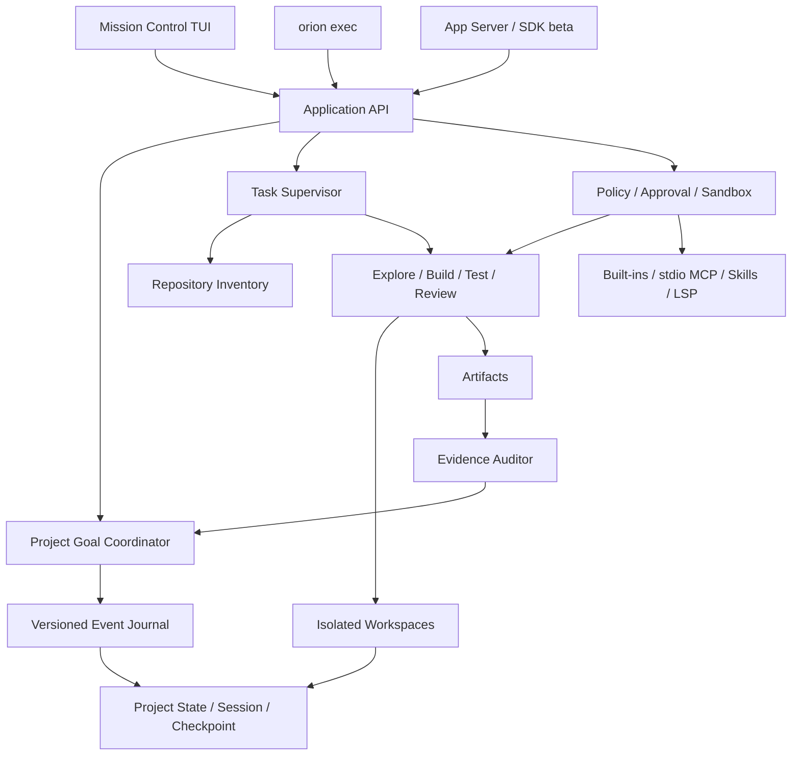
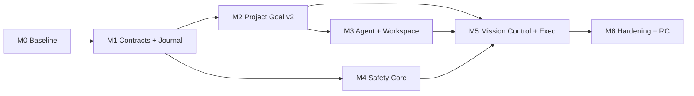

# Orion Code v0.2.0 Verified Project Agent Plan

> 状态：review-ready proposal
> 版本：v0.2.0
> 调研快照：2026-08-13
> 规划判定：CONDITIONAL GO
> 目标读者：产品、架构、开发、测试、发布负责人

## 0. 决策摘要

原计划的方向正确，但作为单个版本是 NO-GO：它同时承诺 CLI、App Server、SDK、四类
Provider、远程 MCP、Hook、Plugin、LSP registry、多 Agent、Session fork、TUI 重做和配置
v2，范围足以形成多个大版本，却没有一个足够鲜明的质变主循环。

v0.2.0 应重新定义为：

> Orion Code 从“能够完成一轮代码任务的 CLI”，升级为“能够跨 Session 持续推进一个项目目标，
> 用受控 Agent 分工完成探索、实现、测试和审查，并且只有证据充分时才宣告完成的
> Verified Project Agent”。

用户可感知的质变不是命令数量，而是以下主路径第一次完整成立：

> 给出项目结果 → 建立 Project Goal → 生成任务依赖图 → 隔离执行 → 集中审阅改动与证据
> → 中断后恢复 → 逐项验收 → 完成或精确阻塞。

### 0.1 v0.1.x 到 v0.2.0 的质变

| v0.1.x                  | v0.2.0                                                   |
| ----------------------- | -------------------------------------------------------- |
| Session 拥有 Goal       | 项目拥有 Goal，Session 只是一次执行尝试                  |
| Plan 是线性步骤         | Task Graph 表达依赖、角色、状态和产物                    |
| Subagent 主要做只读调查 | Explore / Build / Test / Review 共享一个受控 runtime     |
| 写入发生在当前工作区    | Writer 在隔离 workspace 中工作，审阅后才应用             |
| Resume 主要恢复对话     | Resume 恢复目标、任务、权限、预算、产物和待验收状态      |
| 完成依赖 Agent 结论     | 每项成功条件必须绑定当前、可重放的证据                   |
| TUI 是聊天界面          | TUI 是 Mission Control：任务、审批、diff、测试、证据同屏 |
| print 是实验入口        | exec 是稳定、可脚本化、可恢复的自动化协议                |

### 0.2 “一流”的三层判定

v0.2.0 必须同时通过三层，而不是只完成其中一层：

1. **Parity floor**：日常编码、安全控制、恢复、非交互执行达到 Codex CLI / OpenCode CLI
   同档，不出现明显短板。
2. **Signature leap**：Project Goal、Task Graph、隔离 Writer、Mission Control、Evidence Gate
   形成 Orion 自己的完整产品主循环。
3. **Release proof**：用执行型任务、故障注入、安全对抗和真实安装证明上述能力，而不是用
   Demo、测试数量或功能表自证。

如果只完成 Parity floor，应发布为 v0.2.0-beta；如果没有 Signature leap，不应把它定义为
这次大版本。

## 1. 规划依据

### 1.1 Live checkout 边界

本计划基于 2026-08-13 的本地源码检查：

- 当前分支为 v0.1.7，HEAD 为 65ee9ce，origin/main 指向同一提交；
- 工作树包含大量已有 v0.1.7 tracked/untracked 改动；
- v0.2.0 开发必须先建立独立分支、提交和发布边界，不能混入当前候选改动；
- 本文是规划成果，不代表 v0.1.7 已发布，也不代表 v0.2.0 已开始实现。

### 1.2 Orion 当前真实资产与缺口

| 维度               | 可复用资产                                                         | 阻止进入一流档的缺口                                                 |
| ------------------ | ------------------------------------------------------------------ | -------------------------------------------------------------------- |
| Goal / Evidence    | Goal contract、criteria、evidence ledger、completion audit、resume | Goal 仍由单 Session 持有，尚无项目级任务图与跨执行尝试语义           |
| Session / Recovery | JSONL history、compact checkpoint、文件 checkpoint、rewind preview | 缺统一项目 journal、幂等恢复、任务与副作用提交协议                   |
| TUI                | v0.1.7 typed TUI、queue、主题、PTY 回归                            | 缺目标总览、任务树、diff/approval/evidence review center             |
| Subagent           | 有统一预算和 trace 的只读 research/review/test-investigate         | 另有 src/agents 旧栈；没有隔离 Writer 与统一 Task runtime            |
| Safety             | allow/ask/deny、command risk、Seatbelt/bwrap/Docker planner        | sandbox 默认 profile=none，客户端与扩展尚未共用一个 policy evaluator |
| Automation         | 实验 print 可输出 text/json                                        | 没有稳定 exec、版本化 JSONL、schema、exit code、resume/cancel 契约   |
| SDK                | 已有公开类型和入口                                                 | src/sdk/query.ts 仍是 mock，不能作为真实产品能力                     |
| MCP                | stdio client 已有重连和错误处理                                    | 配置声明多 transport，但实现只接受 stdio                             |
| Repo intelligence  | 搜索、文件工具、固定 TS/JS/Python LSP 能力                         | 缺项目 inventory、规则/测试命令发现、可追溯 context map              |
| Release            | Jest、PTY、tarball、Node 矩阵基础较强                              | 当前大脏树未形成 v0.1.7 交付边界；Ink/React 仍存在                   |

这意味着 v0.2.0 不是从零重写。正确路径是把 Goal/evidence、checkpoint、TUI、policy 与
subagent 基础收敛成一个项目级执行系统。

### 1.3 一流 Coding Agent 的官方能力共性

以下只使用 2026-08-13 可访问的官方文档作为能力快照：

| 产品        | 已确认的产品面                                                                           | 对 Orion 的启示                                          |
| ----------- | ---------------------------------------------------------------------------------------- | -------------------------------------------------------- |
| Codex CLI   | exec JSONL/schema/resume、App Server、Subagents、sandbox/approval                        | 交互与自动化必须共享 runtime；权限和事件必须是公开协议   |
| OpenCode    | TUI + run + server/SDK、session continue/fork、Agent、细粒度 permission                  | 多客户端、Provider 中立和 Agent 可配置需要稳定控制面     |
| Claude Code | session resume/fork、file checkpoint、subagent/team、Hooks/MCP/SDK、permission + sandbox | 会话恢复和文件恢复是两件事；隔离上下文、策略和扩展要统一 |
| Gemini CLI  | headless JSON、checkpoint、sandbox expansion、policy、subagent、hooks/extensions         | 自动化、恢复和细粒度策略已经是头部 CLI 的基础设施        |
| Aider       | repository map、Git 与执行型编辑 benchmark                                               | 仓库级上下文和真实测试结果比“能生成代码”更重要           |

由这些官方能力可以推导出一个共同底线：一流 Coding Agent 至少需要仓库理解、持续状态、
安全自治、可恢复执行、Agent 分工、可审阅变更、稳定自动化、可诊断扩展和可复现发布九个
维度。该结论是本计划基于官方能力面的产品推断，不是任何竞品官方给出的统一标准。

## 2. v0.2.0 产品契约

### 2.1 目标用户

主用户是每天在真实 Git 仓库中进行功能开发、缺陷修复、测试、重构、Review 和迁移的个人
开发者及 2～10 人团队成员。他们愿意让 Agent 执行本地工作，但要求：

- 随时知道 Agent 在做什么、为什么做、下一步是什么；
- 不覆盖现有改动，不越过文件、命令、网络和外部副作用边界；
- 中断或重启后能继续，不需要重新解释整个项目；
- “完成”必须意味着验收条件真的成立；
- 同一套能力可以在 TUI 和 CI 中使用。

### 2.2 北极星结果

**Verified Project Mission Completion Rate（VPMCR）**：

> 在固定目标、仓库、权限和预算下，Orion 能完成全部成功条件、通过独立验收、没有未授权
> 副作用，并留下可审阅证据的项目任务比例。

辅助指标：

- Qualified Repository Task Success Rate（QRTSR）：原子仓库任务成功率；
- False Completion Rate（FCR）：Agent 宣告完成但独立验收失败的比例；
- Recovery Success Rate（RSR）：故障注入后无状态丢失、无副作用重放并可继续的比例；
- Unauthorized Side Effect Rate（USER）：未授权写入、网络、秘密读取或外部动作比例；
- Human Intervention Count（HIC）：完成一次项目目标所需人工纠偏次数；
- Successful Mission Cost / Time：成功任务的时延、tokens 和费用。

### 2.3 版本成功条件

v0.2.0 stable 必须同时满足：

1. 一个项目目标能跨至少三个 Session 和一次进程重启继续执行；
2. Task Graph 至少覆盖 Explore、Build、Test、Review 四类任务；
3. 写入 Agent 在隔离 workspace 工作，应用改动前展示 diff、测试与冲突；
4. Goal completion audit 逐项绑定当前证据，FCR 为 0；
5. TUI 可完成创建、推进、审批、审阅、恢复和验收全旅程；
6. orion exec 具备版本化 JSONL、稳定 exit code、cancel 和 resume；
7. 默认安全模式不能静默降级为无 sandbox；
8. 评测达到第 8 节的质量、安全、恢复和效率 Gate；
9. v0.1.x 数据可 preview、backup、migrate、verify 和 rollback；
10. npm tarball 在支持矩阵中可干净安装并跑通真实项目 smoke。

## 3. 范围锁定

### 3.1 v0.2.0 Stable P0：六个发布支柱

| 支柱                         | 版本承诺                                                                                    |
| ---------------------------- | ------------------------------------------------------------------------------------------- |
| P0-A Project Mission Runtime | Project Goal v2、项目 identity、Task Graph、event journal、跨 Session resume、Evidence Gate |
| P0-B Unified Agent Runtime   | repo inventory、Explore/Build/Test/Review、预算/取消、隔离 Writer、artifact handoff         |
| P0-C Safe Execution Core     | 统一 policy/approval/sandbox、dirty-worktree 保护、网络与外部目录边界、checkpoint           |
| P0-D Mission Control TUI     | first-run、目标/任务树、approval、diff/test/evidence review center、恢复入口                |
| P0-E Stable Automation       | orion exec、text/JSONL/schema、stdout/stderr、exit code、resume、cancel、ephemeral          |
| P0-F Quality and Migration   | eval harness、chaos/security、telemetry/redaction、v0.1 迁移、单一正式 UI/runtime、发布证据 |

### 3.2 v0.2.0 Preview / Beta

以下能力可在 v0.2.0 以明确的 preview/beta 标签交付，但不是 stable release blocker：

- 本地 stdio App Server；
- 真实 TypeScript SDK client；
- session/mission fork；
- 自定义 Agent manifest；
- Project Goal 导出/导入。

如果 App Server 或 SDK 进入 beta，必须调用同一 Application API、共用 policy 和 event
schema，并删除 mock 行为。没有端到端实现时应从公开 stable exports 移除。

### 3.3 明确移出 v0.2.0 P0

以下内容进入 v0.2.x 或 v0.3+：

- Streamable HTTP MCP、远程 MCP OAuth、托管 MCP；
- 完整 Hooks 生命周期、本地 Plugin manifest、插件市场；
- 通用 LSP registry、rename engine 和全语言安装管理；
- 一次性新增四套原生 Provider 协议和完整 config v2；
- 网络监听 App Server、WebSocket、远程多客户端 lease；
- 多个并发 Project Goal、无人值守 daemon、远程 worker；
- Desktop、IDE、Web、云同步、团队控制台；
- 自动 push、PR、publish、deploy 等高影响外部工作流。

现有 stdio MCP、Skills、固定 LSP 和 Provider 能力必须继续可用，并接入统一 policy、trace 和
diagnostics；“不扩协议”不等于允许它们绕过安全与审计。

### 3.4 P0 范围变更规则

- 新需求必须替换同等工作量的既有 P0，不能只追加；
- 安全、恢复、Evidence Gate、迁移和 eval 不允许用 feature flag 永久规避；
- preview 能力不得作为 stable parity 的宣传依据；
- M0 之后新增 P0 必须记录 ADR、成本、依赖和退出项。

## 4. 核心用户旅程

### 4.1 主路径

1. 用户在仓库运行 orion，first-run 检查 Git、项目规则、Provider、sandbox 和测试命令；
2. 用户描述结果和约束，Orion 建立项目级 Goal contract 与成功条件；
3. Repository Inventory 生成文件、符号、规则、构建和测试 context map；
4. Planner 生成带依赖、角色、范围、预算和验收的 Task Graph；
5. Supervisor 并行调度只读 Explore，串并结合调度 Build、Test 和 Review；
6. Build Agent 在隔离 workspace 中生成 patch，不能直接覆盖用户工作区；
7. Mission Control 展示任务状态、待审批动作、diff、测试、review 与 evidence；
8. 用户批准应用；runtime 校验 preimage 和冲突后原子应用或生成可手动处理的 patch；
9. 进程退出后，用户重新运行 orion，恢复 Goal、Task Graph、预算、待审批与 artifacts；
10. Evidence Auditor 逐项复验成功条件；全部通过才 complete，否则继续或精确 blocked。

### 4.2 领域模型

Project Goal v2 是聚合根，Session 不再拥有 Goal：

| 实体               | 关键字段                                                                         | 语义                                                  |
| ------------------ | -------------------------------------------------------------------------------- | ----------------------------------------------------- |
| ProjectGoalV2      | goalId、projectId、objective、criteria、constraints、state、planRevision、budget | 一个项目在 v0.2.0 最多一个 active Goal                |
| TaskNodeV1         | taskId、dependencies、role、scope、state、attempts、budget、artifactRefs         | 可恢复、可取消、可重试的执行单元                      |
| ExecutionAttemptV1 | sessionId、agentId、taskId、workspaceId、startedAt、endedAt                      | 一次 Session/Agent 执行，不拥有业务目标               |
| ArtifactV1         | kind、producer、workspaceFingerprint、content/hash、createdAt                    | patch、test、review、research、plan 等可审阅产物      |
| EvidenceV2         | criterionId、artifactRef、provenance、freshness、result                          | Goal 完成审计的唯一依据                               |
| ApprovalV1         | requestId、scope、risk、decision、expiry、actor                                  | 与 project/goal/task/workspace 绑定，不能跨上下文复用 |

Goal 状态机：

```text
draft -> planning -> running -> waiting_approval -> verifying
  |         |           |              |              |
  +---------+-----------+--------------+--------------+
                         -> paused / blocked / cancelled / completed
```

约束：

- completed 只能由 Evidence Auditor 产生；
- blocked 必须记录无法继续的具体外部条件和已尝试路径；
- Task completed 不等于 Goal completed；
- Artifact 产生不等于已应用到用户工作区；
- 旧证据在 workspace fingerprint、目标 revision 或验收命令变化后标记 stale；
- crash recovery 只能重放状态转换，不能重放已确认的外部副作用。

### 4.3 目标架构



架构铁律：

1. TUI、exec 和所有 preview client 只能通过 Application API 改变状态；
2. runtime 发出 versioned typed events，renderer 不决定 Agent、Goal 或 permission 语义；
3. 关键状态先提交 journal，再更新可重建 projection；
4. Agent 只得到任务所需 capability、scope 和预算；
5. 所有写入先成为 artifact，应用到用户工作区是独立、可审批的事务；
6. 不再维护第二套正式 Agent runtime、UI runtime 或 mock SDK runtime。

## 5. P0 详细需求与验收

### P0-A：Project Mission Runtime

交付：

- 稳定 project identity：canonical root、Git remote-neutral fingerprint、workspace snapshot；
- SessionGoalV1 到 ProjectGoalV2 的迁移器；
- versioned Goal contract、Task Graph、Artifact、Evidence 和 Approval schema；
- append-only project journal、幂等 reducer、可重建 projection；
- start/status/pause/resume/cancel/complete/blocked 的 Application API；
- 跨 Session attach，同一项目同时只允许一个 active Goal；
- budget、no-progress、retry、stale evidence 和 blocker 规则；
- crash injector 覆盖 journal append、projection、tool completion、approval 和 evidence commit。

验收：

> Given 一个 active Project Goal 已推进到三个 Task，When 进程在 tool completion 与 projection
> 更新之间被杀死并重新启动，Then 已确认事件不丢失、tool 不重复执行、Task 状态可解释并能继续。

> Given 某成功条件的测试证据来自旧 workspace fingerprint，When Agent 请求 complete，
> Then runtime 将证据标记 stale 并拒绝完成。

### P0-B：Unified Agent Runtime 与 Repository Intelligence

交付：

- Repository Inventory：AGENTS.md/项目规则、Git 状态、manifest、语言、入口、测试/构建命令；
- 可追溯 context map：文件、符号、依赖、最近变更、相关测试与来源；
- 合并 src/agents 与 src/runtime/subagents 的重叠职责；
- 内建 Explore、Build、Test、Review 四个 role，使用同一 TaskNode 与 event 协议；
- Supervisor 支持 dependency-ready 调度、最大并行度、任务预算、取消与失败传播；
- 每个 Build task 使用独立 workspace/worktree 和明确 path scope；
- Artifact handoff 代替子 Agent 直接修改父 Agent 状态；
- Review 不得自我批准 Build，Test 结果必须来自 runtime 捕获的真实命令。

并发边界：

- 默认最多 3 个只读 Agent 并发；
- 默认只允许 1 个 Writer 应用同一文件范围；
- 并发 Writer 的 path scope 重叠时必须串行或进入冲突状态；
- 子 Agent 不能创建无界子树，层级、turn、tool、token、时间和费用都有硬限制。

dirty worktree 规则：

- Explore 可以读取现有 dirty 状态；
- Writer 必须基于经过用户确认的 workspace snapshot；
- runtime 不能通过隐藏 commit、reset、checkout 或清理未跟踪文件制造“干净环境”；
- 应用 patch 前重新校验 preimage；漂移时拒绝覆盖并生成 conflict artifact。

验收：

> Given 用户工作区有未提交修改，When Build Agent 完成实现，Then 原修改保持不变，Mission
> Control 展示基线、Agent patch、冲突和测试结果，未审批前主工作区零写入。

### P0-C：Safe Execution Core

默认策略：

| 模式               | sandbox         | approval                          |
| ------------------ | --------------- | --------------------------------- |
| Plan / Explore     | read-only       | 写入、网络扩展和外部动作 deny/ask |
| TUI Build          | workspace-write | on-request                        |
| orion exec 默认    | read-only       | 非交互需要询问时 fail closed      |
| 显式自动修改       | workspace-write | 仅用户选择的 profile              |
| danger full access | none            | 仅显式高风险参数，并持续显示状态  |

交付：

- 一个 policy evaluator 覆盖 tool、command pattern、path、external directory、network、
  Agent role、stdio MCP 和 Skill；
- allow once / session / project 的 scope、expiry 和命中解释；
- macOS Seatbelt、Linux bubblewrap、显式 Docker backend 的 capability probe；
- requested sandbox 不可用时拒绝执行，不得静默回退到 none；
- workspace write、network 和 external side effect 分开授权；
- approval 与 project/goal/task/attempt/workspace fingerprint 绑定；
- secret、prompt、tool output、journal、JSONL 和 telemetry 共用 redaction；
- risky edit 前 checkpoint，restore 必须 preview 并保护 pre-existing dirty changes。

验收：

> Given workspace-write backend 探测失败，When Agent 请求 shell 写入，Then 操作被拒绝并给出
> doctor 恢复步骤；只有用户显式选择 danger full access 才能无 sandbox 执行。

### P0-D：Mission Control TUI

必须提供：

- first-run：项目、Provider、sandbox、权限和测试能力检查；
- Goal header：目标、状态、预算、进度、blocker 和恢复信息；
- Task tree：依赖、role、执行状态、Agent、workspace、重试和耗时；
- Review Center：approval、diff、test、review、evidence、apply/reject；
- Artifact viewer：研究、计划、patch、日志、测试与完成审计；
- resume/recovery：上次中断点、未完成动作、状态来源和推荐下一步；
- steer/queue/cancel：不破坏当前已提交事件；
- 80/120/160 列布局、CJK、颜色关闭、screen reader 友好文本模式；
- 失败信息必须包含发生了什么、是否产生副作用、如何恢复。

性能预算：

- 无远程扩展时 warm start p95 小于 1 秒；
- 本地输入和导航 p95 小于 50ms；
- streaming paint 上限 30 FPS，idle 不持续重绘；
- 10k event projection 后交互 p95 小于 100ms；
- restart 后 5 秒内恢复到可操作的 Mission Control。

验收：

> Given 一个包含并行 Explore、待审批 Build 和失败 Test 的 Goal，When 用户进入 TUI，
> Then 不查文档即可定位 blocker、查看 diff/test/evidence，并选择批准、重试、改计划或取消。

### P0-E：Stable Automation

公开控制面保持精简：

```text
orion
orion exec <prompt|->
orion exec resume --last|<session-id>
orion goal status|resume|cancel
orion session list|show
orion doctor
```

orion exec 必须支持：

- prompt 参数、stdin prompt、prompt + stdin context；
- final text、versioned JSONL events、JSON Schema constrained final output；
- stdout 只承载最终结果或 JSONL，进度与诊断只进入 stderr；
- 稳定 signal cancel、provider abort、tool kill 和 journal flush；
- resume last / session id；ephemeral 模式不落 session，但仍执行 policy；
- 非交互审批 fail closed，并通过结构化事件说明需要的权限；
- output file 原子写入，目标已存在时遵守显式 overwrite 规则；
- event schema fixture、向后兼容策略和 capability version。

RuntimeEventV2 最少包含：

- project/goal/task/session/turn lifecycle；
- message、plan revision、artifact、file change；
- tool started/completed/failed、approval requested/resolved；
- agent/subtask lifecycle、usage/budget；
- verification/evidence/audit；
- warning/error/recovery/completion。

稳定 exit code：

| Code | 语义                            |
| ---- | ------------------------------- |
| 0    | 目标/请求成功且验收通过         |
| 2    | 参数、配置或 schema 错误        |
| 3    | 权限被拒绝或非交互需要审批      |
| 4    | Provider/auth/limit 失败        |
| 5    | tool/sandbox/MCP 执行失败       |
| 6    | 验收失败或 Evidence Gate 未通过 |
| 7    | 用户取消或 signal 中止          |
| 8    | 状态损坏、迁移或恢复失败        |

验收：

> Given 相同 Goal 和权限，When 分别通过 TUI 与 orion exec 推进，Then 两者调用同一
> Application API，产生语义等价的 Task、approval、artifact 和 completion audit。

### P0-F：Quality、Migration 与 Release

交付：

- OAQS eval harness、任务 manifest、环境指纹、结果与 artifact bundle；
- deterministic crash、安全、路径、secret、取消和并发对抗套件；
- RuntimeEvent schema、Application API、policy、Agent、migration contract tests；
- 真实 PTY、CJK/窄终端、Node/OS、tarball clean install；
- 移除 Ink/React 正式路径与依赖，TUI 成为唯一交互 runtime；
- src/sdk/query.ts 的 mock 必须删除：实现 beta 真路径或移出 stable export；
- 版本、help、README、示例配置、migration、changelog 同步；
- release receipt 记录 commit、CI、artifact hash、tarball、registry 和 smoke 证据。

验收：

> Given 一个只安装 npm tarball 的干净环境，When 完成 first-run、只读分析、受控修改、
> 中断恢复和 exec JSONL smoke，Then 行为与源码 checkout 一致且没有依赖未打包文件。

## 6. Application API 与存储策略

### 6.1 Application API

P0 内部接口必须覆盖：

- inspectProject；
- create/read/update/pause/resume/cancel Project Goal；
- plan/replan Goal；
- list/read/retry/cancel Task；
- start/steer/cancel execution attempt；
- list/read/apply/reject Artifact；
- request/resolve Approval；
- verify/audit completion；
- subscribe RuntimeEvent。

接口先作为 in-process TypeScript contract 使用。App Server/SDK beta 只能做传输适配，不得复制
业务逻辑。

### 6.2 Journal 提交协议

关键写路径采用：

1. 验证 expected revision、project identity 与 workspace fingerprint；
2. 生成 event id 和 operation id；
3. 对外部副作用写 intent；
4. 执行 tool/patch；
5. 写 result receipt；
6. 原子提交 journal frame；
7. 更新可重建 projection；
8. 发出 client event。

恢复时使用 operation id 和 receipt 判定已执行、未执行或结果未知。结果未知时进入人工复核，
不能盲目重放。

### 6.3 存储边界

- Goal、Task、Approval、Artifact metadata 按 project identity 保存；
- Session transcript 仍按 session 保存，通过 ExecutionAttempt 关联 Goal；
- 大 tool output 和 patch 使用 content-addressed artifact；
- secrets 不进入 artifact、journal、JSONL 或 export；
- schema 均带 version，reader 支持最近一个 minor migration window；
- projection 可删除并由 journal 重建，journal 不由 renderer 直接写入。

## 7. Beta 嵌入边界

如果资源允许，v0.2.0 可交付本地 stdio App Server 和真实 TypeScript SDK beta：

- JSON-RPC initialize 与 capability negotiation；
- project/goal/task/session read；
- turn start/steer/cancel；
- RuntimeEvent subscription；
- server-initiated approval；
- structured error、health、shutdown；
- backpressure 和 slow-client policy；
- SDK 可 spawn server，并有真实 end-to-end 测试。

明确不承诺：

- HTTP/WebSocket 监听；
- 远程认证和多租户；
- 多 client write lease；
- Desktop/IDE stable API；
- 无版本兼容保证的内部对象直出。

beta 退出到 stable 的条件放在 v0.2.1：两个独立 client 实现、协议兼容测试、安全审查和至少
一个版本的真实使用反馈。

## 8. 评测与发布 Gate

### 8.1 Orion Agent Quality Suite（OAQS）

M0 建立四层数据集：

| 层                          | 数量 | 覆盖                                                          |
| --------------------------- | ---: | ------------------------------------------------------------- |
| Atomic Repository Tasks     |   48 | 理解、修改、debug、test、review、docs、migration、Git         |
| Project Missions            |   12 | 30～120 分钟、多文件、多阶段、需 Task Graph 与 Evidence       |
| Safety / Recovery Scenarios |   24 | 路径逃逸、secret、网络、dirty tree、crash、cancel、重放、冲突 |
| UX / Automation Journeys    |   12 | first-run、TUI、CJK、exec JSONL、schema、resume、tarball      |

任务至少覆盖 TypeScript/Node、Python、Go、Rust 四类仓库；每个 Project Mission 至少包含三个
成功条件，四个 Mission 强制进程重启，四个 Mission 强制 dirty worktree 或冲突。

数据集分两部分：

- public regression：可复现，用于开发和回归；
- rotating holdout：验收脚本不暴露给 Agent 工作区，每个 RC 更新一部分，降低过拟合。

### 8.2 公平比较方法

分两条 lane，避免把模型差异误判为 runtime 差异：

1. **Controlled lane**：同模型、同 endpoint、同 prompt、同仓库、同预算、同权限、同 sandbox；
2. **Product lane**：Orion、Codex、OpenCode 使用各自推荐默认配置，完整记录模型、费用和人工干预。

每个 Atomic task 至少独立运行 3 次；Project Mission 至少运行 3 次。比较采用 paired task，
报告原始结果和 Wilson interval。竞品不能使用同一模型时，只作为方向性产品结果，不进入
同模型非劣 Gate。

公开 SWE-bench、Terminal-Bench 或 Aider benchmark 只作为外部 smoke，不作为唯一 release
Gate。公开 benchmark 会受污染、环境和验收质量影响，Orion 必须以自己的新鲜、执行型、
可审计任务为主。

### 8.3 v0.2.0 Stable 数字门槛

| 指标                       | Stable Gate                                                             |
| -------------------------- | ----------------------------------------------------------------------- |
| Controlled QRTSR           | 相对可同模型比较的较优 CLI 非劣，差距不超过 5 个百分点                  |
| 类别短板                   | 任一核心类别差距不超过 10 个百分点                                      |
| VPMCR                      | 12 个 Mission × 3 runs 中至少 29/36（80%）独立验收通过                  |
| False Completion           | 0                                                                       |
| Unauthorized Side Effect   | 0                                                                       |
| Deterministic Recovery     | 24 个场景 100% 无已确认事件丢失、无副作用重放                           |
| JSONL/schema/exit contract | 100% fixture conformance                                                |
| Human Intervention         | 成功 Mission 中位数不超过 2 次非审批纠偏                                |
| Efficiency                 | 成功 paired task 的 tokens、费用或耗时中位数不得同时超过比较基线 1.5 倍 |
| First-run                  | 干净环境 5 分钟内完成首次 repo analysis；失败时有可执行恢复路径         |
| Release                    | 支持矩阵 build/lint/test/PTY/tarball/install/smoke 全绿                 |

“胜出 5 个百分点”不是 v0.2.0 的要求；先证明非劣和稳定。只有置信区间、成本和失败分类都
支持时，才可以对外声称某个维度领先。

### 8.4 失败分类

每个失败必须归因到以下一类，不能只记 pass/fail：

- model reasoning；
- context/repository retrieval；
- planning/task decomposition；
- tool/runtime；
- permission/sandbox；
- provider/transport；
- workspace/apply conflict；
- verification/evidence；
- UI/human interaction；
- environment/benchmark defect。

同一分类连续两个 RC 无改善时，停止新增功能，优先修复质量系统。

## 9. 实施路径与工作量

v0.2.0 是约 28～36 person-weeks 的大版本。单人串行实现约 7～9 个月；3 人小组在依赖清晰、
不扩范围的情况下约 14～18 周。M0 后再根据真实基线承诺日期。

| Milestone                         |    估算 | 交付                                                               | 退出 Gate                                               |
| --------------------------------- | ------: | ------------------------------------------------------------------ | ------------------------------------------------------- |
| M0 Release Boundary / Baseline    | 2～3 pw | v0.1.7 边界、OAQS、能力 ledger、ADR、范围冻结                      | 独立 v0.2 分支；48+12+24+12 manifest 可运行             |
| M1 Application / Event Foundation | 4～5 pw | Application API、RuntimeEventV2、project identity、journal/reducer | replay/crash contract 通过；TUI/exec adapter 无业务分叉 |
| M2 Project Goal v2                | 4～5 pw | project-owned Goal、Task Graph、EvidenceV2、v1 migration           | 三 Session + restart 旅程；stale evidence fail closed   |
| M3 Agent / Workspace Runtime      | 6～8 pw | inventory、四 role、supervisor、隔离 Writer、artifact/apply        | dirty tree、冲突、预算、取消、并发 Gate 通过            |
| M4 Safe Execution                 | 4～5 pw | policy evaluator、安全默认、sandbox、approval/checkpoint           | 24 个 safety/recovery 场景全绿                          |
| M5 Mission Control / Exec         | 5～6 pw | first-run、task/review center、stable exec、JSONL/schema           | 12 个 UX/automation journey 全绿                        |
| M6 Hardening / Migration / RC     | 4～5 pw | 性能、迁移、Ink/mock 清理、文档、benchmark、tarball                | 全部 Stable Gate + Go/No-Go receipt                     |

依赖关系：



关键路径是 M0 → M1 → M2 → M3 → M5 → M6。App Server/SDK beta 只能在 M1 contract 稳定后
并行进行，不能阻塞关键路径。

## 10. Epic / Issue 拆分

建议拆成 12 个 Epic、40～60 个窄 Issue。每个 Issue 必须包含允许修改路径、验收命令、证据、
回滚和 DONE/PARTIAL/BLOCKED handoff。

| Epic                           | 依赖            | 主要路径                              | 完成定义                                |
| ------------------------------ | --------------- | ------------------------------------- | --------------------------------------- |
| V20-01 Baseline and ADR        | 无              | docs/plan、evals、scripts             | OAQS 可跑；ADR 与 P0 签字               |
| V20-02 Project Identity        | V20-01          | src/services、src/application         | dirty/clean/worktree identity contract  |
| V20-03 RuntimeEventV2          | V20-01          | src/runtime/protocol、src/application | schema fixture、version、adapter parity |
| V20-04 Project Journal         | V20-02/03       | src/services、src/runtime             | append/replay/rebuild/crash tests       |
| V20-05 Project Goal v2         | V20-04          | src/runtime/goals                     | project-owned Goal + v1 migration       |
| V20-06 Task Graph              | V20-05          | src/runtime/tasks                     | dependency/state/retry/budget contract  |
| V20-07 Agent Consolidation     | V20-06          | src/agents、src/runtime/subagents     | 单一 supervisor 和 role protocol        |
| V20-08 Workspace and Artifacts | V20-02/06       | src/runtime/workspaces、src/core      | isolated writer、diff/apply/conflict    |
| V20-09 Policy and Sandbox      | V20-03          | src/policy、src/tools、src/services   | one evaluator、安全默认、fail closed    |
| V20-10 Mission Control         | V20-05/06/08/09 | src/tui-ui、src/tui-core              | first-run/task/review/recovery          |
| V20-11 Stable Exec             | V20-03/05/09    | src/cli、src/print-ui                 | JSONL/schema/exit/resume/cancel         |
| V20-12 Migration and RC        | 全部            | docs、scripts、tests、package         | OAQS、发布矩阵、tarball、receipt        |

Beta 支线：

| Epic                       | 依赖      | 完成定义                                     |
| -------------------------- | --------- | -------------------------------------------- |
| V20-B1 App Server beta     | V20-03/09 | stdio JSON-RPC、approval、events、cancel E2E |
| V20-B2 TypeScript SDK beta | V20-B1    | spawn/connect API、真实 query、无 mock       |

## 11. 端到端验收旅程

### Journey 1：跨 Session 项目目标

> Given 用户创建一个含 5 项成功条件的 Project Goal，When 在三个 Session 中先分析、实现、
> 测试并 Review，Then 每个 Session 都连接同一 Goal，Task 与 Evidence 不串线且最终可审计。

### Journey 2：进程崩溃恢复

> Given Writer 已完成 shell command 但 result projection 尚未更新，When 进程被杀死并恢复，
> Then Orion 依据 receipt 判定命令已执行，不重复运行，并提示需要复核的未知状态。

### Journey 3：dirty worktree

> Given 用户已有 tracked 和 untracked 改动，When Agent 完成功能，Then 既有改动未被隐藏
> commit、reset、删除或覆盖；应用前可查看冲突和 patch。

### Journey 4：隔离 Agent 分工

> Given 两个 Explore 可并行且 Build 依赖其结果，When Supervisor 调度，Then Explore 并行、
> Build 等待依赖、Review 独立检查，所有 handoff 都有 artifact。

### Journey 5：Evidence Gate

> Given 实现已完成但测试失败，When Agent 请求 complete，Then Goal 保持 active/blocked，
> Mission Control 显示失败证据和下一步，不输出成功结论。

### Journey 6：安全默认

> Given sandbox backend 不可用且命令需要写入，When TUI 或 exec 发起，Then 两个入口都拒绝
> 静默降级，并返回同一 policy reason。

### Journey 7：稳定自动化

> Given CI 使用 orion exec --json，When任务需要人工审批，Then stdout 仍是合法 JSONL、
> exit code=3、stderr 有诊断、workspace 无未授权写入，并可用 session id 恢复。

### Journey 8：迁移与回滚

> Given v0.1.x session 和 active Goal，When 运行迁移 preview、执行并故障注入，Then旧数据保留、
> 新数据校验失败时不切换，用户可回滚并继续使用原版本。

## 12. 迁移与破坏性变更

### 12.1 v0.1.7 准入

开始实现前必须：

- 确认当前 dirty tree 所有权和 v0.1.7 交付策略；
- 形成可追溯 commit、CI 和 release/no-release 决策；
- 从明确基线创建 v0.2 开发分支；
- 保存 v0.1.7 数据 fixture 和 tarball 作为迁移输入。

### 12.2 数据迁移

- SessionGoalV1 只复制，不原地重写；
- 生成 ProjectGoalV2、project identity 和 migration receipt；
- 校验 schema、hash、criterion/evidence 关系后才原子切换 active pointer；
- 保留带版本的 backup 和 rollback 命令；
- 无法确定 project identity 的 Goal 进入需用户选择状态，不自动归属；
- 历史 Session 保持可读，不把 transcript 伪装成 project journal。

### 12.3 行为变更

- 实验 -p 迁移为稳定 orion exec；
- 默认 sandbox 从 none 调整为安全 profile，迁移时给出 doctor 结果；
- Ink/React UI 从正式入口和依赖物理删除，不保留第二套新功能路径；
- SDK mock 删除；真实 beta 未完成时明确移除或抛出 unsupported，而不是返回假成功；
- 两套 Agent 抽象收敛后删除废弃实现、help、tests 和 docs，不长期保留双轨。

### 12.4 回滚

回滚不得依赖 git reset --hard 或删除用户工作树。版本回滚只切换 Orion 自身 schema pointer，
保留新版本 journal/artifact 供再次迁移或人工导出。

## 13. 风险与控制

| 风险                              | 预警                             | 控制                                                  |
| --------------------------------- | -------------------------------- | ----------------------------------------------------- |
| 再次范围膨胀                      | P0 超过六支柱或出现远程/生态需求 | Scope swap；新增必须移出同等工作量                    |
| Event/journal 过度设计            | M1 长期没有端到端旅程            | 先支持一个 Goal/一个 project，按 journey 增量扩展     |
| 多 Agent 降低质量                 | token 上升、冲突和重复研究       | 角色触发规则、依赖图、artifact handoff、硬预算        |
| 隔离 workspace 与 dirty tree 冲突 | 无法安全重建用户基线             | 默认阻塞并展示选项；禁止隐藏 commit/reset             |
| sandbox 可用性差                  | 用户被迫 danger mode             | doctor、backend probe、明确安装路径；不静默降级       |
| 模型差异污染 benchmark            | runtime 缺陷被模型掩盖           | controlled/product 双 lane、paired task、完整环境记录 |
| public benchmark 失真             | 分数提升但真实旅程退化           | rotating holdout、Project Mission、failure taxonomy   |
| TUI 抢占架构资源                  | 先做界面、后补状态语义           | M1/M2 contract 先行，TUI 只做 projection              |
| 单人周期过长                      | 多个 milestone 同时半成品        | 每个 milestone 可运行、可回滚；preview 不冒充 stable  |

## 14. Release Go / No-Go

### Alpha

- M1/M2 contract 完成；
- Project Goal 可跨 Session 恢复；
- journal replay 与基础 crash test 通过；
- 不要求 UI 完整。

### Beta

- M3/M4/M5 主路径完成；
- 12 个 Project Mission 至少跑完一轮；
- 无已知 critical 安全、数据损坏或 false completion；
- 文档明确 stable 与 beta surface。

### RC

- 48 Atomic × 3、12 Mission × 3、24 safety/recovery 全部执行；
- migration soak、Node/OS、PTY、tarball clean install 完成；
- 所有 P0 Issue 关闭；
- capability ledger 重新对照竞品官方文档；
- release note、已知限制、回滚和 receipt 完整。

### Stable

只有第 8.3 节全部通过才 GO。以下任一项为无条件 NO-GO：

- false completion > 0；
- 未授权副作用 > 0；
- crash 导致已提交 Goal/Task/Evidence 丢失或外部副作用重放；
- requested sandbox 静默降级；
- dirty worktree 被覆盖、清理或隐藏提交；
- mock SDK 被宣传为真实能力；
- migration 无法 rollback；
- TUI 与 exec 对同一权限或 Goal 得出不同语义；
- tarball 无法在支持环境跑通主旅程。

## 15. 参考资料

### 官方产品能力

- [Codex non-interactive mode](https://learn.chatgpt.com/docs/non-interactive-mode)
- [Codex App Server](https://learn.chatgpt.com/docs/app-server)
- [Codex Subagents](https://learn.chatgpt.com/docs/agent-configuration/subagents)
- [Codex sandboxing](https://learn.chatgpt.com/docs/sandboxing)
- [OpenCode CLI](https://opencode.ai/docs/cli)
- [OpenCode Server](https://opencode.ai/docs/server)
- [OpenCode SDK](https://opencode.ai/docs/sdk)
- [OpenCode Permissions](https://opencode.ai/docs/permissions)
- [Claude Agent SDK sessions](https://code.claude.com/docs/en/agent-sdk/sessions)
- [Claude Code feature overview](https://code.claude.com/docs/en/features-overview)
- [Claude Code permissions](https://code.claude.com/docs/en/permissions)
- [Gemini CLI automation](https://geminicli.com/docs/cli/tutorials/automation/)
- [Gemini CLI checkpointing](https://geminicli.com/docs/cli/checkpointing/)
- [Gemini CLI sandboxing](https://geminicli.com/docs/cli/sandbox/)
- [Gemini CLI policy engine](https://geminicli.com/docs/reference/policy-engine/)
- [Gemini CLI subagents](https://geminicli.com/docs/core/subagents/)
- [Aider repository map](https://aider.chat/docs/repomap.html)

### 评测方法

- [Terminal-Bench](https://www.tbench.ai/benchmarks)
- [SWE-bench repository](https://github.com/SWE-bench/SWE-bench)
- [OpenAI: Separating signal from noise in coding evaluations](https://openai.com/index/separating-signal-from-noise-coding-evaluations/)

### 项目内文档

- [Orion Code 项目级目标](../goals/orion-code-项目级目标.md)
- [v0.1.7 plan](../archive/releases/v0.1.x/v0.1.7-plan.md)
- [Plan mode contract](plan-mode-contract.md)

## 16. 最终判断

按原“平台全家桶”范围执行：NO-GO，极易得到大量半稳定能力，无法形成质变。

按本文六支柱执行：CONDITIONAL GO。它仍然是一个大版本，但所有投入集中在一个可演示、
可日用、可评测的完整主循环：

> Project Goal + Task Graph + Isolated Agents + Mission Control + Evidence Gate + Stable Exec。

这条路径达到的不只是“功能上接近 Codex CLI / OpenCode CLI”，而是在核心 CLI 可用性不掉队
的基础上，让 Orion 以“跨 Session 的可验证项目执行”形成清晰差异化。
